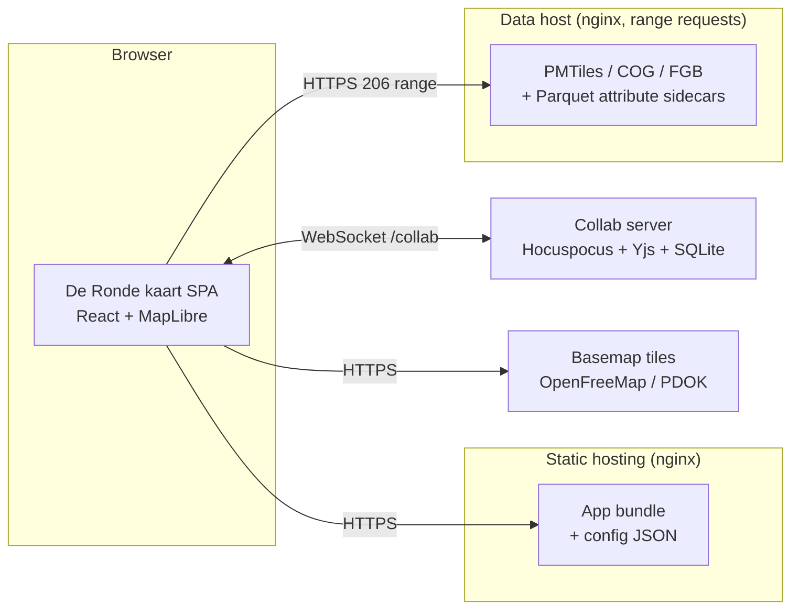
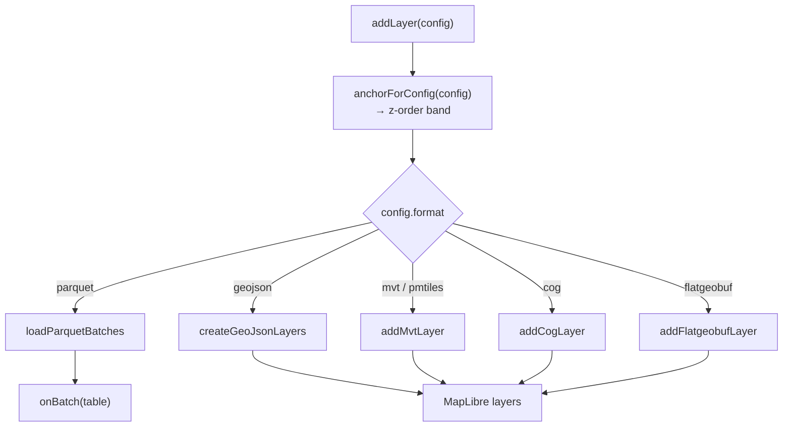
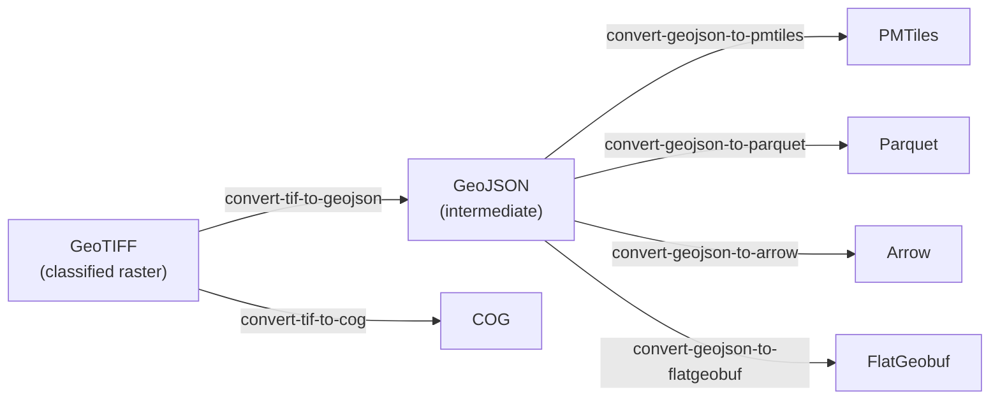

# De Ronde kaart — System Design Document

**Audience:** developers and maintainers. Assumes ordinary programming
knowledge; React and GIS specifics are explained where they matter.

**Status:** describes the system as it stands at the time of writing. Figures
(line counts, layer counts) were measured against the working tree, not
estimated.

---

## 1. Purpose, scope, and how to read this

De Ronde kaart is a web map for thematic geospatial data. Almost everything
about a deployment comes from JSON files: which layers exist, how they are
styled, how they are grouped in the menu, which charts they support, and which
UI features are on. Adding a layer means editing config and uploading data, not
changing code.

This document explains how the system is split up and why. Task-specific
documentation lives elsewhere:

| For | Read |
|---|---|
| The collaboration subsystem — client, server, guards (§10, **optional feature**) | [system-design-collaboration.md](system-design-collaboration.md) |
| The Power BI integration (§11, **optional**) | [system-design-power-bi.md](system-design-power-bi.md) |
| Why `maplibre-gl` and `typescript` are pinned (§3) — read before upgrading either | [system-design-version-constraints.md](system-design-version-constraints.md) |
| How layer styling is authored and translated per target (§6.4) | [system-design-styling.md](system-design-styling.md) |
| Running the collaboration server, its guards and operations | [collab-server/README.md](../collab-server/README.md) |
| The Power BI visual — building, publishing, hosting gotchas | [powerbi-visual/README.md](../powerbi-visual/README.md), [known_issues.md](../powerbi-visual/known_issues.md) |
| Per-tenant configuration projects | [configs/README.md](../configs/README.md) |
| Docker/nginx deployment | [deploy/README.md](../deploy/README.md) |
| Server provisioning scripts | [server/README.md](../server/README.md) |
| URL parameters (user-facing reference) | [README.md](../README.md) |

### Start here

| Task | Go to |
|---|---|
| Add a layer to an existing deployment | §12 Configuration, then `configs/<project>/layers.json` |
| Add support for a new data format | §6.1–6.2, then [use-map-layers.ts:112](../src/hooks/use-map-layers.ts#L112) |
| Change how a layer is styled | [system-design-styling.md](system-design-styling.md), then [geostyler.ts](../src/layers/geostyler.ts) |
| Understand why a filter isn't applying | §7 |
| Work out why charts show no data | §8 (`attributeSource`) |
| Prepare source data for upload | §14 Data pipeline |
| Deploy | §13, then [deploy/README.md](../deploy/README.md) |

---

## 2. System context

The app shows analysis maps of Dutch regional data — housing, care,
demographics, accessibility, green space. It is a static web page. It reads its
data straight off a file server, and optionally connects to a collaboration
server for shared annotations.



The data host is deliberately dumb — no tile server, no database, no API, just a
file server. Every format the app reads is one file that the browser fetches
*byte ranges* out of, so the whole data tier is `nginx` serving static files.
That removes a service that would otherwise need installing, securing and
monitoring.

---

## 3. Technology stack and major dependencies

#### Rendering

| Package | Why |
|---|---|
| `maplibre-gl` ^6.2 |Drawing geographic data |
| `react-map-gl` ^8.1 |Wrapper between maplibre-gl and react-map-gl |

#### Data formats

One package per format the map can read; the *format* rationale (when to reach
for which) is §6.1, and the loading mechanics are §6.3.

| Package | We use | Why |
|---|---|---|
| `pmtiles` ^4.4 | `Protocol`, registered as `pmtiles://` | Serves a whole vector tileset from one file over range requests — no tile server (§2) |
| `@geomatico/maplibre-cog-protocol` ^0.9 | `cogProtocol` (registered as `cog://`), `setColorFunction` | Cloud-Optimized GeoTIFF as a MapLibre raster source. `setColorFunction` is the hook [system-design-styling.md](system-design-styling.md) uses to classify raster pixels through the same GeoStyler rules a vector layer uses |
| `flatgeobuf` ^4.4 | `deserialize` from the ESM build (`flatgeobuf/lib/mjs/geojson.js`) | Bbox-filtered streaming reads against the file's packed Hilbert R-tree — large vector data browsed at high zoom without tiling it first (§6.3) |
| `apache-arrow` ^21.1 | `Table`, `tableFromIPC` | The in-memory columnar table every analytics path consumes: chart aggregation, statistics and the filter dropdowns all read Arrow (§8) |
| slim adaptation of `parquet-wasm` | `readParquet`, `readParquetStream`, plus the init promise | Decodes the Parquet attribute sidecars to Arrow IPC.|

#### Collaboration (optional)

Shared annotations on the map. See [system-design-collaboration.md](system-design-collaboration.md).

#### UI

| Package | We use | Why |
|---|---|---|
| `react`·`react-dom` ^19.2 | — | |
| `@base-ui/react` ^1.3 | `Button` and `Dialog` | User interface elements for interaction |
| `material-symbols` ^0.45 | `@import "material-symbols/outlined.css"`, rendered as ligature text by `Icon`/`NavIcon` | Icon's such as the `share` icon |

#### Charts

| Package | We use | Why |
|---|---|---|
| `d3-shape` ^3.2 | `pie` (donut) |  |
| `d3-scale` ^4.0 | `scaleLinear`, `scaleBand` (bar), `scalePoint` (line) | Domain→range mapping including the band/point padding rules |

### Build tooling

`vite` ^8.0 with `@vitejs/plugin-react` and `@tailwindcss/vite`;
`typescript` ~5.9; `eslint` ^10 with `typescript-eslint` ^8,
`eslint-plugin-react-hooks` ^7 and `eslint-plugin-react-refresh`.

### Indirect dependencies

Browser features the app needs, and what breaks without each:

| Capability | Role | Without it |
|---|---|---|
| **WebGL2** | The renderer. MapLibre 6 calls `getContext("webgl2")` and has no WebGL1 path | No map at all |
| **Canvas 2D** | PNG export and the Power BI snapshot ([map-capture.ts](../src/lib/map-capture.ts)), hatch-pattern sprites ([hatch-pattern.ts](../src/layers/hatch-pattern.ts)), icon sprites | Export and hatch fills fail; the map still renders |
| **Module Web Workers** | MapLibre parses tiles off-thread; the worker is a separate ESM file located via `import.meta.url` | No tile is ever parsed — see the `setWorkerUrl` note above |
| **WebAssembly** | Slim adaptation `parquet-wasm` decodes the attribute sidecars | Charts, Kerncijfers and filter dropdowns go empty; map layers are unaffected (§8) |
| **HTTP range requests (206)** | PMTiles, COG and FlatGeobuf read slices of one large file; Parquet streams column chunks | PMTiles/COG/FGB layers fail outright; Parquet falls back to a whole-file read (§6.3) |
| **`postMessage` + iframe embedding** | The Power BI visual and the circular embed drive the app through it (§11) | Embedded deployments lose all external control |
| **`Content-Encoding: br`/`gzip`** | `dist/` ships precompressed; nginx serves the `.br`/`.gz` siblings (§13) | Assets still serve, uncompressed and several times larger |

**WebGPU is *not* a dependency.** MapLibre 6.2's bundle contains zero
references to it. Worth stating because the assumption is easy to make of a
modern GL map, and it would change the browser support floor if it were true.

### External runtime services

| Endpoint | Role |
|---|---|
| `tiles.openfreemap.org` | Vector basemap tiles (the unversioned `/planet` TileJSON), **glyph PBFs** (all map label text) and the sprite sheet — used by both basemaps, including "luchtfoto", whose labels are drawn over the PDOK imagery |
| `service.pdok.nl` | Aerial imagery WMTS behind the "luchtfoto" basemap |
| `maps.googleapis.com` | Street View panel, loaded lazily via the `callback=` readiness signal ([street-view.tsx](../src/components/ui/street-view.tsx)) |
| `fonts.gstatic.com` | Material Symbols SVG for a `map.json` `clickMarker.icon` given by name ([map-config.ts](../src/config/map-config.ts)) |
| The tenant data host | Every layer, sidecar and metadata fragment (`data.woonzorglimburg.nl`, `data.startanalyse2026.nl`) |

### Version constraints worth knowing

**Moved to [system-design-version-constraints.md](system-design-version-constraints.md).**

Why `maplibre-gl` stays on v6 with its worker import spelled exactly as it is,
and why `typescript` is held at 5.x. Read it before upgrading either: the
MapLibre constraint fails as a blank map with no console error, and the
TypeScript one is not the configurable version guard it appears to be.

---

## 4. Architecture overview


Four principles organise the system.

### 4.1 Config-driven

Five JSON files define behaviour (§12). The app ships with empty stubs in
`public/`; a tenant's real files in `configs/<project>/` are swapped in at build
or dev time, selected by the `VITE_CONFIG_PROJECT` environment variable. Two
projects exist today: `woonzorglimburg` (79 layers) and `startanalyse2026`
(199 layers).

### 4.2 One renderer, one style model

Everything draws through MapLibre: tiled vector data (MVT/PMTiles), rasters
(COG), viewport-loaded FlatGeobuf, and in-memory GeoJSON for host-pushed data
and the overlays (study area, annotations, click marker, selection box).

Styling is written once per layer and translated per target — MapLibre paint and
filter expressions for vector layers, a per-pixel colour function for COG. See
[system-design-styling.md](system-design-styling.md).

#### The MapLibre object model in brief

Enough of MapLibre's own model to read §6 and §7.

```
Map  ──owns──▶  Style ──▶ sources { id: Source }   data, no appearance
                      ├──▶ layers  [ Layer, … ]    appearance, ordered
                      ├──▶ sprite                  image atlas (icons, hatches)
                      └──▶ glyphs                  font atlas (labels)
```

**Map** — one per map view; this app runs two side by side for compare mode.
`react-map-gl` creates it, but every layer operation afterwards calls MapLibre
directly through `mapRef.current.getMap()`.

**Style** — one JSON document holding everything drawable. The consequence that
bites: changing basemap calls `setStyle()`, which replaces that document, so
**every source, layer, sprite image and anchor the app added is destroyed** and
must be re-applied (§15).

**Source** — data, no appearance. Three types: `vector` (a `{z}/{x}/{y}`
template, or a `pmtiles://` URL whose handler reads the archive header instead),
`raster` (`cog://`), and `geojson` (in-memory). Sources are shared between
layers.

**Layer** — one draw pass over one source. The app emits `fill`, `line`,
`circle`, `symbol`, `fill-extrusion`, `heatmap` and `raster`. For vector
sources, `source-layer` picks one layer *inside* the tiles; MapLibre has no
setter for it, which is why the timeseries stepper removes and re-adds layers
instead of mutating them.

**One config is not one layer.** `buildNativeLayerDefs`
([mvt-style.ts](../src/layers/mvt-style.ts)) emits one MapLibre layer per
GeoStyler rule, id `<format-prefix>-layer-<configId>-<ruleName>`. A 17-rule
layer is 17 MapLibre layers over one shared source, and add, remove, visibility,
filtering and picking all walk that same id list (§4.4).

**Order is the array.** `style.layers` is bottom-to-top, and that *is* the draw
order. `addLayer(spec, beforeId)` inserts directly below the named layer. The
app never reshuffles, because five invisible `background` anchor layers
partition the stack into bands and each config picks its band (§6.5).

**Three property bags per layer**, each with an in-place setter, so appearance
changes never require re-adding a layer:

| Bag | Holds | Setter |
|---|---|---|
| `paint` | Colour, width, opacity, radius — pure appearance | `setPaintProperty` |
| `layout` | Whether/how geometry becomes drawable: `visibility`, `icon-image`, label placement | `setLayoutProperty` |
| `filter` | Which features enter the layer at all | `setFilter` |

`filter` matters most for §7: a filtered-out feature is not drawn **and not
queryable**, so filtering the map and filtering picking are one act, not two.

**Expressions** are the style language — JSON arrays evaluated per feature and
zoom, e.g. `["==", ["get", "gm_code"], "GM0882"]`. Both translations produce
them: GeoStyler rules become `paint` and `filter` expressions, and the area
filter compiles its selection into one (§7).

**Sprite and glyphs** are style-owned image and font atlases. Icon symbolizers
must `addImage()` before `addLayer()`, and since `setStyle` wipes the sprite,
`hasImage` is re-checked on every add rather than cached.

**Querying only sees what is drawn.** `queryRenderedFeatures` is tile-clipped,
style-filtered and viewport-limited — not a data API. A feature outside the
viewport or above the source's max zoom is simply absent (§9).

**Protocols are global, not per map.** `addProtocol("pmtiles", …)` and
`addProtocol("cog", …)` are called at module scope in
[MapView.tsx](../src/components/map/MapView.tsx), so both maps share them;
registering per map would double-register.

### 4.3 Module stores for cross-cutting filter state

Filter selections live in **module-level stores**, not React state
([area-filter.ts](../src/layers/area-filter.ts),
[box-filter.ts](../src/layers/box-filter.ts)). MapLibre filter expressions,
feature picking and chart aggregation all read the same store directly; React
holds only a `version` counter, used as a cache key.

The reason: not all consumers are UI components. Picking runs from an event
handler, and chart aggregation walks an Arrow table outside the render path.
Threading a filter down to each through the component tree would be verbose and
easy to let drift out of sync.

**What a "store" is here.** Not a library and not a subscription mechanism: one
`const store` object at module scope, private to its file, plus the exported
functions that read and replace it. The module is a singleton, so both maps and
every non-React consumer see the same selection.

| | Area filter | Box filter |
|---|---|---|
| Shape | `{ version, levels: [{ key, codes: Set<string>, digits: string[] }] }` | `{ version, bbox: [minLng, minLat, maxLng, maxLat] \| null }` |
| Written by | `setAreaFilterSelection(Map<key, Set<code>>)` | `setBoxFilter(bbox \| null)` |
| Owning hook | [use-area-filter.ts](../src/hooks/use-area-filter.ts) | [use-box-select.ts](../src/hooks/use-box-select.ts) |
| Inactive when | `levels` is empty | `bbox` is `null` |

Each store has one **writer**, which replaces the state wholesale rather than
mutating part of it, bumps `version`, and returns it. Everything else is a
**reader**, one per consumer *shape* — the same predicate against whatever that
consumer holds: a MapLibre expression (`areaFilterExpression`), an Arrow row
(`arrowRowMatchesAreaFilter`, `arrowRowMatchesBoxFilter`), or a plain property
bag (`featureMatchesAreaFilter`). §7 covers the shared semantics.

Readers run across ~14k rows per redraw, so some derived state is precomputed
into the store: the area filter keeps each code's digit prefix alongside the raw
code, and both modules cache column resolution in a `WeakMap` keyed on the Arrow
batch or `Table`, invalidated by `version`.

**The `version` counter is the whole React bridge.** The writer returns it and
the owning hook parks it in state — `setVersion(setBoxFilter(next))` — so it is
the only store state React holds, and it is a cache key, never data. A bump does
two things: `useChartData` clears its cached aggregates, and
[App.tsx](../src/App.tsx) re-runs `setFilter` over the live layers. Charts use
`areaFilter.version + boxSelect.version` as one key; the sum works because both
counters only increase.

The cost: a store write is invisible to React on its own. Nothing re-renders
unless the owning hook's `setVersion` runs, so code reaching past the hook into
the store would filter the map but leave the sidebar showing a stale selection.

### 4.4 Single source of truth per concern

- **All layer mutation** goes through `useMapLayers`
  (`addLayer`/`removeLayer`/`hideLayer`/`toggleLayer`), whether it came from the
  navigation tree, the legend, a URL command, a Power BI message, or an
  annotation snapshot restore.
- **All camera framing** goes through [fly-to.ts](../src/lib/fly-to.ts)
  (`viewForBbox`, `flyToBbox`, `flyToView`), so the bbox→zoom heuristic is never
  duplicated. The Power BI visual relies on this: it sends a raw bbox and lets
  the app resolve it.
- **All native layer identity** comes from `buildNativeLayerDefs`
  ([mvt-style.ts](../src/layers/mvt-style.ts)), used for add, remove,
  visibility, filtering and picking alike.

---

## 5. Module structure

Code is split by responsibility, not by feature: one hook per capability, with
presentation kept out of the data engine.

`src/` holds **17,375 lines across 91 TypeScript files**.

| Directory | Files | Responsibility |
|---|---|---|
| [src/layers/](../src/layers/) | 18 | The data engine: formats, loaders, styling, filtering, aggregation |
| [src/hooks/](../src/hooks/) | 20 | Feature logic — one hook per capability |
| [src/components/](../src/components/) | 36 | Presentation (map, legend, navigation, charts, annotations, share) |
| [src/lib/](../src/lib/) | 10 | Pure utilities: capture, geometry, share URLs, formatting |
| [src/config/](../src/config/) | 1 | `map.json` loading, UI flags, initial view |
| [src/types/](../src/types/) | 2 | Ambient declarations (annotations, Google Streetview) |
| [src/vendor/](../src/vendor/) | 2 | Generated parquet-wasm bindings |

### Largest modules

| Lines | File | Note |
|---|---|---|
| 1721 | [App.tsx](../src/App.tsx) | Composition root — **the main structural weak point** |
| 1014 | [use-map-layers.ts](../src/hooks/use-map-layers.ts) | Layer engine |
| 706 | [map-capture.ts](../src/lib/map-capture.ts) | WebGL capture and PNG compositing |
| 540 | [use-annotation-tool.ts](../src/hooks/use-annotation-tool.ts) | Drawing interaction model |
| 447 | [map-config.ts](../src/config/map-config.ts) | `map.json` validation |

`App.tsx` wires roughly twenty hooks, owns the dual-map layout, and holds the
annotation, box-select and share state. It is the file most in need of splitting
up; nothing about the architecture requires it to be this large.

### The hooks layer

Twenty hooks, each owning one capability: `use-map-layers`, `use-navigation`,
`use-area-filter`, `use-box-select`, `use-chart-data`, `use-feature-pick`,
`use-annotations`, `use-annotation-tool`, `use-annotation-layers`, `use-collab`,
`use-url-commands`, `use-embed-data`, `use-map-snapshot`, `use-study-area-layer`,
`use-filtered-study-area`, `use-click-marker-layer`, `use-selection-box-layer`,
`use-hover-cursor`, `use-auto-collapse`, `use-session-flag`.

---

## 6. Layers

The deepest part of the system, and where most complexity lives.

### 6.1 Format matrix

`LayerFormat` ([types.ts](../src/layers/types.ts)) admits eight values.
`geojson` is in-memory only and cannot be declared in `layers.json`;
`composite` is a grouping construct, not a data format.

| Format | What it is | Loader | Renderer |
|---|---|---|---|
| `geojson` | In-memory `FeatureCollection` (Power BI push) | none — `config.data` | MapLibre (GeoJSON source) |
| `pmtiles` | Single-file vector tile archive, `pmtiles://` protocol | MapLibre source | MapLibre (vector) |
| `mvt` | Vector tile template `{z}/{x}/{y}.pbf` | MapLibre source | MapLibre (vector) |
| `flatgeobuf` | FGB with packed Hilbert R-tree, bbox-filtered range reads | [flatgeobuf-loader.ts](../src/layers/flatgeobuf-loader.ts) | MapLibre (GeoJSON source) |
| `cog` | Cloud-Optimized GeoTIFF, `cog://` protocol | protocol handler | MapLibre (raster) |
| `composite` | Zoom-banded children under one legend entry | [composite-manager.ts](../src/layers/composite-manager.ts) | delegates per child |

In the `woonzorglimburg` project the mix is 68 pmtiles, 7 cog, 2 composite,
1 mvt, 1 flatgeobuf — tiles dominate because they scale to province-wide
extents. `.parquet` files live on as **attribute sidecars** for the
charts panel and the filter dropdowns (§6.1, `attributeSource`).

### 6.2 Format dispatch

All routing happens in one place: `dispatchFormatLoad`
([use-map-layers.ts:112](../src/hooks/use-map-layers.ts#L112)), shared by
top-level layers and composite children.



The canonical predicate for the native-vector branch is:

```ts
export function isNativeVectorFormat(format: LayerConfig["format"]): boolean {
  return format === "mvt" || format === "pmtiles" || format === "flatgeobuf";
}
```

### 6.3 Loading and caching

**URL-keyed table cache** ([table-cache.ts](../src/layers/table-cache.ts)) —
shared by the Arrow and Parquet loaders. It stores the **in-flight Promise, not
the resolved Table**, so concurrent loads of one URL join a single download
instead of racing two. One file is routinely wanted at once by the left map, the
right map, several `layers.json` ids, the filter dropdowns and the charts panel.
Failed loads are evicted so a retry is possible.

**Parquet streaming** ([parquet-loader.ts](../src/layers/parquet-loader.ts)) —
reads the footer, then fetches column chunks on demand via HTTP 206. Each
`RecordBatch` is emitted as a *cumulative* table, yielding to the event loop
between batches so the page stays responsive. It feeds the charts/statistics
panel and the filter dropdowns, and no longer drives any map rendering. It falls
back to a whole-file read if streaming throws, e.g. on a host without range
support. The WASM init is a cached promise, not a boolean flag: wasm-bindgen
sets its own guard only after fetch and compile resolve, so concurrent callers
each downloaded the ~1.6 MB module.

**Tile overscaling vs splitting** — MapLibre 6 introduced
`zoomLevelsToOverscale`, defaulting to `4`: past a source's maxzoom, only the
top 4 zoom levels are overscaled and the levels between are *split*. MapLibre's
docs note this "changes the results of query rendered features", and the app is
unusually exposed: **all** picking — feature info, hover cursor, marker snap,
annotation select/drag — runs through `queryRenderedFeatures`, while the PMTiles
archives cap at z12–z14 and users routinely zoom past z16.

Measured on the v6 default, `line` layers from z12 archives became **rendered
but unpickable** above their cap (`cbsgemeente2026` from z14, `cbswijk2026` from
z17); `fill` and `symbol` were unaffected. The map is therefore constructed with
`zoomLevelsToOverscale={undefined}`
([MapView.tsx](../src/components/map/MapView.tsx)), restoring v5 semantics.
The failure is **silent and zoom-dependent** — nothing throws and `tsc` cannot
see it — so verify picking across z11–z18 on a z12-capped *line* layer before
changing it. The proper fix is re-tiling those archives deeper, which would then
allow v6's default and its high-zoom performance benefit.

**FlatGeobuf sessions** ([flatgeobuf-loader.ts](../src/layers/flatgeobuf-loader.ts))
— deliberately *not* URL-cached, because what is loaded depends on the camera.
State lives in per-`(map, config)` sessions in a `WeakMap`, which covers the two
comparison maps and the export preview map without extra bookkeeping. Three
mechanisms matter: a minimum zoom below which nothing is fetched (a zoomed-out
viewport would cover the whole dataset), a 25% bbox pad so small pans need no
request, and a **generation counter** for cancellation — incrementing it makes
the in-flight async iterator abandon, so stale results never reach the source.

### 6.4 Styling: one model, three translations

**Moved to [system-design-styling.md](system-design-styling.md).**

Style is authored once per layer as GeoStyler rules and translated per render
target by [geostyler.ts](../src/layers/geostyler.ts): MapLibre paint/filter
expressions for vector layers, and a per-pixel colour function for COG that runs
raster bands through the same `evaluateFilter` a vector layer uses.

### 6.5 Z-ordering

TODO: spits toe op wat het werkelijk doet, welke indeling mogelijk is etc

New layers are inserted relative to **named invisible anchor layers**, which
permanently divide the stack into bands
([map-view-config.ts](../src/components/map/map-view-config.ts)):

```ts
export const ANCHORS = {
  background: "background-layers", // for instance meadows or water
  map: "map-layers",        // default
  foreground: "foreground-layers",
  overlay: "overlay-layers", // topographic elements such as roads and labels
  studyarea: "studyarea-layers"
} as const;
```

---

## 7. Filtering

Two independent systems with different scopes.

| | Area filter | Box filter |
|---|---|---|
| Source | `filter.json` dropdowns (Gemeente/Wijk/Buurt) | User-drawn rectangle |
| MapLibre rendering | ✅ (`setFilter`) | ❌ |
| Feature picking | ✅ | ❌ |
| Charts / statistics | ✅ | ✅ |
| COG (raster) | ❌ | n/a |

**Area filter** ([area-filter.ts](../src/layers/area-filter.ts)) — cascading
administrative selection. The rules: *AND across levels, OR within a level,
inapplicable levels skipped, empty selection passes everything*. Three
implementations, one per consumer shape: a MapLibre filter expression for vector
layers, an Arrow row predicate for aggregation over the sidecar tables, and a
plain-props predicate (`featureMatchesAreaFilter`). The last has no caller today
— picking gets filtering for free, see below — but it is the clearest statement
of the semantics in plain JavaScript.

`setFilter` removes non-matching features entirely, so they are neither drawn
nor pickable. There is no "rendered but transparent" state to special-case.

Because CBS area codes nest (`GM0882` ⊂ `WK088200` ⊂ `BU08820000`), a layer
without the exact key column falls back to digit-prefix matching over
`bu_code`/`wk_code`/`gm_code`.

**Box filter** ([box-filter.ts](../src/layers/box-filter.ts)) — restricts *only*
chart aggregation; map rendering and picking are untouched. A row passes when its
representative point (the point coordinate, or first vertex for lines/polygons)
falls inside the box. It handles nested GeoArrow encodings and `geoarrow.wkb`,
the latter by reading only the WKB header — a province-wide polygon can carry
thousands of vertices and the test needs one.

**Composition** happens in exactly one place, chart aggregation:

```ts
function rowPassesFilters(table: Table, index: number): boolean {
  return arrowRowMatchesAreaFilter(rowInfo(table, index))
      && arrowRowMatchesBoxFilter(table, index);
}
```

Their two version counters are summed into a single cache key, so either
changing invalidates cached aggregates.

---

## 8. Charts and statistics

[charts.json](../configs/woonzorglimburg/charts.json) is a **library** of chart
definitions referenced by id from a layer's `charts` array. Types: donut, bar,
line. Aggregations: sum, mean, count. A layer may also declare `statistics`
(the "Kerncijfers" grid) with `sum`/`count`/`mean`/`variance`.

Aggregation ([chart-data.ts](../src/layers/chart-data.ts)) is a single pass over
the table, skipping rows that fail the combined filters. Variance uses
**Welford's algorithm** for numerical stability. Group-by charts fold everything
past the top 8 groups into one "Overig" datum. Results are cached on
`(table, spec, filter version)` — keyed on the **table**, not the layer, so two
layers sharing a sidecar compute once.

### `attributeSource` — why tile layers need a sidecar

Charts aggregate the **entire dataset**, but vector tiles only contain the
current viewport at the current zoom. Aggregating from tiles would produce
numbers that silently change as the user pans.

A pmtiles/mvt/cog layer therefore points `attributeSource` at a `.parquet` or
`.arrow` sidecar carrying the same rows. The map renders from `source`; the
analytics panel reads `attributeSource`. Dispatch is on the **sidecar's own
extension**, not the layer's format — the point is that the two differ.

A tile-format layer declaring charts *without* a sidecar renders an empty panel
and warns once. Not hypothetical: it is what happened when layers were migrated
from Parquet to PMTiles, and the silence is why it went unnoticed.

---

## 9. Feature catalogue

| Capability | Implemented in | Notes |
|---|---|---|
| **Dual map / comparison** | [App.tsx](../src/App.tsx), [comparison-slider.tsx](../src/components/ui/comparison-slider.tsx) | Two `MapView`s, shared camera, CSS `clipPath` split. Right map mounts only when it holds a comparable layer |
| **Navigation tree** | [use-navigation.ts](../src/hooks/use-navigation.ts), [navigation/](../src/components/ui/navigation/) | `top` or `sidebar` mode, chosen in `map.json` |
| **Legend** | [legend.tsx](../src/components/ui/legend.tsx), [legend-style.ts](../src/lib/legend-style.ts) | Per-layer and per-rule toggles, move between maps, basemap cycling |
| **Feature info** | [use-feature-pick.ts](../src/hooks/use-feature-pick.ts), [feature-info.tsx](../src/components/ui/feature-info.tsx) | `queryRenderedFeatures` over the clickable layers |
| **Street View** | [street-view.tsx](../src/components/ui/street-view.tsx) | Lazy Google Maps load via `callback=` readiness signal |
| **Area filter** | [use-area-filter.ts](../src/hooks/use-area-filter.ts), [FilterSection.tsx](../src/components/ui/sidebar/FilterSection.tsx) | Also replaces the study area and flies to the selection |
| **Box selection** | [use-box-select.ts](../src/hooks/use-box-select.ts) | Scopes statistics only |
| **Charts panel** | [charts/](../src/components/charts/), [use-chart-data.ts](../src/hooks/use-chart-data.ts) | Up to 4 charts + Kerncijfers |
| **Annotations** | [use-annotation-tool.ts](../src/hooks/use-annotation-tool.ts), [use-annotation-source.ts](../src/hooks/use-annotation-source.ts) | Circle / polygon / pin, each carrying a session snapshot |
| **Timeseries** | [use-map-layers.ts](../src/hooks/use-map-layers.ts), `TimeseriesControl` | Play/scrub over a `%YEAR%` placeholder in `sourceLayer` |
| **Sharing** | [share-url.ts](../src/lib/share-url.ts), [ShareDialog.tsx](../src/components/share/ShareDialog.tsx) | Hash-encoded state, share link, circular PNG export |
| **PNG export** | [map-capture.ts](../src/lib/map-capture.ts) | 2048² circular export with legend and callouts |
| **Circular embed** | [CircularExportView.tsx](../src/components/share/CircularExportView.tsx) | `?embed=circular` or `open-circular` message |

### Annotations in brief

Three shape types, directly manipulated: drag a circle's rim to resize but its
body to move; drag out a bbox to create a polygon; mousedown on a polygon edge
splits it there. Escape unwinds one step at a time (cancel drag → deselect →
disarm tool). Hit-testing prioritises vertices, then edges, then bodies, so small
handles on large shapes stay grabbable.

Each annotation stores a **session snapshot** — area-filter selections, both
maps' layers and hidden ids, and the camera — restored by clicking it. Restore is
cancellable, applies hidden state only after layer adds resolve, and skips layers
no longer in `layers.json`.

---

## 10. Collaboration subsystem

**Moved to [system-design-collaboration.md](system-design-collaboration.md).**

Shared annotations over a Yjs/Hocuspocus WebSocket session: the client
lifecycle and its Awareness handling, the capability-URL security model, and the
server-side guards.

**The subsystem is optional.** It is gated on the `annotations` flag in
`map.json` (default `false`; collaborative *sessions* additionally require
`share`), and the collab server is a separate deployable rather than part of the
static bundle. Switched off — as in the default configuration and in
`startanalyse2026` — annotations stay local to the browser and nothing else in
the app changes.

---

## 11. Power BI integration

**Moved to [system-design-power-bi.md](system-design-power-bi.md).**

A thin custom visual that embeds the hosted app in an iframe and drives it via
`postMessage`.

**The integration is optional and peripheral** — the app neither knows nor cares
whether it is embedded. Nothing in §§4–10 depends on it. Only two things leak
back into the core: the in-memory `geojson` layer format (§6.1) and the snapshot
bridge that keeps Power BI's PDF/PowerPoint export from rendering the map blank.
Both are explained in the companion document.

---

## 12. Configuration system

| File | Loader | Drives |
|---|---|---|
| `layers.json` | [config.ts](../src/layers/config.ts) `loadLayerConfigs` | Every renderable layer |
| `navigation.json` | [navigation.ts](../src/layers/navigation.ts) `loadNavigation` | Category tree |
| `charts.json` | [charts.ts](../src/layers/charts.ts) `loadChartsConfig` | Chart library |
| `filter.json` | [area-filter.ts](../src/layers/area-filter.ts) `loadAreaFilterConfig` | Area filter levels |
| `map.json` | [map-config.ts](../src/config/map-config.ts) `loadMapConfig` | Initial view, study area, ~15 UI flags |

All five are cached at module level after first load.

### Two-tier validation philosophy

Which files may fail hard is a deliberate split, verified against the source:
`config.ts` and `navigation.ts` each contain a `throw` and no `catch`;
`charts.ts`, `area-filter.ts` and `map-config.ts` each contain a `catch` and no
`throw`.

- **`layers.json` and `navigation.json` throw** on a missing or failed fetch.
  Without them there is no app, so failing loudly is correct.
- **`map.json`, `charts.json` and `filter.json` never throw.** Each catches,
  warns, and returns defaults — an embedded map must always load, even
  misconfigured.

Within `layers.json`, validation is **per-entry drop-and-warn**: one malformed
layer disappears with a console warning rather than taking down the other 78.

`validateTimeseries` is stricter — it drops the whole block unless `sourceLayer`
contains the placeholder, because a timeseries that steps through years without
the rendered layer changing is a confusing silent no-op.

### Per-tenant overlay

[vite.config.ts](../vite.config.ts) defines a `configOverlay` plugin: when
`VITE_CONFIG_PROJECT` is set, files from `configs/<project>/` are served in place
of the `public/` defaults (dev) or copied over them (build). Unset, behaviour is
the plain `public/` content. See [configs/README.md](../configs/README.md).

---

## 13. Build and deployment

### Vite pipeline

Four plugins: React, Tailwind, the config overlay (§12), an **icon-font
subsetter** ([subset-icon-font.ts](../scripts/subset-icon-font.ts) — scans
sources for icon names and ships only those glyphs), and **dist precompression**
([precompress-dist.ts](../scripts/precompress-dist.ts) — Brotli q11 + gzip, so
nginx serves precompressed assets).

Manual chunking splits `vendor-parquet`, `vendor-arrow` and `vendor-maplibre`
so they cache independently of app changes.

`npm run build` is `tsc -b && vite build` — the typecheck gates the bundle.

### Deployment

[Dockerfile](../Dockerfile) is a two-stage build (`node:20-alpine` →
`nginx:alpine`, port 80). [docker-compose.yml](../docker-compose.yml) adds the
`collab` service. nginx configs live in [deploy/](../deploy/).

For non-Docker hosts, [server/](../server/) holds provisioning scripts:
`setup_map_application.sh` (app + nginx + `/collab` proxy),
`setup_collab_server.sh` (systemd unit), `setup_fileserver.sh` (the data host),
`setup_landing_page.sh`.

---

## 14. Data pipeline

The first stage uses GeoDMS to translate source data into intermediate
`.geojson` files. Simplification can happen here, preserving topology so shapes
stay correctly joined at lower zoom levels. An experimental alternative uses
**mapshaper** via `convert-tif-to-geojson.py`. Those intermediate files then go
into the converters below.

[data/](../data/) holds eight Python converters that turn source rasters and
vectors into the formats the app reads. They use PEP 723 inline dependency
metadata, so `uv run <script>` needs no environment setup.



Choosing an output: **COG** for continuous surfaces (elevation, imagery);
**PMTiles** for classified polygons at province scale; **Parquet/Arrow** when
charts need whole-dataset attributes; **FlatGeobuf** for large vector data
browsed at high zoom.

Workflow: convert → upload to the data host → reference the URL from
`layers.json`.

---