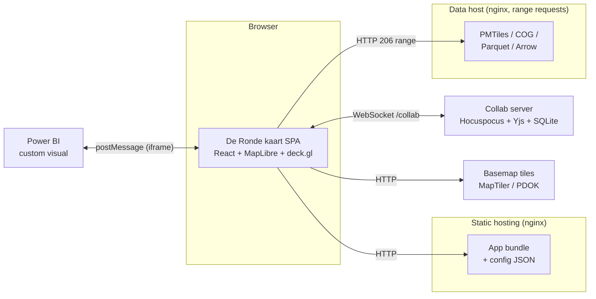
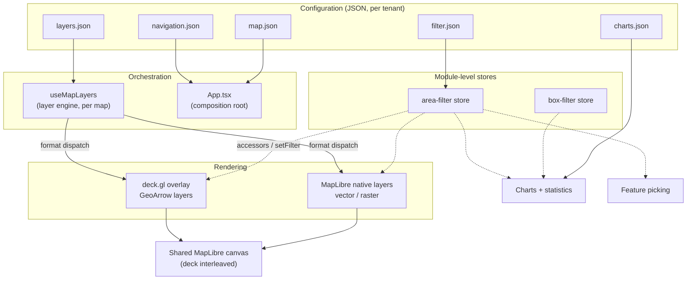
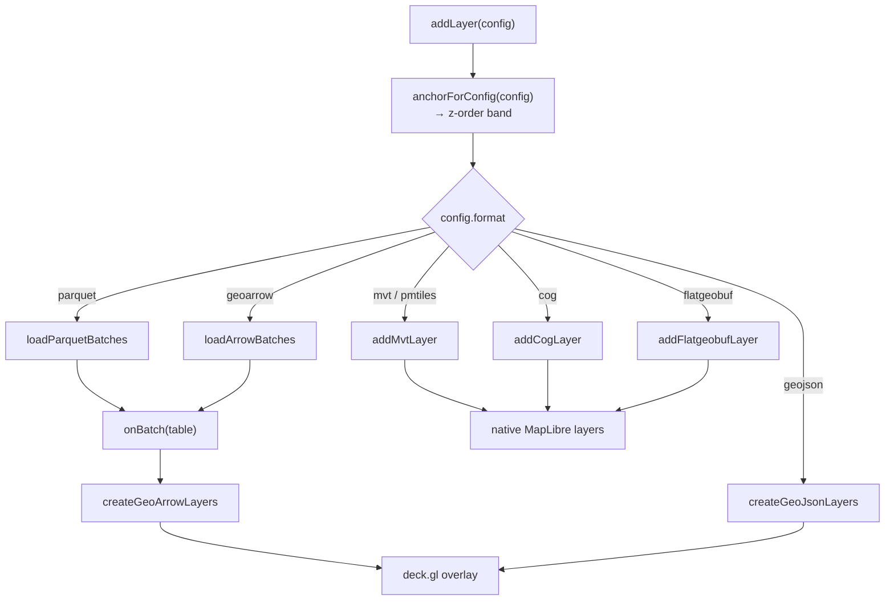
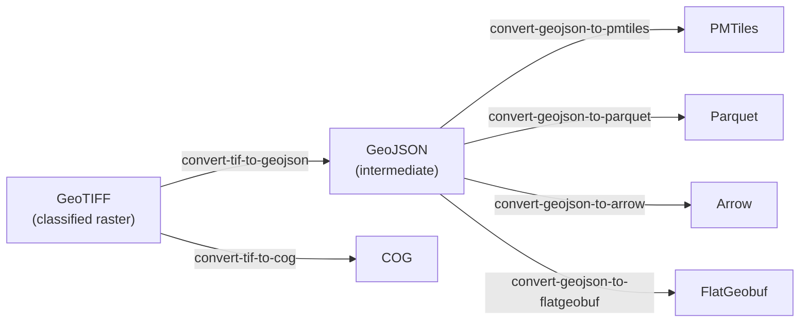

# De Ronde kaart — System Design Document

**Audience:** developers and maintainers. Assumes familiarity with React and
general GIS concepts (tiles, projections, vector vs raster).

**Status:** describes the system as it stands at the time of writing. Figures
(line counts, layer counts) were measured against the working tree, not
estimated.

---

## 1. Purpose, scope, and how to read this

De Ronde kaart is a configuration-driven web map for thematic geospatial data. A
deployment is defined almost entirely by JSON: which layers exist, how they are
styled, how they are grouped in the navigation tree, which charts they support,
and which UI features are switched on. Adding a layer is normally a config edit
and a data upload, not a code change.

This document covers **architecture and rationale** — how the system is divided,
why the divisions are where they are, and which constraints shaped them. It does
not duplicate the task-scoped documentation that already exists:

| For | Read |
|---|---|
| Running the collaboration server, its guards and operations | [collab-server/README.md](../collab-server/README.md) |
| Building and publishing the Power BI visual | [powerbi-visual/README.md](../powerbi-visual/README.md) |
| Power BI hosting gotchas (CSP, frame-ancestors) | [powerbi-visual/known_issues.md](../powerbi-visual/known_issues.md) |
| Per-tenant configuration projects | [configs/README.md](../configs/README.md) |
| Docker/nginx deployment | [deploy/README.md](../deploy/README.md) |
| Server provisioning scripts | [server/README.md](../server/README.md) |
| URL parameters (user-facing reference) | [README.md](../README.md) |

### Start here

| Task | Go to |
|---|---|
| Add a layer to an existing deployment | §12 Configuration, then `configs/<project>/layers.json` |
| Add support for a new data format | §6.1–6.2, then [use-map-layers.ts:112](../src/hooks/use-map-layers.ts#L112) |
| Change how a layer is styled | §6.4, then [geostyler.ts](../src/layers/geostyler.ts) |
| Understand why a filter isn't applying | §7 |
| Work out why charts show no data | §8 (`attributeSource`) |
| Prepare source data for upload | §14 Data pipeline |
| Deploy | §13, then [deploy/README.md](../deploy/README.md) |

---

## 2. System context

De Ronde kaart serves thematic analysis maps (housing, care, demographics,
accessibility, green space) for Dutch regional data — principally Limburg. It
runs as a static single-page application, reads its data from a plain HTTP file
host over range requests, and optionally connects to two auxiliary services: a
collaboration server for shared annotations, and a Power BI host that embeds it.



The data host is deliberately dumb — no tile server, no database, no API. Every
format the app reads is a single file addressed by range requests, so the whole
data tier is `nginx` serving static files.

---

## 3. Technology stack and major dependencies

Versions below are the **declared semver ranges** from
[package.json](../package.json). The lockfile resolves higher within those
ranges; consult `package-lock.json` for exact resolutions.

### Runtime dependencies

| Group | Packages |
|---|---|
| **Rendering** | `maplibre-gl` ^5.21, `react-map-gl` ^8.1, `@deck.gl/core`·`layers`·`geo-layers`·`mapbox`·`aggregation-layers` ^9.2, `@geoarrow/deck.gl-geoarrow` ^0.4 |
| **Data formats** | `apache-arrow` ^21.1, `flatgeobuf` ^4.4, `pmtiles` ^4.4, `@geomatico/maplibre-cog-protocol` ^0.9, plus vendored `parquet-wasm` |
| **Collaboration** | `yjs` ^13.6, `@hocuspocus/provider` ^4.4 |
| **UI** | `react`·`react-dom` ^19.2, `@base-ui/react` ^1.3, `tailwindcss` ^4.2, `material-symbols` ^0.45, `lucide-react` ^1.7, `class-variance-authority`, `clsx`, `tailwind-merge` |
| **Charts / util** | `d3-array` ^3.2, `d3-scale` ^4.0, `d3-shape` ^3.2, `qrcode` ^1.5 |

### Build tooling

`vite` ^8.0 with `@vitejs/plugin-react` and `@tailwindcss/vite`;
`typescript` ~5.9; `eslint` ^10 with `typescript-eslint` ^8,
`eslint-plugin-react-hooks` ^7 and `eslint-plugin-react-refresh`.

### Notable: vendored parquet-wasm

`parquet-wasm` is **not** a normal dependency. A slim WASM build is vendored at
[src/vendor/parquet-wasm/](../src/vendor/parquet-wasm/), produced by
[scripts/build-parquet-wasm.sh](../scripts/build-parquet-wasm.sh). It is
generated code, so it is excluded from linting in
[eslint.config.js](../eslint.config.js) and given its own Rollup chunk
(`vendor-parquet`).

### Version constraints worth knowing

- **`maplibre-gl` is held at v5.** MapLibre 6 removed `map.transform`, which
  `@deck.gl/mapbox` still reads internally (`deck-utils.ts`, guarded by
  `@ts-ignore`). Upgrading breaks the deck.gl overlay at runtime while
  compiling cleanly. Revisit when deck.gl stops using that property.
- **TypeScript is held at 5.x.** `typescript-eslint` hard-throws on TS 7
  (`"typescript-eslint does not support TS 7.0"`), which would disable linting
  entirely.

---

## 4. Architecture overview



Four principles organise the system.

### 4.1 Config-driven

Five JSON files define behaviour (§12). The app ships with empty stubs in
`public/`; a tenant configuration in `configs/<project>/` is overlaid at build
or dev time by a Vite plugin keyed on `VITE_CONFIG_PROJECT`. Two projects exist
today: `woonzorglimburg` (79 layers) and `startanalyse2026` (199 layers).

### 4.2 Dual renderer, one style model

The app runs **two rendering engines simultaneously against one canvas**:
deck.gl (as an interleaved `MapboxOverlay`) for Arrow-backed tabular data, and
native MapLibre layers for tiles and raster. This is not incidental — each
engine is better at a different job:

- deck.gl reads Apache Arrow columnar data directly on the GPU, so a
  million-row Parquet file renders without ever becoming GeoJSON.
- MapLibre handles tiled sources (MVT/PMTiles), raster (COG), and symbol
  collision natively, with a mature style spec.

The cost is that styling must be expressed once and translated twice. That is
what [geostyler.ts](../src/layers/geostyler.ts) exists for: a renderer-neutral
rule engine whose output feeds deck.gl colour accessors, MapLibre filter
expressions, and a COG per-pixel colour function alike (§6.4).

### 4.3 Module stores for cross-cutting filter state

Filter selections live in **module-level stores**, not React state
([area-filter.ts](../src/layers/area-filter.ts),
[box-filter.ts](../src/layers/box-filter.ts)). deck.gl accessors, MapLibre
filter expressions, feature picking and chart aggregation all read the same
store directly. React mirrors only a `version` counter, used as a deck.gl
`updateTriggers` key and a memo-cache key.

The reason is that the consumers are not all React components — deck accessors
run per row on the GPU path, and picking runs from an event handler. Prop
drilling a filter into all four would be both verbose and easy to desynchronise.

### 4.4 Single source of truth per concern

- **All layer mutation** funnels through `useMapLayers`
  (`addLayer`/`removeLayer`/`hideLayer`/`toggleLayer`), whether it originates
  from the navigation tree, the legend, a URL command, a Power BI message, or an
  annotation snapshot restore.
- **All camera framing** goes through [fly-to.ts](../src/lib/fly-to.ts)
  (`viewForBbox`, `flyToBbox`, `flyToView`), so bbox→zoom heuristics are never
  duplicated — notably, the Power BI visual sends a raw bbox and lets the app
  resolve it.
- **All native layer identity** comes from `buildNativeLayerDefs`
  ([mvt-style.ts](../src/layers/mvt-style.ts)), used for add, remove, visibility,
  filtering and picking alike.

---

## 5. Module structure

Code is split by responsibility, not by feature: one hook per capability, with
presentation kept out of the data engine.

`src/` holds **17,375 lines across 91 TypeScript files**.

| Directory | Files | Responsibility |
|---|---|---|
| [src/layers/](../src/layers/) | 18 | The data engine: formats, loaders, styling, filtering, aggregation |
| [src/hooks/](../src/hooks/) | 20 | Feature logic — one hook per capability |
| [src/components/](../src/components/) | 36 | Presentation (map, legend, navigation, charts, annotations, share) |
| [src/lib/](../src/lib/) | 10 | Pure utilities: capture, geometry, share URLs, formatting |
| [src/config/](../src/config/) | 1 | `map.json` loading, UI flags, initial view |
| [src/types/](../src/types/) | 2 | Ambient declarations (annotations, Google Maps) |
| [src/vendor/](../src/vendor/) | 2 | Generated parquet-wasm bindings |

### Largest modules

| Lines | File | Note |
|---|---|---|
| 1721 | [App.tsx](../src/App.tsx) | Composition root — **the main structural weak point** |
| 1014 | [use-map-layers.ts](../src/hooks/use-map-layers.ts) | Layer engine |
| 706 | [map-capture.ts](../src/lib/map-capture.ts) | WebGL capture and PNG compositing |
| 543 | [layer-factory.ts](../src/layers/layer-factory.ts) | deck.gl layer construction |
| 540 | [use-annotation-tool.ts](../src/hooks/use-annotation-tool.ts) | Drawing interaction model |
| 447 | [map-config.ts](../src/config/map-config.ts) | `map.json` validation |

`App.tsx` wires roughly twenty hooks, owns the dual-map composition, and holds
the annotation/box-select/share interaction state. It is the file most in need
of decomposition; nothing about the architecture requires it to be this large.

### The hooks layer

Twenty hooks, each owning one capability: `use-map-layers`, `use-navigation`,
`use-area-filter`, `use-box-select`, `use-chart-data`, `use-feature-pick`,
`use-annotations`, `use-annotation-tool`, `use-annotation-layers`, `use-collab`,
`use-url-commands`, `use-embed-data`, `use-map-snapshot`, `use-study-area-layer`,
`use-filtered-study-area`, `use-click-marker-layer`, `use-selection-box-layer`,
`use-hover-cursor`, `use-auto-collapse`, `use-session-flag`.

---

## 6. Layer subsystem

The deepest part of the system, and where most complexity lives.

### 6.1 Format matrix

`LayerFormat` ([types.ts](../src/layers/types.ts)) admits eight values.
`geojson` is in-memory only and cannot be declared in `layers.json`;
`composite` is a grouping construct, not a data format.

| Format | What it is | Loader | Renderer |
|---|---|---|---|
| `parquet` | Parquet with GeoArrow-encoded geometry, read by range requests | [parquet-loader.ts](../src/layers/parquet-loader.ts) | deck.gl |
| `geoarrow` | Arrow IPC (`.arrow`/`.feather`) | [arrow-loader.ts](../src/layers/arrow-loader.ts) | deck.gl |
| `geojson` | In-memory `FeatureCollection` (Power BI push) | none — `config.data` | deck.gl |
| `pmtiles` | Single-file vector tile archive, `pmtiles://` protocol | MapLibre source | MapLibre (vector) |
| `mvt` | Vector tile template `{z}/{x}/{y}.pbf` | MapLibre source | MapLibre (vector) |
| `flatgeobuf` | FGB with packed Hilbert R-tree, bbox-filtered range reads | [flatgeobuf-loader.ts](../src/layers/flatgeobuf-loader.ts) | MapLibre (GeoJSON source) |
| `cog` | Cloud-Optimized GeoTIFF, `cog://` protocol | protocol handler | MapLibre (raster) |
| `composite` | Zoom-banded children under one legend entry | [composite-manager.ts](../src/layers/composite-manager.ts) | delegates per child |

In the `woonzorglimburg` project the mix is 68 pmtiles, 5 cog, 3 parquet,
2 composite, 1 mvt — tiles dominate because they scale to province-wide extents.

### 6.2 Format dispatch

All routing happens in one place: `dispatchFormatLoad`
([use-map-layers.ts:112](../src/hooks/use-map-layers.ts#L112)), shared by
top-level layers and composite children.



The canonical predicate for the native-vector branch is:

```ts
export function isNativeVectorFormat(format: LayerConfig["format"]): boolean {
  return format === "mvt" || format === "pmtiles" || format === "flatgeobuf";
}
```

### 6.3 Loading and caching

**URL-keyed table cache** ([table-cache.ts](../src/layers/table-cache.ts)) —
shared by the Arrow and Parquet loaders. The design point is that it stores the
**in-flight Promise, not the resolved Table**, so concurrent loads of the same
URL dedupe rather than racing two downloads. This matters because one file is
routinely referenced by the left map, the right comparison map, several
`layers.json` ids, the filter dropdowns and the charts panel at once. Rejected
loads are evicted so a retry is possible.

**Parquet streaming** ([parquet-loader.ts](../src/layers/parquet-loader.ts)) —
reads the footer, then fetches column chunks on demand via HTTP 206. Each
`RecordBatch` is emitted as a *cumulative* table so deck.gl paints progressively,
yielding to the event loop between batches. Falls back to a whole-file read if
streaming throws (e.g. a host without range support). The WASM init is a
memoized promise rather than a boolean flag — wasm-bindgen sets its own guard
only after fetch and compile resolve, so concurrent callers each downloaded the
~1.6 MB module.

**FlatGeobuf sessions** ([flatgeobuf-loader.ts](../src/layers/flatgeobuf-loader.ts))
— deliberately *not* URL-cached, because what is loaded depends on the camera.
State lives in per-`(map, config)` sessions in a `WeakMap`, which naturally
handles the two comparison maps and the export preview map. Notable mechanisms:
a minimum zoom below which nothing is fetched (a zoomed-out viewport bbox would
cover the entire dataset), a 25% bbox pad so small pans need no request, and a
**generation counter** used as cancellation — an incremented generation makes
the in-flight async iterator abandon, guaranteeing stale results never reach the
source.

### 6.4 Styling: one model, three translations

[geostyler.ts](../src/layers/geostyler.ts) holds the shared engine —
`evaluateFilter`, `matchRule` (first match wins), and per-symbolizer extractors.
Filter comparison is deliberately loose (`==`), because JSON config values
arrive as strings or numbers interchangeably.

**→ deck.gl** ([layer-factory.ts](../src/layers/layer-factory.ts)): one layer per
record batch × per rule. Rules are applied by **transparency, not row dropping**
— each rule's layer returns its colour only for rows whose *winning* rule is
that one, else transparent. The performance mechanism is `ruleIndexColumn`, a
`WeakMap` memo of the winning rule index per row, computed once per batch and
shared across rule layers, both maps, and filter re-evaluations.

**→ MapLibre** ([mvt-style.ts](../src/layers/mvt-style.ts)): rules become
MapLibre filter expressions (`&&`→`all`, `||`→`any`) and symbolizers map by kind
(`Fill`→`fill`, `Line`→`line`, `Mark`→`circle`, `Icon`→`symbol`). Unsupported
kinds warn loudly rather than drawing an invisible layer.

**→ COG** ([cog-style.ts](../src/layers/cog-style.ts)): a per-pixel colour
function where raster bands are exposed as `band0`, `band1`, … and run through
**the same `evaluateFilter`** — so a raster classifies with identical rule
syntax to a vector layer.

### 6.5 Z-ordering

Both renderers insert against **named invisible anchor layers**
([map-view-config.ts](../src/components/map/map-view-config.ts)):

```ts
export const ANCHORS = {
  background: "background-layers",
  map: "map-layers",        // default
  overlay: "overlay-layers",
  foreground: "foreground-layers",
  studyarea: "studyarea-layers",
} as const;
```

A layer's `beforeid` selects its band. Because deck.gl (interleaved) and
`map.addLayer` both honour the same anchors, ordering is correct without any
post-hoc `moveLayer` shuffling, and without depending on load timing.

### 6.6 Composites

A composite is one legend/navigation entry wrapping inline child configs, each
active over a `[minzoom, maxzoom)` band. `composite-manager.ts` watches
`moveend` and loads/unloads children as the zoom crosses band edges, delegating
the actual work to a host implemented in `useMapLayers` (deck-rendered children
need React state setters that module scope cannot reach).

Two flavours: a parent **with** `geostyler` means zoom-banded alternatives
sharing one legend; a parent **without** means children render simultaneously
and each contributes its own legend classes.

---

## 7. Filtering

Two independent systems with different scopes.

| | Area filter | Box filter |
|---|---|---|
| Source | `filter.json` dropdowns (Gemeente/Wijk/Buurt) | User-drawn rectangle |
| deck.gl rendering | ✅ (non-matching → transparent) | ❌ |
| MapLibre rendering | ✅ (`setFilter`) | ❌ |
| Feature picking | ✅ | ❌ |
| Charts / statistics | ✅ | ✅ |
| COG (raster) | ❌ | n/a |

**Area filter** ([area-filter.ts](../src/layers/area-filter.ts)) — cascading
administrative selection. Semantics are *AND across levels, OR within a level,
inapplicable levels skipped, empty selection passes everything*. It exists in
four implementations, one per consumer: an Arrow row predicate for deck
accessors, a MapLibre filter expression for native layers, a plain-props
predicate for picking, and the aggregation path.

Note a deliberate behavioural asymmetry: **deck.gl renders non-matching rows
transparent, while MapLibre removes them from the layer entirely**. Visually
equivalent, cheaper on the MapLibre side, and it makes them unpickable — which
matches what the picking predicate already enforced.

Because CBS area codes nest (`GM0882` ⊂ `WK088200` ⊂ `BU08820000`), a layer
without the exact key column falls back to digit-prefix matching over
`bu_code`/`wk_code`/`gm_code`.

**Box filter** ([box-filter.ts](../src/layers/box-filter.ts)) — restricts *only*
chart aggregation; map rendering and picking are untouched. A row passes when
its representative point (the point coordinate, or first vertex for
lines/polygons) falls inside the box. It handles both nested GeoArrow encodings
and `geoarrow.wkb`, the latter by walking only the WKB header — a
province-wide polygon can carry thousands of vertices and the test needs exactly
one.

**Composition** happens in exactly one place, chart aggregation:

```ts
function rowPassesFilters(table: Table, index: number): boolean {
  return arrowRowMatchesAreaFilter(rowInfo(table, index))
      && arrowRowMatchesBoxFilter(table, index);
}
```

Their two version counters are summed into a single cache key, so either
changing invalidates memoized aggregates.

---

## 8. Charts and statistics

[charts.json](../configs/woonzorglimburg/charts.json) is a **library** of chart
definitions referenced by id from a layer's `charts` array. Types: donut, bar,
line. Aggregations: sum, mean, count. A layer may also declare `statistics`
(the "Kerncijfers" grid) with `sum`/`count`/`mean`/`variance`.

Aggregation ([chart-data.ts](../src/layers/chart-data.ts)) is a single pass over
the table, skipping rows that fail the combined filters. Variance uses
**Welford's algorithm** for numerical stability. Group-by charts fold everything
beyond the top 8 groups into a single "Overig" datum. Results are memoized on
`(table, spec, filter version)`, with the memo keyed on the **table** rather than
the layer so two layers sharing one sidecar compute once.

### `attributeSource` — why tile layers need a sidecar

Charts aggregate the **entire dataset**. Vector tiles only contain the current
viewport at the current zoom, so aggregating from tiles would produce numbers
that silently change as the user pans.

A pmtiles/mvt/cog layer therefore points `attributeSource` at a `.parquet` or
`.arrow` sidecar carrying the same rows. The map renders from `source`; the
analytics panel reads `attributeSource`. Dispatch is on the **sidecar's own
extension**, not the layer's format — the entire point is that the two differ.

A tile-format layer that declares charts *without* a sidecar renders an empty
panel and warns once. This is not hypothetical: it is exactly what happened when
layers were migrated from Parquet to PMTiles, and the silence is why it went
unnoticed.

---

## 9. Feature catalogue

| Capability | Implemented in | Notes |
|---|---|---|
| **Dual map / comparison** | [App.tsx](../src/App.tsx), [comparison-slider.tsx](../src/components/ui/comparison-slider.tsx) | Two `MapView`s, shared camera, CSS `clipPath` split. Right map mounts only when it holds a comparable layer |
| **Navigation tree** | [use-navigation.ts](../src/hooks/use-navigation.ts), [navigation/](../src/components/ui/navigation/) | `top` or `sidebar` mode, chosen in `map.json` |
| **Legend** | [legend.tsx](../src/components/ui/legend.tsx), [legend-style.ts](../src/lib/legend-style.ts) | Per-layer and per-rule toggles, move between maps, basemap cycling |
| **Feature info** | [use-feature-pick.ts](../src/hooks/use-feature-pick.ts), [feature-info.tsx](../src/components/ui/feature-info.tsx) | Dual picking: deck `pickMultipleObjects` + `queryRenderedFeatures` |
| **Street View** | [street-view.tsx](../src/components/ui/street-view.tsx) | Lazy Google Maps load via `callback=` readiness signal |
| **Area filter** | [use-area-filter.ts](../src/hooks/use-area-filter.ts), [FilterSection.tsx](../src/components/ui/sidebar/FilterSection.tsx) | Also replaces the study area and flies to the selection |
| **Box selection** | [use-box-select.ts](../src/hooks/use-box-select.ts) | Scopes statistics only |
| **Charts panel** | [charts/](../src/components/charts/), [use-chart-data.ts](../src/hooks/use-chart-data.ts) | Up to 4 charts + Kerncijfers |
| **Annotations** | [use-annotation-tool.ts](../src/hooks/use-annotation-tool.ts), [use-annotation-layers.ts](../src/hooks/use-annotation-layers.ts) | Circle / polygon / pin, each carrying a session snapshot |
| **Timeseries** | [use-map-layers.ts](../src/hooks/use-map-layers.ts), `TimeseriesControl` | Play/scrub over a `%YEAR%` placeholder in `sourceLayer` |
| **Sharing** | [share-url.ts](../src/lib/share-url.ts), [ShareDialog.tsx](../src/components/share/ShareDialog.tsx) | Hash-encoded state, QR, social intents |
| **PNG export** | [map-capture.ts](../src/lib/map-capture.ts) | 2048² circular export with legend and callouts |
| **Circular embed** | [CircularExportView.tsx](../src/components/share/CircularExportView.tsx) | `?embed=circular` or `open-circular` message |

### Annotations in brief

Three shape types with a direct-manipulation model: drag a circle's rim to
resize but its body to move; drag out a polygon bbox to create; mousedown on a
polygon edge splits it at that point. Escape unwinds progressively (cancel drag
→ deselect → disarm tool). Hit-testing prioritises vertices, then edges, then
bodies.

Each annotation stores a **session snapshot** — area-filter selections, both
maps' layers and hidden ids, and the camera. Clicking an annotation restores it.
Restore is cancellable, applies hidden state only after layer adds resolve, and
skips layers no longer present in `layers.json`.

---

## 10. Collaboration subsystem

### Client

The design decision that shapes everything: **annotations live in a `Y.Doc` from
app mount, not from room join**. "Local mode" is simply that doc without a
provider. Joining a room attaches a provider to the *same* doc, so Yjs's initial
sync merges pre-existing local annotations into the room — ids are UUIDs, so
there are no collisions.

[use-collab.ts](../src/hooks/use-collab.ts) owns the lifecycle. Live cursors and
"who is looking at which annotation" are **Yjs Awareness** state — ephemeral,
never persisted. Cursor updates throttle to ~25 Hz with a trailing send so the
final resting position always arrives, and awareness→React updates are batched
per animation frame so several peers do not cause hundreds of re-renders per
second.

Identity ([collab-identity.ts](../src/lib/collab-identity.ts)) is a
`localStorage`-persisted pseudonym drawn from a Dutch flora/fauna list plus a
colour. **Nothing is verified** — names are self-chosen.

Conflict semantics: `update` replaces the whole per-annotation value, so
concurrent edits to the *same* annotation are last-writer-wins. Accepted for
now, mitigated in practice by the active-annotation highlight.

### Server

[collab-server/](../collab-server/) is a Hocuspocus (Yjs) WebSocket server with
SQLite persistence — 7 TypeScript modules and the repo's only automated tests
(16, via `node:test`).

**Security model: capability URLs.** The unguessable room UUID in the share link
is the only key. `onConnect` rejects any document name that is not a UUID, so
arbitrary names cannot be probed, and **no endpoint lists rooms**. The id
travels in the URL *hash fragment*, which browsers never send to servers, so it
stays out of access logs and `Referer` headers.

Documented limitations: anyone with the link has full read+write, author names
are unverified, and the SQLite file is plaintext.

**Guards** (all server-side — a client can call the Yjs API directly and bypass
any browser-side throttle). Every limit is env-tunable; defaults from
[config.ts](../collab-server/src/config.ts):

| Guard | Mechanism | Default |
|---|---|---|
| P0 document size | Reject oversized doc in `onStoreDocument` | 2 MB |
| P1 content caps | Per-annotation validation | 300 annotations, 200-char title, 2000-char description, 500 polygon points, 128 KB snapshot |
| P2 flood limiter | Sliding window on bytes and message count | 10 s window, 8 MB, 2000 messages |
| P3 room TTL + GC | Activity sidecar table, periodic delete + `VACUUM` | 90 days, daily |
| P4 size monitoring | Warn past DB file threshold | 512 MB |

**A load-bearing constraint:** Hocuspocus runs `onStoreDocument` as a sequential
promise chain ordered by `priority`, and a throw aborts the rest.
`GuardExtension.priority = 1000` (default 100) so validation runs **before** the
SQLite extension writes. A server-config hook would not work — config hooks are
appended last, by which point the bad document is already on disk.

Because a CRDT update is already merged into the in-memory document by the time
any hook runs, a validation failure aborts the *persist*; it cannot undo the
edit.

---

## 11. Power BI integration

[powerbi-visual/](../powerbi-visual/) is a thin custom visual that **embeds the
hosted app in an iframe** and drives it via `postMessage`. It renders no map
itself. Data flows one way: Power BI → map (no cross-filtering back).

### Message protocol

| Direction | Message | Payload |
|---|---|---|
| → app | `map-config` | UI flag overrides (searchbar, navigation, streetview, share, annotations) |
| → app | `map-command` | `{commands?, view?, filter?}` |
| → app | `map-data` | `{dataset: {id, name?, geometryType?, style?, features}}` |
| → app | `map-data-remove` | `{id}` |
| → app | `request-snapshot` | — |
| → app | `open-circular` | `{layers?, view?, title?, subtitle?, filter?}` |
| → host | `map-ready` | sent once the left map is ready |
| → host | `map-snapshot` | `{dataUrl, width, height}` |

The visual keeps `desired*` vs `sent*` state and reconciles on every update and
on `map-ready` (resetting the `sent*` trackers, since a fresh app instance has
nothing on it) — so an iframe reload re-syncs declaratively.

Data mapping supports lng/lat columns or base64 WKB
([wkb.ts](../powerbi-visual/src/wkb.ts) handles Point/LineString/Polygon plus
Multi*, ISO Z/M and EWKB), capped at 30,000 rows.

### Why the snapshot bridge exists

Power BI's PDF/PowerPoint export **does not rasterize cross-origin sandboxed
iframes** — the map would export blank. So while embedded, the app pushes a JPEG
snapshot of the composited canvas to the parent
([use-map-snapshot.ts](../src/hooks/use-map-snapshot.ts)), and the visual paints
it into an `` in its own DOM, which the export path *does* capture. Sent on
ready, debounced on map idle, and on request. Gated on being embedded rather
than on the `share` flag, because export must work even where the share UI is
disabled.

Two independent hosting gates (see
[known_issues.md](../powerbi-visual/known_issues.md)): the app host must be in
the visual's `WebAccess` privilege, **and** the app must send no
`X-Frame-Options` / `frame-ancestors` at all — the sandbox gives the iframe an
opaque origin that `frame-ancestors` cannot match, not even with `*`.

---

## 12. Configuration system

| File | Loader | Drives |
|---|---|---|
| `layers.json` | [config.ts](../src/layers/config.ts) `loadLayerConfigs` | Every renderable layer |
| `navigation.json` | [navigation.ts](../src/layers/navigation.ts) `loadNavigation` | Category tree |
| `charts.json` | [charts.ts](../src/layers/charts.ts) `loadChartsConfig` | Chart library |
| `filter.json` | [area-filter.ts](../src/layers/area-filter.ts) `loadAreaFilterConfig` | Area filter levels |
| `map.json` | [map-config.ts](../src/config/map-config.ts) `loadMapConfig` | Initial view, study area, ~15 UI flags |

All five are module-level cached after first load.

### Two-tier validation philosophy

Verified against the source: `config.ts` and `navigation.ts` each contain a
`throw` and no `catch`; `charts.ts`, `area-filter.ts` and `map-config.ts` each
contain a `catch` and no `throw`.

- **`layers.json` and `navigation.json` throw** on a missing or failed fetch.
  Without them there is no app, so failing loudly is correct.
- **`map.json`, `charts.json` and `filter.json` never throw.** Each catches,
  warns, and returns defaults — an embedded map must always load, even
  misconfigured.

Within `layers.json`, validation is **per-entry drop-and-warn**, never
all-or-nothing: one malformed layer disappears with a console warning rather
than taking down the other 78.

`validateTimeseries` is deliberately stricter — it drops the whole block unless
`sourceLayer` contains the placeholder, because a timeseries that steps through
years without the rendered layer ever changing is a confusing silent no-op.

### Per-tenant overlay

[vite.config.ts](../vite.config.ts) defines a `configOverlay` plugin: when
`VITE_CONFIG_PROJECT` is set, files from `configs/<project>/` are served in place
of the `public/` defaults (dev) or copied over them (build). Unset, behaviour is
the plain `public/` content. See [configs/README.md](../configs/README.md).

---

## 13. Build and deployment

### Vite pipeline

Four plugins: React, Tailwind, the config overlay (§12), an **icon-font
subsetter** ([subset-icon-font.ts](../scripts/subset-icon-font.ts) — scans
sources for icon names and ships only those glyphs), and **dist precompression**
([precompress-dist.ts](../scripts/precompress-dist.ts) — Brotli q11 + gzip, so
nginx serves precompressed assets).

Manual chunking splits the heavy stacks so they cache independently:
`vendor-parquet`, `vendor-arrow`, `vendor-deck`, `vendor-maplibre`.

`npm run build` is `tsc -b && vite build` — typecheck gates the bundle.

### Deployment

[Dockerfile](../Dockerfile) is a two-stage build (`node:20-alpine` →
`nginx:alpine`, port 80). [docker-compose.yml](../docker-compose.yml) adds the
`collab` service. nginx configs live in [deploy/](../deploy/).

For non-Docker hosts, [server/](../server/) holds provisioning scripts:
`setup_map_application.sh` (app + nginx + `/collab` proxy),
`setup_collab_server.sh` (systemd unit), `setup_fileserver.sh` (the data host),
`setup_landing_page.sh`.

---

## 14. Data pipeline

[data/](../data/) holds eight Python converters that turn source rasters and
vectors into the formats the app reads. They use PEP 723 inline dependency
metadata, so `uv run <script>` needs no environment setup.



Choosing an output: **COG** for continuous surfaces (elevation, imagery);
**PMTiles** for classified polygons at province scale; **Parquet/Arrow** when
charts need whole-dataset attributes; **FlatGeobuf** for large vector data
browsed at high zoom.

Two prerequisites are not pip-installable: **GDAL** (Python bindings, for the
PMTiles/COG writers — an OSGeo4W or conda environment) and **mapshaper** (Node,
via `npx`) for topology-preserving simplification. `convert-tif-to-geojson.py`
delegates simplification to mapshaper specifically because neighbouring polygons
share borders: simplifying each polygon independently would produce slivers and
gaps along every internal boundary.

Workflow: convert → upload to the data host → reference the URL from
`layers.json`.

---

## 15. Cross-cutting concerns and known constraints

### GL lifecycle hazards

The most common source of subtle breakage, and heavily commented in the source:

- **Never share deck.gl `Layer` instances across the two overlays.** Each map
  owns its own deck instance; a shared layer draws against a finalized GL
  program. Per-side hooks are duplicated for this reason, and study-area layers
  are `.clone({})`d before reuse.
- Gate B-side layer hooks on the right map being mounted, so instances die with
  their deck.
- Keep `topLayers` arrays memoized — panning at 60 fps otherwise defeats the
  layer memo.
- MapLibre's canvas has no `preserveDrawingBuffer`, so pixels are readable
  **only** synchronously inside a `render` event, never after an `await`. This
  shapes the whole of [map-capture.ts](../src/lib/map-capture.ts).

### Testing

**The app has no automated tests.** The only tests in the repo are
`collab-server`'s 16 (`node:test`, run with `npm test` in that directory).
Verification of app behaviour is currently manual.

### CI

**There is no CI.** No `.github/` workflow exists; nothing enforces typecheck,
lint or build on push. At the time of writing all three gates pass locally
(`tsc -b`, `eslint .` with 0 errors, `npm run build`), but nothing keeps them
that way.

### Other known issues

- **`App.tsx` is 1721 lines** and wires ~20 hooks. Decomposition would be the
  highest-value structural refactor.
- **The Google Maps API key is hardcoded** in
  [street-view.tsx](../src/components/ui/street-view.tsx). This is normal for
  Maps JS (the key is necessarily public) but it should be HTTP-referrer
  restricted in the Google Cloud console.
- **`maplibre-gl` cannot move to v6** until deck.gl stops reading
  `map.transform` (§3).
- **TypeScript cannot move to v7** until `typescript-eslint` supports it (§3).
- **Per-rule visibility is not shareable** — share URLs encode layer and hidden
  state, but there is no rule-level command, so per-rule toggles are dropped.

---

## 16. Appendices

### A. File index

| Concern | Path |
|---|---|
| Layer type model | [src/layers/types.ts](../src/layers/types.ts) |
| `layers.json` validation | [src/layers/config.ts](../src/layers/config.ts) |
| Layer engine / orchestrator | [src/hooks/use-map-layers.ts](../src/hooks/use-map-layers.ts) |
| Format dispatch | [use-map-layers.ts:112](../src/hooks/use-map-layers.ts#L112) |
| deck.gl layer construction | [src/layers/layer-factory.ts](../src/layers/layer-factory.ts) |
| GeoStyler → MapLibre | [src/layers/mvt-style.ts](../src/layers/mvt-style.ts) |
| GeoStyler → COG | [src/layers/cog-style.ts](../src/layers/cog-style.ts) |
| Shared style engine | [src/layers/geostyler.ts](../src/layers/geostyler.ts) |
| Table dedup cache | [src/layers/table-cache.ts](../src/layers/table-cache.ts) |
| Area filter | [src/layers/area-filter.ts](../src/layers/area-filter.ts) |
| Box filter | [src/layers/box-filter.ts](../src/layers/box-filter.ts) |
| Chart aggregation | [src/layers/chart-data.ts](../src/layers/chart-data.ts) |
| Composites | [src/layers/composite-manager.ts](../src/layers/composite-manager.ts) |
| Z-order anchors, basemaps | [src/components/map/map-view-config.ts](../src/components/map/map-view-config.ts) |
| Map capture / PNG export | [src/lib/map-capture.ts](../src/lib/map-capture.ts) |
| Share URL encoding | [src/lib/share-url.ts](../src/lib/share-url.ts) |
| Camera framing | [src/lib/fly-to.ts](../src/lib/fly-to.ts) |
| `map.json` flags | [src/config/map-config.ts](../src/config/map-config.ts) |
| Collab server guards | [collab-server/src/guard-extension.ts](../collab-server/src/guard-extension.ts) |
| Power BI visual | [powerbi-visual/src/visual.ts](../powerbi-visual/src/visual.ts) |

### B. Glossary

| Term | Meaning |
|---|---|
| **COG** | Cloud-Optimized GeoTIFF — a raster laid out so range requests fetch just the needed tiles and overviews |
| **PMTiles** | Single-file tile archive read by HTTP range requests; replaces a directory of millions of `.pbf` files |
| **MVT** | Mapbox Vector Tile — the vector tile encoding PMTiles archives contain |
| **FlatGeobuf** | Streamable vector format with a packed Hilbert R-tree, allowing bbox-filtered range reads |
| **GeoArrow** | Convention for encoding geometry in Apache Arrow columnar buffers, readable by the GPU without conversion |
| **GeoStyler** | Renderer-neutral cartographic style model (rules with filters and symbolizers) |
| **CRDT** | Conflict-free Replicated Data Type — the structure (here Yjs) letting peers edit concurrently without a server arbiter |
| **Hocuspocus** | WebSocket server implementation for Yjs documents |
| **Awareness** | Yjs's ephemeral presence channel (cursors, selection) — never persisted to the document |
| **RD New / EPSG:28992** | The Dutch national projected CRS; source data typically arrives in it and is reprojected to WGS84 |
| **Capability URL** | An unguessable URL that *is* the access credential — used here for collaboration rooms |
