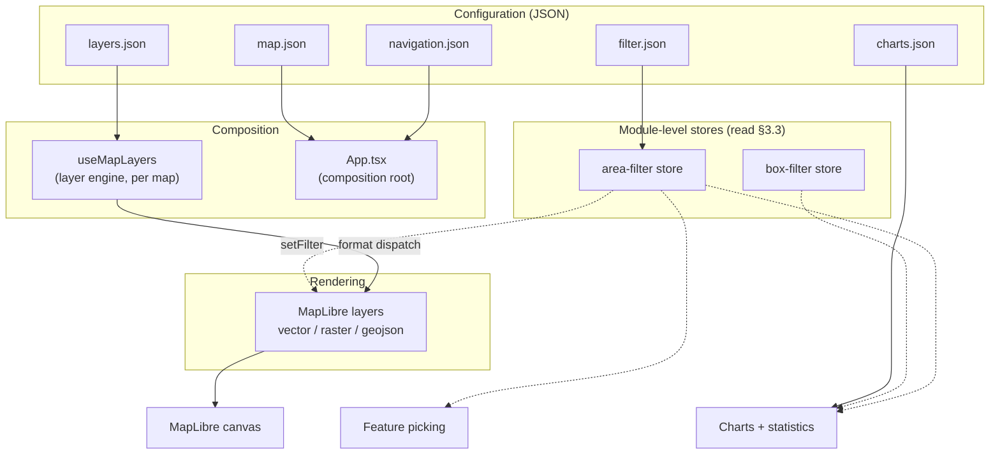
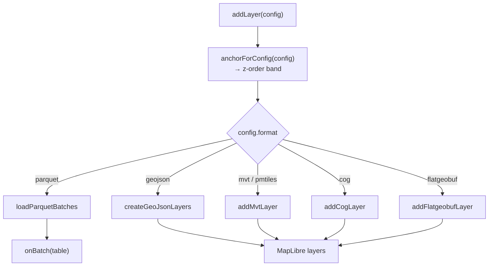
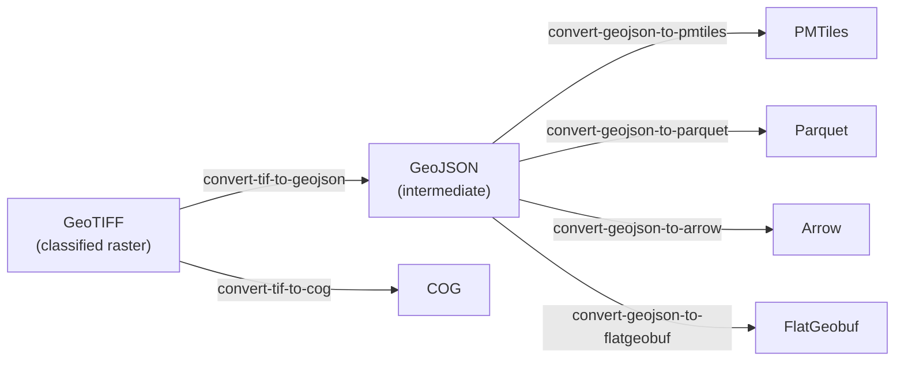

# De Ronde kaart — System Design Document

---

## 1. Introduction

De Ronde kaart is an opensource web-based map application for geospatial data. Focussed on transparant visualizations with clear styling, thorough metainfo while remaining performant.

## 2. Technology stack and major dependencies

#### Rendering

| Package | Why |
|---|---|
| `maplibre-gl` ^6.2 |Drawing geographic data |
| `react-map-gl` ^8.1 |Wrapper between maplibre-gl and React |

#### Data formats

One package per format the map can read; the *format* rationale (when to reach
for which) is §5.1, and the loading mechanics are §5.3.

| Package | We use | Why |
|---|---|---|
| `pmtiles` ^4.4 | `Protocol`, registered as `pmtiles://` | Serves a whole vector tileset from one file over range requests — no tile server |
| `@geomatico/maplibre-cog-protocol` ^0.9 | `cogProtocol` (registered as `cog://`), `setColorFunction` | Cloud-Optimized GeoTIFF as a MapLibre raster source. `setColorFunction` is the hook [system-design-styling.md](system-design-styling.md) uses to classify raster pixels through the same GeoStyler rules a vector layer uses |
| `flatgeobuf` ^4.4 | `deserialize` from the ESM build (`flatgeobuf/lib/mjs/geojson.js`) | Bbox-filtered streaming reads against the file's packed Hilbert R-tree — large vector data browsed at high zoom without tiling it first (§5.3) |
| `apache-arrow` ^21.1 | `Table`, `tableFromIPC` | The in-memory columnar table every analytics path consumes: chart aggregation, statistics and the filter dropdowns all read Arrow (§7) |
| slim adaptation of `parquet-wasm` | `readParquet`, `readParquetStream`, plus the init promise | Decodes the Parquet attribute sidecars to Arrow IPC.|

#### UI

| Package | We use | Why |
|---|---|---|
| `react`·`react-dom` ^19.2 | — | |
| `@base-ui/react` ^1.3 | `Button` and `Dialog` | User interface elements for interaction |
| `material-symbols` ^0.45 | `@import "material-symbols/outlined.css"`, rendered as ligature text by `Icon`/`NavIcon` | Icon's such as the `share` icon |

#### Charts

| Package | We use | Why |
|---|---|---|
| `d3-shape` ^3.2 | `pie` (donut) |  |
| `d3-scale` ^4.0 | `scaleLinear`, `scaleBand` (bar), `scalePoint` (line) | Domain→range mapping including the band/point padding rules |

### Build tooling

`vite` ^8.0 with `@vitejs/plugin-react` and `@tailwindcss/vite`;
`typescript` ~5.9; `eslint` ^10 with `typescript-eslint` ^8,
`eslint-plugin-react-hooks` ^7 and `eslint-plugin-react-refresh`.

### Indirect dependencies

Browser features the app needs, and what breaks without each:

| Capability | Role | Without it |
|---|---|---|
| **WebGL2** | The renderer. MapLibre 6 calls `getContext("webgl2")` and has no WebGL1 path | No map at all |
| **Canvas 2D** | PNG export and the Power BI snapshot ([map-capture.ts](../src/lib/map-capture.ts)), hatch-pattern sprites ([hatch-pattern.ts](../src/layers/hatch-pattern.ts)), icon sprites | Export and hatch fills fail; the map still renders |
| **Module Web Workers** | MapLibre parses tiles off-thread; the worker is a separate ESM file located via `import.meta.url` | No tile is ever parsed — see the `setWorkerUrl` note above |
| **WebAssembly** | Slim adaptation `parquet-wasm` decodes the attribute sidecars | Charts, Kerncijfers and filter dropdowns go empty; map layers are unaffected (§7) |
| **HTTP range requests (206)** | PMTiles, COG and FlatGeobuf read slices of one large file; Parquet streams column chunks | PMTiles/COG/FGB layers fail outright; Parquet falls back to a whole-file read (§5.3) |
| **`postMessage` + iframe embedding** | The Power BI visual and the circular embed drive the app through it (§10) | Embedded deployments lose all external control |
| **`Content-Encoding: br`/`gzip`** | `dist/` ships precompressed; nginx serves the `.br`/`.gz` siblings (§12) | Assets still serve, uncompressed and several times larger |

### External runtime services

| Endpoint | Role |
|---|---|
| `tiles.openfreemap.org` | Vector basemap tiles (the unversioned `/planet` TileJSON), **glyph PBFs** (all map label text) and the sprite sheet — used by both basemaps, including "luchtfoto", whose labels are drawn over the PDOK imagery |
| `service.pdok.nl` | Aerial imagery WMTS behind the "luchtfoto" basemap |
| `maps.googleapis.com` | Street View panel, loaded lazily via the `callback=` readiness signal ([street-view.tsx](../src/components/ui/street-view.tsx)) |
| `fonts.gstatic.com` | Material Symbols SVG for a `map.json` `clickMarker.icon` given by name ([map-config.ts](../src/config/map-config.ts)) |
| The tenant data host | Every layer, sidecar and metadata fragment (`data.woonzorglimburg.nl`, `data.startanalyse2026.nl`) |

### Version constraints worth knowing

**See [system-design-version-constraints.md](system-design-version-constraints.md).**

---

## 3. Architecture overview



Four principles organise the system.

### 3.1 Config-driven

Five JSON files define behaviour (§11). The app ships with empty stubs in
`public/`; a tenant's real files in `configs/<project>/` are swapped in at build
or dev time, selected by the `VITE_CONFIG_PROJECT` environment variable. Two
projects exist today: `woonzorglimburg` (79 layers) and `startanalyse2026`
(199 layers).

### 3.2 One renderer, one style model

Everything draws through MapLibre: tiled vector data (MVT/PMTiles), rasters
(COG), viewport-loaded FlatGeobuf, and in-memory GeoJSON for host-pushed data
and the overlays (study area, annotations, click marker, selection box).

Styling is written once per layer and translated per target — MapLibre paint and
filter expressions for vector layers, a per-pixel colour function for COG. See
[system-design-styling.md](system-design-styling.md).

#### The MapLibre object model in brief

Enough of MapLibre's own model to read §5 and §6.

```
Map  ──owns──▶  Style ──▶ sources { id: Source }   data, no appearance
                      ├──▶ layers  [ Layer, … ]    appearance, ordered
                      ├──▶ sprite                  image atlas (icons, hatches)
                      └──▶ glyphs                  font atlas (labels)
```

**Map** — one per map view; this app runs two side by side for compare mode.
`react-map-gl` creates it, but every layer operation afterwards calls MapLibre
directly through `mapRef.current.getMap()`.

**Style** — one JSON document holding everything drawable. The consequence that
bites: changing basemap calls `setStyle()`, which replaces that document, so
**every source, layer, sprite image and anchor the app added is destroyed** and
must be re-applied (§14).

**Source** — data, no appearance. Three types: `vector` (a `{z}/{x}/{y}`
template, or a `pmtiles://` URL whose handler reads the archive header instead),
`raster` (`cog://`), and `geojson` (in-memory). Sources are shared between
layers.

**Layer** — one draw pass over one source. The app emits `fill`, `line`,
`circle`, `symbol`, `fill-extrusion`, `heatmap` and `raster`. For vector
sources, `source-layer` picks one layer *inside* the tiles; MapLibre has no
setter for it, which is why the timeseries stepper removes and re-adds layers
instead of mutating them.

**One config is not one layer.** `buildNativeLayerDefs`
([mvt-style.ts](../src/layers/mvt-style.ts)) emits one MapLibre layer per
GeoStyler rule, id `<format-prefix>-layer-<configId>-<ruleName>`. A 17-rule
layer is 17 MapLibre layers over one shared source, and add, remove, visibility,
filtering and picking all walk that same id list (§3.4).

**Order is the array.** `style.layers` is bottom-to-top, and that *is* the draw
order. `addLayer(spec, beforeId)` inserts directly below the named layer. The
app never reshuffles, because five invisible `background` anchor layers
partition the stack into bands and each config picks its band (§5.5).

**Three property bags per layer**, each with an in-place setter, so appearance
changes never require re-adding a layer:

| Bag | Holds | Setter |
|---|---|---|
| `paint` | Colour, width, opacity, radius — pure appearance | `setPaintProperty` |
| `layout` | Whether/how geometry becomes drawable: `visibility`, `icon-image`, label placement | `setLayoutProperty` |
| `filter` | Which features enter the layer at all | `setFilter` |

`filter` matters most for §6: a filtered-out feature is not drawn **and not
queryable**, so filtering the map and filtering picking are one act, not two.

**Expressions** are the style language — JSON arrays evaluated per feature and
zoom, e.g. `["==", ["get", "gm_code"], "GM0882"]`. Both translations produce
them: GeoStyler rules become `paint` and `filter` expressions, and the area
filter compiles its selection into one (§6).

**Sprite and glyphs** are style-owned image and font atlases. Icon symbolizers
must `addImage()` before `addLayer()`, and since `setStyle` wipes the sprite,
`hasImage` is re-checked on every add rather than cached.

**Querying only sees what is drawn.** `queryRenderedFeatures` is tile-clipped,
style-filtered and viewport-limited — not a data API. A feature outside the
viewport or above the source's max zoom is simply absent (§8).

**Protocols are global, not per map.** `addProtocol("pmtiles", …)` and
`addProtocol("cog", …)` are called at module scope in
[MapView.tsx](../src/components/map/MapView.tsx), so both maps share them;
registering per map would double-register.

### 3.3 Module stores for cross-cutting filter state

Filter selections live in **module-level stores**, not React state
([area-filter.ts](../src/layers/area-filter.ts),
[box-filter.ts](../src/layers/box-filter.ts)). MapLibre filter expressions,
feature picking and chart aggregation all read the same store directly; React
holds only a `version` counter, used as a cache key.

The reason: not all consumers are UI components. Picking runs from an event
handler, and chart aggregation walks an Arrow table outside the render path.
Threading a filter down to each through the component tree would be verbose and
easy to let drift out of sync.

**What a "store" is here.** Not a library and not a subscription mechanism: one
`const store` object at module scope, private to its file, plus the exported
functions that read and replace it. The module is a singleton, so both maps and
every non-React consumer see the same selection.

| | Area filter | Box filter |
|---|---|---|
| Shape | `{ version, levels: [{ key, codes: Set<string>, digits: string[] }] }` | `{ version, bbox: [minLng, minLat, maxLng, maxLat] \| null }` |
| Written by | `setAreaFilterSelection(Map<key, Set<code>>)` | `setBoxFilter(bbox \| null)` |
| Owning hook | [use-area-filter.ts](../src/hooks/use-area-filter.ts) | [use-box-select.ts](../src/hooks/use-box-select.ts) |
| Inactive when | `levels` is empty | `bbox` is `null` |

Each store has one **writer**, which replaces the state wholesale rather than
mutating part of it, bumps `version`, and returns it. Everything else is a
**reader**, one per consumer *shape* — the same predicate against whatever that
consumer holds: a MapLibre expression (`areaFilterExpression`), an Arrow row
(`arrowRowMatchesAreaFilter`, `arrowRowMatchesBoxFilter`), or a plain property
bag (`featureMatchesAreaFilter`). §6 covers the shared semantics.

Readers run across ~14k rows per redraw, so some derived state is precomputed
into the store: the area filter keeps each code's digit prefix alongside the raw
code, and both modules cache column resolution in a `WeakMap` keyed on the Arrow
batch or `Table`, invalidated by `version`.

**The `version` counter is the whole React bridge.** The writer returns it and
the owning hook parks it in state — `setVersion(setBoxFilter(next))` — so it is
the only store state React holds, and it is a cache key, never data. A bump does
two things: `useChartData` clears its cached aggregates, and
[App.tsx](../src/App.tsx) re-runs `setFilter` over the live layers. Charts use
`areaFilter.version + boxSelect.version` as one key; the sum works because both
counters only increase.

The cost: a store write is invisible to React on its own. Nothing re-renders
unless the owning hook's `setVersion` runs, so code reaching past the hook into
the store would filter the map but leave the sidebar showing a stale selection.

### 3.4 Single source of truth per concern

- **All layer mutation** goes through `useMapLayers`
  (`addLayer`/`removeLayer`/`hideLayer`/`toggleLayer`), whether it came from the
  navigation tree, the legend, a URL command, a Power BI message, or an
  annotation snapshot restore.
- **All camera framing** goes through [fly-to.ts](../src/lib/fly-to.ts)
  (`viewForBbox`, `flyToBbox`, `flyToView`), so the bbox→zoom heuristic is never
  duplicated. The Power BI visual relies on this: it sends a raw bbox and lets
  the app resolve it.
- **All native layer identity** comes from `buildNativeLayerDefs`
  ([mvt-style.ts](../src/layers/mvt-style.ts)), used for add, remove,
  visibility, filtering and picking alike.

---

## 4. Module structure

Code is split by responsibility, not by feature: one hook per capability, with
presentation kept out of the data engine.

`src/` holds **19,130 lines across 107 TypeScript files**.

| Directory | Files | Lines | Responsibility |
|---|---|---|---|
| [src/hooks/](../src/hooks/) | 30 | 5,532 | Feature logic — one hook per capability |
| [src/components/](../src/components/) | 36 | 5,052 | Presentation (map, legend, navigation, charts, annotations, share) |
| [src/layers/](../src/layers/) | 23 | 4,304 | The data engine: formats, loaders, styling, filtering, aggregation |
| [src/lib/](../src/lib/) | 11 | 1,388 | Pure utilities: capture, geometry, share URLs, formatting |
| [src/vendor/](../src/vendor/) | 2 | 1,082 | Generated parquet-wasm bindings |
| [src/config/](../src/config/) | 1 | 494 | `map.json` loading, UI flags, initial view |
| [src/types/](../src/types/) | 2 | 143 | Ambient declarations (annotations, Google Streetview) |

### Largest modules

| Lines | File | Note |
|---|---|---|
| 1126 | [use-map-layers.ts](../src/hooks/use-map-layers.ts) | Layer engine |
| 1099 | [App.tsx](../src/App.tsx) | Composition root |
| 977 | [parquet_wasm.d.ts](../src/vendor/parquet-wasm/parquet_wasm.d.ts) | Generated bindings |
| 697 | [map-capture.ts](../src/lib/map-capture.ts) | WebGL capture and PNG compositing |
| 562 | [legend.tsx](../src/components/ui/legend.tsx) | Legend rows, per-class toggles, drag reorder |
| 540 | [use-annotation-tool.ts](../src/hooks/use-annotation-tool.ts) | Drawing interaction model |
| 494 | [map-config.ts](../src/config/map-config.ts) | `map.json` validation |
| 489 | [annotation-style.ts](../src/layers/annotation-style.ts) | Annotation symbolizers |
| 446 | [mvt-style.ts](../src/layers/mvt-style.ts) | GeoStyler → MapLibre paint translation |

### The hooks layer

Thirty hooks, each owning one capability: `use-map-layers`, `use-layer-handlers`,
`use-navigation`, `use-nav-expansion`, `use-area-filter`, `use-host-filter`,
`use-box-select`, `use-chart-data`, `use-charts-panel`, `use-feature-pick`,
`use-click-popup`, `use-map-pointer`, `use-annotations`, `use-annotation-tool`,
`use-annotation-commands`, `use-annotation-source`, `use-collab`,
`use-url-commands`, `use-embed-data`, `use-map-snapshot`, `use-share-state`,
`use-study-area-layer`, `use-filtered-study-area`, `use-click-marker-layer`,
`use-selection-box-layer`, `use-hover-cursor`, `use-basemap`,
`use-panel-minimize`, `use-auto-collapse`, `use-session-flag`.

Nearly all of them are extractions from `App.tsx` rather than new features. The
most recent five, and the reason each is a unit:

- **`use-basemap`** — the basemap cycle. Self-contained; the *resync* that a style
  swap requires stays in App, because the list of overlays to re-add is per-map.
- **`use-panel-minimize`** — the three session-persisted window flags plus the
  small-screen auto-collapse. Grouped because auto-collapse writes all three
  together in the priority order Navigatie → Statistieken → Kaartlagen. Its
  setters are passed through untouched: `useSessionFlag`'s `toggle` closes over
  its value, and re-wrapping it would defeat the memos that keep the `Sidebar`
  from re-rendering per map frame.
- **`use-charts-panel`** — which layer the statistics panel shows. Owns the
  selected id rather than exposing it, because the id is deliberately *kept* when
  its layer is removed (so re-adding restores the selection) and only the resolved
  config reports "the layer is actually gone".
- **`use-click-popup`** — the click marker, Street View target, popup anchor, and
  which map's pick is on show. One concern despite having been declared 500 lines
  apart in App: the popup is shared, so closing it must clear both maps' picks.
- **`use-map-pointer`** — the pointer fan-out across picking, hover, area-select,
  annotation drawing and collab presence. Takes *both* sides at once rather than
  being a per-map hook: a click on one map clears the other's pick, so a per-side
  hook would need its sibling's `clear` — circular.

Earlier rounds produced `use-share-state`, `use-layer-handlers` and
`use-annotation-commands` (the annotation write/pick operations, while `App` keeps
the parts that interleave with rendering); `use-annotation-source` is the former
`use-annotation-layers`, renamed for what it owns. `use-nav-expansion` holds the
sidebar treeview's expand/collapse state in `sessionStorage`, lifted out of the
tree rows because collapsing a branch unmounts its subtree, which would otherwise
discard the state of everything inside it.

---

## 5. Layers

### 5.1 Formats

`LayerFormat` ([types.ts](../src/layers/types.ts)) admits eight values.
`geojson` is in-memory only and cannot be declared in `layers.json`;
`composite` is a grouping construct, not a data format.

| Format | What it is | Loader | Renderer |
|---|---|---|---|
| `geojson` | In-memory `FeatureCollection` (Power BI push) | none — `config.data` | MapLibre (GeoJSON source) |
| `pmtiles` | Single-file vector tile archive, `pmtiles://` protocol | MapLibre source | MapLibre (vector) |
| `mvt` | Vector tile template `{z}/{x}/{y}.pbf` | MapLibre source | MapLibre (vector) |
| `flatgeobuf` | FGB with packed Hilbert R-tree, bbox-filtered range reads | [flatgeobuf-loader.ts](../src/layers/flatgeobuf-loader.ts) | MapLibre (GeoJSON source) |
| `cog` | Cloud-Optimized GeoTIFF, `cog://` protocol | protocol handler | MapLibre (raster) |
| `composite` | Zoom-banded children under one legend entry | [composite-manager.ts](../src/layers/composite-manager.ts) | delegates per child |

### 5.2 Format dispatch

All routing happens in one place: `dispatchFormatLoad`
([use-map-layers.ts:112](../src/hooks/use-map-layers.ts#L112)), shared by
top-level layers and composite children.



### 5.3 Styling

**See [system-design-styling.md](system-design-styling.md).**

### 5.4 Z-ordering

New layers are inserted relative to **named invisible anchor layers**.

```ts
export const ANCHORS = {
  background: "background-layers", // for instance meadows or water
  map: "map-layers",        // default
  foreground: "foreground-layers",
  overlay: "overlay-layers", // topographic elements such as roads and labels
  studyarea: "studyarea-layers"
} as const;
```

---

## 6. Filtering

Two independent systems with different scopes.

| | Area filter | Box filter |
|---|---|---|
| Source | `filter.json` dropdowns (Gemeente/Wijk/Buurt) | User-drawn rectangle |
| MapLibre rendering | ✅ (`setFilter`) | ❌ |
| Feature picking | ✅ | ❌ |
| Charts / statistics | ✅ | ✅ |
| COG (raster) | ❌ | n/a |

**Area filter** ([area-filter.ts](../src/layers/area-filter.ts)) — cascading
administrative selection. The rules: *AND across levels, OR within a level,
inapplicable levels skipped, empty selection passes everything*. Three
implementations, one per consumer shape: a MapLibre filter expression for vector
layers, an Arrow row predicate for aggregation over the sidecar tables, and a
plain-props predicate (`featureMatchesAreaFilter`). The last has no caller today
— picking gets filtering for free, see below — but it is the clearest statement
of the semantics in plain JavaScript.

`setFilter` removes non-matching features entirely, so they are neither drawn
nor pickable. There is no "rendered but transparent" state to special-case.

Because CBS area codes nest (`GM0882` ⊂ `WK088200` ⊂ `BU08820000`), a layer
without the exact key column falls back to digit-prefix matching over
`bu_code`/`wk_code`/`gm_code`.

**Box filter** ([box-filter.ts](../src/layers/box-filter.ts)) — restricts *only*
chart aggregation; map rendering and picking are untouched. A row passes when its
representative point (the point coordinate, or first vertex for lines/polygons)
falls inside the box. It handles nested GeoArrow encodings and `geoarrow.wkb`,
the latter by reading only the WKB header — a province-wide polygon can carry
thousands of vertices and the test needs one.

**Composition** happens in exactly one place, chart aggregation:

```ts
function rowPassesFilters(table: Table, index: number): boolean {
  return arrowRowMatchesAreaFilter(rowInfo(table, index))
      && arrowRowMatchesBoxFilter(table, index);
}
```

Their two version counters are summed into a single cache key, so either
changing invalidates cached aggregates.

---

## 7. Charts and statistics

[charts.json](../configs/woonzorglimburg/charts.json) is a **library** of chart
definitions referenced by id from a layer's `charts` array. Types: donut, bar,
line. Aggregations: sum, mean, count. A layer may also declare `statistics`
(the "Kerncijfers" grid) with `sum`/`count`/`mean`/`variance`.

Aggregation ([chart-data.ts](../src/layers/chart-data.ts)) is a single pass over
the table, skipping rows that fail the combined filters. Variance uses
**Welford's algorithm** for numerical stability. Group-by charts fold everything
past the top 8 groups into one "Overig" datum. Results are cached on
`(table, spec, filter version)` — keyed on the **table**, not the layer, so two
layers sharing a sidecar compute once.

### `attributeSource` — why tile layers need a sidecar

Charts aggregate the **entire dataset**, but vector tiles only contain the
current viewport at the current zoom. Aggregating from tiles would produce
numbers that silently change as the user pans.

A pmtiles/mvt/cog layer therefore points `attributeSource` at a `.parquet` or
`.arrow` sidecar carrying the same rows. The map renders from `source`; the
analytics panel reads `attributeSource`. Dispatch is on the **sidecar's own
extension**, not the layer's format — the point is that the two differ.

A tile-format layer declaring charts *without* a sidecar renders an empty panel
and warns once. Not hypothetical: it is what happened when layers were migrated
from Parquet to PMTiles, and the silence is why it went unnoticed.

---

## 8. Feature catalogue

| Capability | Implemented in | Notes |
|---|---|---|
| **Dual map / comparison** | [App.tsx](../src/App.tsx), [comparison-slider.tsx](../src/components/ui/comparison-slider.tsx) | Two `MapView`s, shared camera, CSS `clipPath` split. Right map mounts only when it holds a comparable layer |
| **Navigation tree** | [use-navigation.ts](../src/hooks/use-navigation.ts), [navigation/](../src/components/ui/navigation/) | `top` or `sidebar` mode, chosen in `map.json` |
| **Legend** | [legend.tsx](../src/components/ui/legend.tsx), [legend-style.ts](../src/lib/legend-style.ts) | Per-layer and per-rule toggles, move between maps, basemap cycling |
| **Feature info** | [use-feature-pick.ts](../src/hooks/use-feature-pick.ts), [feature-info.tsx](../src/components/ui/feature-info.tsx) | `queryRenderedFeatures` over the clickable layers |
| **Street View** | [street-view.tsx](../src/components/ui/street-view.tsx) | Lazy Google Maps load via `callback=` readiness signal |
| **Area filter** | [use-area-filter.ts](../src/hooks/use-area-filter.ts), [FilterSection.tsx](../src/components/ui/sidebar/FilterSection.tsx) | Also replaces the study area and flies to the selection |
| **Box selection** | [use-box-select.ts](../src/hooks/use-box-select.ts) | Scopes statistics only |
| **Charts panel** | [charts/](../src/components/charts/), [use-chart-data.ts](../src/hooks/use-chart-data.ts) | Up to 4 charts + Kerncijfers |
| **Annotations** | [use-annotation-tool.ts](../src/hooks/use-annotation-tool.ts), [use-annotation-source.ts](../src/hooks/use-annotation-source.ts) | Circle / polygon / pin, each carrying a session snapshot |
| **Timeseries** | [use-map-layers.ts](../src/hooks/use-map-layers.ts), `TimeseriesControl` | Play/scrub over a `%YEAR%` placeholder in `sourceLayer` |
| **Sharing** | [share-url.ts](../src/lib/share-url.ts), [ShareDialog.tsx](../src/components/share/ShareDialog.tsx) | Hash-encoded state, share link, circular PNG export |
| **PNG export** | [map-capture.ts](../src/lib/map-capture.ts) | 2048² circular export with legend and callouts |
| **Circular embed** | [CircularExportView.tsx](../src/components/share/CircularExportView.tsx) | `?embed=circular` or `open-circular` message |

## 9. Configuration system

| File | Loader | Drives |
|---|---|---|
| `layers.json` | [config.ts](../src/layers/config.ts) `loadLayerConfigs` | Every renderable layer |
| `navigation.json` | [navigation.ts](../src/layers/navigation.ts) `loadNavigation` | Category tree |
| `charts.json` | [charts.ts](../src/layers/charts.ts) `loadChartsConfig` | Chart library |
| `filter.json` | [area-filter.ts](../src/layers/area-filter.ts) `loadAreaFilterConfig` | Area filter levels |
| `map.json` | [map-config.ts](../src/config/map-config.ts) `loadMapConfig` | Initial view, study area, ~15 UI flags |

All five are cached at module level after first load.

---

## 10. Data pipeline

The first stage uses GeoDMS to translate source data into intermediate
`.geojson` files. Simplification can happen here, preserving topology so shapes
stay correctly joined at lower zoom levels. An experimental alternative uses
**mapshaper** via `convert-tif-to-geojson.py`. Those intermediate files then go
into the converters below.

[data/](../data/) holds eight Python converters that turn source rasters and
vectors into the formats the app reads. They use PEP 723 inline dependency
metadata, so `uv run <script>` needs no environment setup.



Choosing an output: **COG** for continuous surfaces (elevation, imagery);
**PMTiles** for classified polygons at province scale; **Parquet/Arrow** when
charts need whole-dataset attributes; **FlatGeobuf** for large vector data
browsed at high zoom.

Workflow: convert → upload to the data host → reference the URL from
`layers.json`.

---

---

## 11. (optional) subsystems

**Collaboration on the map see [system-design-collaboration.md](system-design-collaboration.md).**
**Power-Bi custom visual see [system-design-power-bi.md](system-design-power-bi.md).**

---