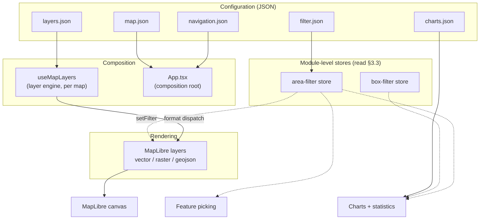
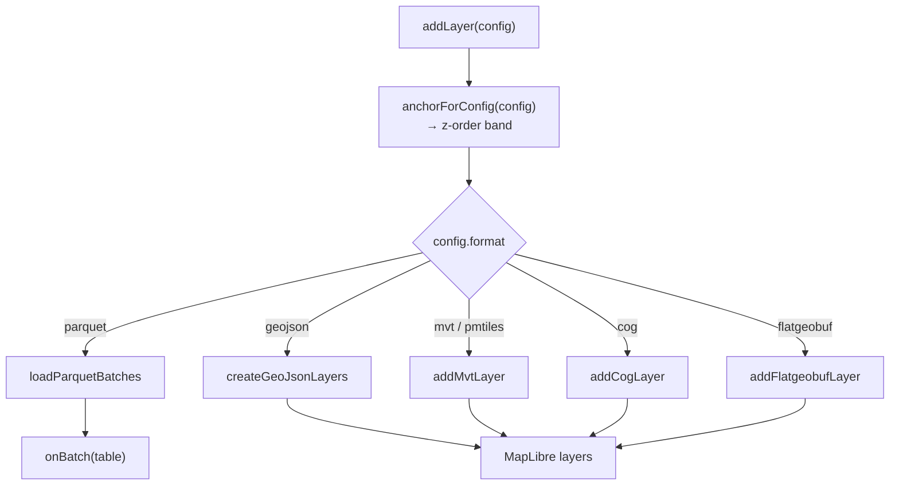
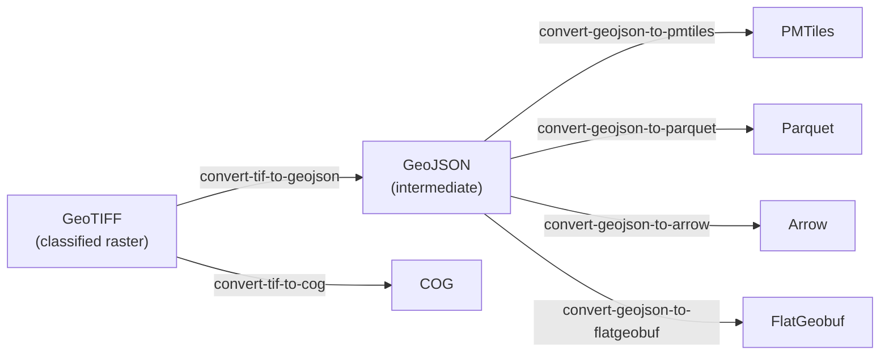
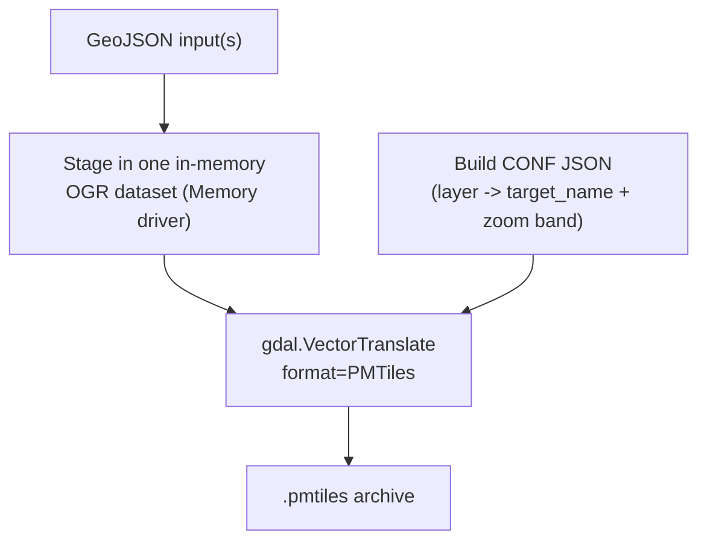

# De Ronde kaart — System Design Document

---

## 1. Introduction

De Ronde kaart is an opensource web-based map application for geospatial data. Focussed on transparant visualizations with clear styling, thorough metainfo while remaining performant.

This document describes *how* the system is built — components, state
management, data formats. What the application is meant to do, and for whom, is
described in [functional-design.md](functional-design.md).

## 2. Technology stack and major dependencies

#### Rendering

| Package | Why |
|---|---|
| `maplibre-gl` ^6.2 |Drawing geographic data |

#### Data formats

The formats the map can read.

| Format | Description |
|---|---|
| [PMTiles](https://github.com/protomaps/PMTiles/blob/main/spec/v3/spec.md) | Single-file tile archive with an embedded directory index. Serves a whole tileset over HTTP range requests, so no tile server is needed. The dominant format here — most layers ship as PMTiles |
| [Mapbox Vector Tile](https://github.com/mapbox/vector-tile-spec) | Protobuf-encoded vector tiles served per-tile from a URL template. Geometry is clipped per tile, which is why polygon outlines can show seams |
| [Cloud-Optimized GeoTIFF](https://cogeo.org/) | GeoTIFF laid out with internal tiling and overviews so a viewer can range-request just the resolution and area it needs. Drawn as a raster source, with pixel values classified through the same GeoStyler rules a vector layer uses |
| [FlatGeobuf](https://flatgeobuf.org/) | Streamable binary vector format with a packed Hilbert R-tree index, allowing bbox-filtered reads. Lets large vector datasets be browsed at high zoom without tiling them first (§5.3) |
| [GeoJSON](https://datatracker.ietf.org/doc/html/rfc7946) | Plain-text vector geometry. Used for small or inline datasets, including the in-memory data a Power BI host pushes in |
| [Apache Arrow](https://arrow.apache.org/docs/format/Columnar.html) | In-memory columnar table format. Every analytics path consumes it: chart aggregation, statistics and the filter dropdowns all read Arrow (§7) |
| [Apache Parquet](https://parquet.apache.org/docs/file-format/) | Compressed columnar file format. Carries the attribute sidecars that accompany the tiled geometry, decoded to Arrow in a WebAssembly worker |

#### UI

| Package | We use | Why |
|---|---|---|
| `solid-js` ^1.9 | `createSignal`/`createMemo`/`createEffect`, `Show`/`For`, `Portal` | The reactive layer. Compiles JSX to fine-grained DOM updates: there is no virtual DOM and no re-render, so a signal write touches only the nodes bound to it |
| — | [button.tsx](../src/components/ui/button.tsx), [dialog.tsx](../src/components/ui/dialog.tsx) | The two UI primitives are hand-rolled (~80 lines): a styled `<button>` and a `<Portal>`-based dialog with its own focus trap, `Escape` and backdrop-click. No component kit is used |
| `material-symbols` ^0.45 | `@import "material-symbols/outlined.css"`, rendered as ligature text by `Icon`/`NavIcon` | Icon's such as the `share` icon |

#### Charts

| Package | We use | Why |
|---|---|---|
| `d3-shape` ^3.2 | `pie` (donut) |  |
| `d3-scale` ^4.0 | `scaleLinear`, `scaleBand` (bar), `scalePoint` (line) | Domain→range mapping including the band/point padding rules |

### Build tooling

`vite` ^8.0 with `vite-plugin-solid` and `@tailwindcss/vite`;
`typescript` ~5.9 (`jsx: "preserve"`, `jsxImportSource: "solid-js"` — Solid's
Babel transform, not TypeScript, lowers the JSX); `eslint` ^10 with
`typescript-eslint` ^8 and `eslint-plugin-solid`, whose `solid/reactivity` rule
is set to **error**: Solid props are getters, so destructuring one reads it once
and the component then silently never updates.

### Indirect dependencies

Browser features the app needs, and what breaks without each:

| Capability | Role | Without it |
|---|---|---|
| **WebGL2** | The renderer. MapLibre 6 calls `getContext("webgl2")` and has no WebGL1 path | No map at all |
| **Canvas 2D** | PNG export and the Power BI snapshot ([map-capture.ts](../src/lib/map-capture.ts)), hatch-pattern sprites ([hatch-pattern.ts](../src/layers/hatch-pattern.ts)), icon sprites | Export and hatch fills fail; the map still renders |
| **Module Web Workers** | MapLibre parses tiles off-thread; the worker is a separate ESM file located via `import.meta.url` | No tile is ever parsed — see the `setWorkerUrl` note above |
| **WebAssembly** | Slim adaptation `parquet-wasm` decodes the attribute sidecars | Charts, Kerncijfers and filter dropdowns go empty; map layers are unaffected (§7) |
| **HTTP range requests (206)** | PMTiles, COG and FlatGeobuf read slices of one large file; Parquet streams column chunks | PMTiles/COG/FGB layers fail outright; Parquet falls back to a whole-file read (§5.3) |
| **`postMessage` + iframe embedding** | The Power BI visual and the circular embed drive the app through it (§10) | Embedded deployments lose all external control |
| **`Content-Encoding: br`/`gzip`** | `dist/` ships precompressed; nginx serves the `.br`/`.gz` siblings (§12) | Assets still serve, uncompressed and several times larger |

### External runtime services

| Endpoint | Role |
|---|---|
| `tiles.openfreemap.org` | Vector basemap tiles (the unversioned `/planet` TileJSON), **glyph PBFs** (all map label text) and the sprite sheet — used by both basemaps, including "luchtfoto", whose labels are drawn over the PDOK imagery |
| `service.pdok.nl` | Aerial imagery WMTS behind the "luchtfoto" basemap |
| `maps.googleapis.com` | Street View panel, loaded lazily via the `callback=` readiness signal ([street-view.tsx](../src/components/ui/street-view.tsx)) |
| `fonts.gstatic.com` | Material Symbols SVG for a `map.json` `clickMarker.icon` given by name ([map-config.ts](../src/config/map-config.ts)) |
| The tenant data host | Every layer, sidecar and metadata fragment (`data.woonzorglimburg.nl`, `data.startanalyse2026.nl`) |

### Version constraints worth knowing

**See [system-design-version-constraints.md](system-design-version-constraints.md).**

---

## 3. Architecture overview



Four principles organise the system.

### 3.1 Config-driven

Nine JSON files define behaviour (§11) — five for the map, four for the dashboard. The app ships with empty implementations in
`public/`; a tenant's real files in `configs/<project>/` are swapped in at build
or dev time, selected by the `VITE_CONFIG_PROJECT` environment variable.

### 3.2 One renderer, one style model

Everything draws through MapLibre: tiled vector data (MVT/PMTiles), rasters
(COG), viewport-loaded FlatGeobuf, and in-memory GeoJSON for host-pushed data
and the overlays (study area, annotations, click marker, selection box).

Styling is written once per layer and translated per target — MapLibre paint and
filter expressions for vector layers, a per-pixel colour function for COG. See
[system-design-styling.md](system-design-styling.md).

#### The MapLibre object model in brief

```
Map  ──owns──▶  Style ──▶ sources { id: Source }   data, no appearance
                      ├──▶ layers  [ Layer, … ]    appearance, ordered
                      ├──▶ sprite                  image atlas (icons, hatches)
                      └──▶ glyphs                  font atlas (labels)
```

**Map** — one per map view; this app runs two side by side for compare mode.

**Style** — one JSON document holding everything drawable.

**Source** — data, no appearance. Three types: `vector` (a `{z}/{x}/{y}`
template, or a `pmtiles://` URL whose handler reads the archive header instead),
`raster` (`cog://`), and `geojson` (in-memory). Sources are shared between
layers.

**Layer** — one draw pass over one source. The app emits `fill`, `line`,
`circle`, `symbol`, `fill-extrusion`, `heatmap` and `raster`. For vector
sources, `source-layer` picks one layer *inside* the tiles; MapLibre has no
setter for it, which is why the timeseries stepper removes and re-adds layers
instead of mutating them.

**One config is not one layer.** `buildNativeLayerDefs`
([mvt-style.ts](../src/layers/mvt-style.ts)) emits one MapLibre layer per
GeoStyler rule, id `<format-prefix>-layer-<configId>-<ruleName>`. A 17-rule
layer is 17 MapLibre layers over one shared source, and add, remove, visibility,
filtering and picking all walk that same id list (§3.4).

**Order is the array.** `style.layers` is bottom-to-top. The
app never reshuffles, because five invisible `background` anchor layers
partition the stack into bands and each config picks its band (§5.5).

**Expressions** are the style language — JSON arrays evaluated per feature and
zoom, e.g. `["==", ["get", "gm_code"], "GM0882"]`. Both translations produce
them: GeoStyler rules become `paint` and `filter` expressions, and the area
filter compiles its selection into one (§6).

**Sprite and glyphs** are style-owned image and font atlases. Icon symbolizers
must `addImage()` before `addLayer()`, and since `setStyle` wipes the sprite,
`hasImage` is re-checked on every add rather than cached.

**Querying only sees what is drawn.** `queryRenderedFeatures` is tile-clipped,
style-filtered and viewport-limited — not a data API. A feature outside the
viewport or above the source's max zoom is simply absent (§8).

**Protocols are global, not per map.** `addProtocol("pmtiles", …)` and
`addProtocol("cog", …)` are called at module scope in
[MapView.tsx](../src/components/map/MapView.tsx), so both maps share them;
registering per map would double-register.

### 3.3 Module stores for cross-cutting filter state

Filter selections live in **module-level stores** outside any component
([area-filter.ts](../src/layers/area-filter.ts),
[box-filter.ts](../src/layers/box-filter.ts)). MapLibre filter expressions,
feature picking and chart aggregation all read the same store directly.

Each store *is* a Solid signal, so there is no bridge: a component that reads
`areaFilterLevels()` or `boxFilter()` subscribes to it like any other signal,
and the imperative callers (a `moveend` listener, a worker completion) call the
same accessor synchronously from outside every reactive scope.

| | Area filter | Box filter |
|---|---|---|
| Shape | `Accessor<[{ key, codes: Set<string>, digits: string[] }]>` | `Accessor<[minLng, minLat, maxLng, maxLat] \| null>` |
| Written by | `setAreaFilterSelection(Map<key, Set<code>>)` | `setBoxFilter(bbox \| null)` |
| Owning hook | [use-area-filter.ts](../src/hooks/use-area-filter.ts) | [use-box-select.ts](../src/hooks/use-box-select.ts) |
| Inactive when | `levels` is empty | `bbox` is `null` |

Each store has one **writer**, which replaces the state wholesale rather than
mutating part of it, bumps `version`, and returns it. Everything else is a
**reader**, one per consumer *shape* — the same predicate against whatever that
consumer holds: a MapLibre expression (`areaFilterExpression`), an Arrow row
(`arrowRowMatchesAreaFilter`, `arrowRowMatchesBoxFilter`), or a plain property
bag (`featureMatchesAreaFilter`). §6 covers the shared semantics.

Readers run across ~14k rows per redraw, so some derived state is precomputed
into the store: the area filter keeps each code's digit prefix alongside the raw
code, and both modules cache column resolution in a `WeakMap` keyed on the Arrow
batch or `Table`, invalidated by the identity of the current levels array.

**This replaced a `version` counter.** Under React the stores were not
observable, so each writer bumped an integer that the owning hook parked in
state; that counter was the entire bridge between the store and the UI. With
signals the state itself propagates, so the counter is gone from both stores.
One derived counter survives, in
[chart-data.ts](../src/layers/chart-data.ts): `filterEpoch()` increments when
either store changes, because the chart aggregation cache is keyed by a
primitive.

### 3.4 Single source of truth per concern

- **All layer mutation** goes through `useMapLayers`
  (`addLayer`/`removeLayer`/`hideLayer`/`toggleLayer`), whether it came from the
  navigation tree, the legend, a URL command, a Power BI message, or an
  annotation snapshot restore.
- **All camera framing** goes through [fly-to.ts](../src/lib/fly-to.ts)
  (`viewForBbox`, `flyToBbox`, `flyToView`), so the bbox→zoom heuristic is never
  duplicated. The Power BI visual relies on this: it sends a raw bbox and lets
  the app resolve it.
- **All native layer identity** comes from `buildNativeLayerDefs`
  ([mvt-style.ts](../src/layers/mvt-style.ts)), used for add, remove,
  visibility, filtering and picking alike.

---

## 4. Module structure

Code is split by responsibility, not by feature: one hook per capability, with
presentation kept out of the data engine.

`src/` holds **22,487 lines across 120 TypeScript files**.

| Directory | Files | Lines | Responsibility |
|---|---|---|---|
| [src/components/](../src/components/) | 40 | 6,540 | Presentation (map, legend, navigation, charts, annotations, share) |
| [src/hooks/](../src/hooks/) | 32 | 5,622 | Feature logic — one hook per capability |
| [src/layers/](../src/layers/) | 27 | 5,387 | The data engine: formats, loaders, styling, filtering, aggregation |
| [src/lib/](../src/lib/) | 14 | 1,734 | Pure utilities: capture, geometry, share URLs, formatting |
| [src/vendor/](../src/vendor/) | 2 | 1,082 | Generated parquet-wasm bindings |
| [src/config/](../src/config/) | 1 | 541 | `map.json` loading, UI flags, initial view |
| [src/types/](../src/types/) | 2 | 143 | Ambient declarations (annotations, Google Streetview) |
| `src/` (root) | 2 | 1,438 | `App.tsx` composition root and the `main.tsx` bootstrap |

"Hooks" is kept as the directory name and the `use*` prefix, but these are Solid
**primitives**: each runs once, at setup, and wires signals and effects. They are
not re-invoked per render — there is no render — so the rules that governed React
hooks (call order, dependency arrays, stable identities) do not apply.

### Largest modules

| Lines | File | Note |
|---|---|---|
| 1390 | [App.tsx](../src/App.tsx) | Composition root |
| 1211 | [use-map-layers.ts](../src/hooks/use-map-layers.ts) | Layer engine |
| 977 | [parquet_wasm.d.ts](../src/vendor/parquet-wasm/parquet_wasm.d.ts) | Generated bindings |
| 720 | [map-capture.ts](../src/lib/map-capture.ts) | WebGL capture and PNG compositing |
| 642 | [legend.tsx](../src/components/ui/legend.tsx) | Legend rows, per-class toggles, drag reorder |
| 541 | [map-config.ts](../src/config/map-config.ts) | `map.json` validation |
| 525 | [use-annotation-tool.ts](../src/hooks/use-annotation-tool.ts) | Drawing interaction model |
| 506 | [mvt-style.ts](../src/layers/mvt-style.ts) | GeoStyler → MapLibre paint translation |
| 489 | [annotation-style.ts](../src/layers/annotation-style.ts) | Annotation symbolizers |

### The hooks layer

Thirty-two hooks, each owning one capability: `use-map-layers`,
`use-layer-handlers`, `use-filter-layers`, `use-navigation`, `use-nav-expansion`,
`use-area-filter`, `use-host-filter`, `use-box-select`, `use-chart-data`,
`use-charts-panel`, `use-feature-pick`, `use-feature-highlight`,
`use-click-popup`, `use-map-pointer`, `use-annotations`, `use-annotation-tool`,
`use-annotation-commands`, `use-annotation-source`, `use-collab`,
`use-url-commands`, `use-embed-data`, `use-map-snapshot`, `use-share-state`,
`use-study-area-layer`, `use-filtered-study-area`, `use-click-marker-layer`,
`use-selection-box-layer`, `use-hover-cursor`, `use-basemap`,
`use-panel-minimize`, `use-auto-collapse`, `use-session-flag`.

Every one of them takes and returns **accessors** (`Accessor<T>`), never plain
snapshots: that is what lets a caller pass state that does not exist yet — the
right map's handle, a layer stack still loading — without the hook re-running.

Nearly all of them are extractions from `App.tsx` rather than new features. The
most recent five, and the reason each is a unit:

- **`use-basemap`** — the basemap cycle. Self-contained; the *resync* that a style
  swap requires stays in App, because the list of overlays to re-add is per-map.
- **`use-panel-minimize`** — the three session-persisted window flags plus the
  small-screen auto-collapse. Grouped because auto-collapse writes all three
  together in the priority order Navigatie → Statistieken → Kaartlagen.
- **`use-charts-panel`** — which layer the statistics panel shows. Owns the
  selected id rather than exposing it, because the id is deliberately *kept* when
  its layer is removed (so re-adding restores the selection) and only the resolved
  config reports "the layer is actually gone".
- **`use-click-popup`** — the click marker, Street View target, popup anchor, and
  which map's pick is on show. One concern despite having been declared 500 lines
  apart in App: the popup is shared, so closing it must clear both maps' picks.
- **`use-map-pointer`** — the pointer fan-out across picking, hover, area-select,
  annotation drawing and collab presence. Takes *both* sides at once rather than
  being a per-map hook: a click on one map clears the other's pick, so a per-side
  hook would need its sibling's `clear` — circular.

Earlier rounds produced `use-share-state`, `use-layer-handlers` and
`use-annotation-commands` (the annotation write/pick operations, while `App` keeps
the parts that interleave with rendering); `use-annotation-source` is the former
`use-annotation-layers`, renamed for what it owns. `use-nav-expansion` holds the
sidebar treeview's expand/collapse state in `sessionStorage`, lifted out of the
tree rows because collapsing a branch unmounts its subtree, which would otherwise
discard the state of everything inside it.

---

## 5. Layers

### 5.1 Formats

See chapter 2.

### 5.2 Format dispatch

All routing happens in one place: `dispatchFormatLoad`
([use-map-layers.ts:112](../src/hooks/use-map-layers.ts#L112)), shared by
top-level layers and composite children.



### 5.3 Styling

**See [system-design-styling.md](system-design-styling.md).**

### 5.4 Z-ordering

New layers are inserted relative to **named invisible anchor layers**.

```ts
export const ANCHORS = {
  background: "background-layers", // for instance meadows or water
  map: "map-layers",        // default
  foreground: "foreground-layers",
  overlay: "overlay-layers", // topographic elements such as roads and labels
  studyarea: "studyarea-layers"
} as const;
```

---

## 6. Filtering

Two independent systems with different scopes.

| | Area filter | Box filter |
|---|---|---|
| Source | `filter.json` dropdowns (Gemeente/Wijk/Buurt) | User-drawn rectangle |
| MapLibre rendering | ✅ (`setFilter`) | ❌ |
| Feature picking | ✅ | ❌ |
| Charts / statistics | ✅ | ✅ |
| COG (raster) | ❌ | n/a |

**Area filter** ([area-filter.ts](../src/layers/area-filter.ts)) — cascading
administrative selection. The rules: *AND across levels, OR within a level,
inapplicable levels skipped, empty selection passes everything*. Three
implementations, one per consumer shape: a MapLibre filter expression for vector
layers, an Arrow row predicate for aggregation over the sidecar tables, and a
plain-props predicate (`featureMatchesAreaFilter`). The last has no caller today
— picking gets filtering for free, see below — but it is the clearest statement
of the semantics in plain JavaScript.

`setFilter` removes non-matching features entirely, so they are neither drawn
nor pickable. There is no "rendered but transparent" state to special-case.

Because CBS area codes nest (`GM0882` ⊂ `WK088200` ⊂ `BU08820000`), a layer
without the exact key column falls back to digit-prefix matching over
`bu_code`/`wk_code`/`gm_code`.

**Box filter** ([box-filter.ts](../src/layers/box-filter.ts)) — restricts *only*
chart aggregation; map rendering and picking are untouched. A row passes when its
representative point (the point coordinate, or first vertex for lines/polygons)
falls inside the box. It handles nested GeoArrow encodings and `geoarrow.wkb`,
the latter by reading only the WKB header — a province-wide polygon can carry
thousands of vertices and the test needs one.

**Composition** happens in exactly one place, chart aggregation:

```ts
function rowPassesFilters(table: Table, index: number): boolean {
  return arrowRowMatchesAreaFilter(rowInfo(table, index))
      && arrowRowMatchesBoxFilter(table, index);
}
```

Their two version counters are summed into a single cache key, so either
changing invalidates cached aggregates.

---

## 7. Charts and statistics

[charts.json](../configs/woonzorglimburg/charts.json) is a **library** of chart
definitions referenced by id from a layer's `charts` array. Types: donut, bar,
line. Aggregations: sum, mean, count. A layer may also declare `statistics`
(the "Kerncijfers" grid) with `sum`/`count`/`mean`/`variance`.

Aggregation ([chart-data.ts](../src/layers/chart-data.ts)) is a single pass over
the table, skipping rows that fail the combined filters. Variance uses
**Welford's algorithm** for numerical stability. Group-by charts fold everything
past the top 8 groups into one "Overig" datum. Results are cached on
`(table, spec, filter version)` — keyed on the **table**, not the layer, so two
layers sharing a sidecar compute once.

### `attributeSource` — why tile layers need a sidecar

Charts aggregate the **entire dataset**, but vector tiles only contain the
current viewport at the current zoom. Aggregating from tiles would produce
numbers that silently change as the user pans.

A pmtiles/mvt/cog layer therefore points `attributeSource` at a `.parquet` or
`.arrow` sidecar carrying the same rows. The map renders from `source`; the
analytics panel reads `attributeSource`. Dispatch is on the **sidecar's own
extension**, not the layer's format — the point is that the two differ.

A tile-format layer declaring charts *without* a sidecar renders an empty panel
and warns once. Not hypothetical: it is what happened when layers were migrated
from Parquet to PMTiles, and the silence is why it went unnoticed.

---

## 8. Feature catalogue

| Capability | Implemented in | Notes |
|---|---|---|
| **Dual map / comparison** | [App.tsx](../src/App.tsx), [comparison-slider.tsx](../src/components/ui/comparison-slider.tsx) | Two `MapView`s, shared camera, CSS `clipPath` split. Right map mounts only when it holds a comparable layer |
| **Navigation tree** | [use-navigation.ts](../src/hooks/use-navigation.ts), [navigation/](../src/components/ui/navigation/) | `top` or `sidebar` mode, chosen in `map.json` |
| **Legend** | [legend.tsx](../src/components/ui/legend.tsx), [legend-style.ts](../src/lib/legend-style.ts) | Per-layer and per-rule toggles, move between maps, basemap cycling |
| **Feature info** | [use-feature-pick.ts](../src/hooks/use-feature-pick.ts), [feature-info.tsx](../src/components/ui/feature-info.tsx) | `queryRenderedFeatures` over the clickable layers |
| **Street View** | [street-view.tsx](../src/components/ui/street-view.tsx) | Lazy Google Maps load via `callback=` readiness signal |
| **Area filter** | [use-area-filter.ts](../src/hooks/use-area-filter.ts), [FilterSection.tsx](../src/components/ui/sidebar/FilterSection.tsx) | Also replaces the study area and flies to the selection |
| **Box selection** | [use-box-select.ts](../src/hooks/use-box-select.ts) | Scopes statistics only |
| **Charts panel** | [charts/](../src/components/charts/), [use-chart-data.ts](../src/hooks/use-chart-data.ts) | Up to 4 charts + Kerncijfers |
| **Annotations** | [use-annotation-tool.ts](../src/hooks/use-annotation-tool.ts), [use-annotation-source.ts](../src/hooks/use-annotation-source.ts) | Circle / polygon / pin, each carrying a session snapshot |
| **Timeseries** | [use-map-layers.ts](../src/hooks/use-map-layers.ts), `TimeseriesControl` | Play/scrub over a `%YEAR%` placeholder in `sourceLayer` |
| **Sharing** | [share-url.ts](../src/lib/share-url.ts), [ShareDialog.tsx](../src/components/share/ShareDialog.tsx) | Hash-encoded state, share link, circular PNG export |
| **PNG export** | [map-capture.ts](../src/lib/map-capture.ts) | 2048² circular export with legend and callouts |
| **Circular embed** | [CircularExportView.tsx](../src/components/share/CircularExportView.tsx) | `?embed=circular` or `open-circular` message |
| **Dashboard (standalone)** | [dashboard/](../src/dashboard/), [components/dashboard/](../src/components/dashboard/) | `?mode=dashboard` map-less view over parquet via DuckDB-Wasm, gated by `map.json`'s `dashboard`; the engine is loaded only on that route |
| **Area comparison** | [use-complementary-dashboard.ts](../src/hooks/use-complementary-dashboard.ts), [compare-slots.ts](../src/layers/compare-slots.ts) | Up to 4 areas clicked into coloured slots (dashed outlines via a numeric `compareSlot` feature state), compared in the "meer informatie" panel |

## 9. Configuration system

| File | Loader | Drives |
|---|---|---|
| `layers.json` | [config.ts](../src/layers/config.ts) `loadLayerConfigs` | Every renderable layer |
| `navigation.json` | [navigation.ts](../src/layers/navigation.ts) `loadNavigation` | Category tree |
| `charts.json` | [charts.ts](../src/layers/charts.ts) `loadChartsConfig` | Chart library |
| `filter.json` | [area-filter.ts](../src/layers/area-filter.ts) `loadAreaFilterConfig` | Area filter levels |
| `map.json` | [map-config.ts](../src/config/map-config.ts) `loadMapConfig` | Initial view, study area, ~16 UI flags |
| `dashboard_semantic_model.json` | [semantic-model.ts](../src/dashboard/semantic-model.ts) `loadSemanticModel` | Parquet tables, relationships, measures |
| `dashboard_standalone.json` / `dashboard_export.json` | [layout-config.ts](../src/dashboard/layout-config.ts) | Widget grid, on screen and in print |
| `dashboard_complementary.json` | [complementary-config.ts](../src/dashboard/complementary-config.ts) | Selection layers, zoom threshold, comparison widgets |

All are cached at module level after first load. The dashboard files are fetched only when a
dashboard mode is entered.

---

## 10. Data pipeline

The first stage uses GeoDMS to translate source data into intermediate
`.geojson` files. Simplification can happen here, preserving topology so shapes
stay correctly joined at lower zoom levels — and it *must* happen here rather
than in the tile driver, for reasons documented in
[preprocessing-pipeline.md](preprocessing-pipeline.md). An experimental
alternative uses **mapshaper** via `convert-tif-to-geojson.py`. Those
intermediate files then go into the converters below.

[data/](../data/) holds eight Python converters that turn source rasters and
vectors into the formats the app reads. They use PEP 723 inline dependency
metadata, so `uv run <script>` needs no environment setup.



Choosing an output: **COG** for continuous surfaces (elevation, imagery);
**PMTiles** for classified polygons at province scale; **Parquet/Arrow** when
charts need whole-dataset attributes; **FlatGeobuf** for large vector data
browsed at high zoom.

Workflow: convert → upload to the data host → reference the URL from
`layers.json`.

### 10.1 The PMTiles converter and how tiling works

[convert-geojson-to-pmtiles.py](../data/convert-geojson-to-pmtiles.py) is the odd
one out among the converters. The others write one flat table or one
spatially-indexed file per input. This one builds a **generalized tile pyramid**:
the same geometry is re-cut and re-simplified once per zoom level, so what the
browser downloads is bounded by the viewport instead of by the size of the
dataset.

It does not implement any of that itself. It drives GDAL's **PMTiles vector
driver** (GDAL ≥ 3.8), which reuses GDAL's MVT writer and wraps the result in a
PMTiles archive. Everything below the staging step is the driver's work.

Because GDAL's Python bindings (`osgeo`) have no usable PyPI wheel on Windows,
this is the one converter where the `uv run` shortcut generally does *not* work —
it needs an OSGeo4W or conda environment. [build-startanalyse-pmtiles.py](../data/build-startanalyse-pmtiles.py)
hunts for such an interpreter itself before shelling out.

#### What the script does



Three things happen before GDAL is handed the data:

| Step | Why |
|---|---|
| Field names lowercased | House convention across the converters. Done with a `SELECT … AS` pass, because field definitions are sealed once a layer is copied (GDAL ≥ 3.9 raises `SetName() not allowed on a sealed object`) |
| Optional `--unquote` | Some GeoDMS exports store quote characters *inside* string values (`"'s1a'"`). Left alone, every `==` in a map style has to match the quotes too |
| Everything staged into one in-memory dataset | PMTiles is **write-once** — a layer cannot be appended to an existing archive, so all sources must be present for the single `VectorTranslate` call |

Attributes are otherwise copied as-is. There is deliberately **no numeric
downcasting** (MVT stores numbers as varints, so a narrower integer type costs
the same bytes) and **no ring-winding normalization** (the driver re-clips and
re-tessellates every polygon per tile, so input winding does not survive).

#### The tiling algorithm

For each zoom level from `MINZOOM` to `MAXZOOM`, the driver reprojects the
staged features to Web Mercator (never pass `dstSRS` — the driver warns and
ignores it; CRS-less input is assumed EPSG:4326), clips each feature to every
tile it touches plus a buffer (default 80 grid units at `EXTENT=4096`, so a
feature crossing a tile boundary is written once per tile it touches),
quantizes the coordinates onto the tile's integer grid (4096 units per tile
edge — ≈1.2 m per unit at z13, halving each zoom), repairs what the rounding
breaks, and gzips the result under the `MAX_SIZE` (default 500 000 bytes) and
`MAX_FEATURES` (default 200 000) limits. Past those limits the driver re-encodes
at reduced precision **or drops features** — quietly, which is the failure mode
to watch for. Part of this is multi-threaded (`GDAL_NUM_THREADS`), staging
intermediate features in a temporary database next to the output.

How the quantization works at the source level — the snap formula, the
integer-space winding and validity repair, why shared boundaries between
adjacent polygons survive the rounding, and the cases where they don't — is
documented in [preprocessing-pipeline.md](preprocessing-pipeline.md), together
with the practical rules that follow (topology-preserving generalization
belongs upstream in GeoDMS, never in the driver's `SIMPLIFICATION`; adjacent
polygons must share vertex-identical borders in the input).

An extra `mvt_id` field appears in the output. That is the driver, not the script.

#### Options the script exposes

| Flag | Driver option | Default here | Note |
|---|---|---|---|
| `--minzoom` / `--maxzoom` | `MINZOOM` / `MAXZOOM` | 0 / 14 | The driver's own `MAXZOOM` default is 5 — far too shallow, so the script always sets it. 22 is the format maximum |
| `--simplification` | `SIMPLIFICATION` | unset | Integer tile units, applied below the max zoom |
| `--max-size` | `MAX_SIZE` | unset (driver: 500 000) | Raise it when a low-zoom tile holds the whole dataset |
| `--max-features` | `MAX_FEATURES` | unset (driver: 200 000) | |
| `--name` / `--description` | `NAME` / `DESCRIPTION` | file stem / — | Archive metadata only |
| `--layer` / `--spec` | `CONF` | — | Layer composition, below |

`EXTENT`, `BUFFER`, `TILING_SCHEME` and `TYPE` are left at driver defaults and
are not exposed.

The Startanalyse build ([build-startanalyse-pmtiles.py](../data/build-startanalyse-pmtiles.py))
is the worked example: **z0–13** and **`MAX_SIZE` at 2 MB**. z13 is where more
depth stops adding visible detail for buurt polygons — MapLibre overzooms past a
source's maxzoom anyway, and each extra level roughly quadruples the tile count.
The raised `MAX_SIZE` exists because at z0 all 14 500 buurten land in one tile,
which the 500 KB default would silently thin out.

#### Layer composition and zoom bands

One archive holds many named layers, which is why folder mode collapses a whole
directory into a single `.pmtiles` rather than one file per input — a deliberate
departure from the sibling converters.

`--layer NAME=PATH[@MINZOOM-MAXZOOM]` can also point **several files at one
layer name**, each covering a different zoom range: coarse geometry when zoomed
out, full detail when zoomed in, under the single layer name the style refers to.
This maps onto `CONF`: each input becomes its own OGR layer (`panden_lod0`,
`panden_lod1`, …) sharing a `target_name`, with its own `minzoom`/`maxzoom`.

Two consequences worth knowing:

- Bands within a layer must be **mutually exclusive**. Overlapping bands would
  emit both geometries into the same tiles, so the script rejects them outright.
  Gaps are allowed but warned about — no tiles exist for that layer in an
  uncovered range.
- The archive's `vector_layers` metadata reports the **union** of a layer's bands
  (a 6–11 + 12–14 split is advertised as `6–14`). The banding is real and does
  govern which source contributes which tiles; it is simply invisible in that
  metadata field.

#### Serving

PMTiles is gzip-compressed **internally** — tiles, directories and metadata each
carry their own gzip. So `.pmtiles` must be served with `Accept-Ranges: bytes`, a
CORS-exposed `Content-Range`, and **runtime gzip switched off**: re-compressing
breaks the range requests the format depends on entirely and makes clients
double-decompress. `server/setup_fileserver.sh` already handles this, in the same
location block as `.parquet` and `.tif`.

---

---

## 11. (optional) subsystems

**Collaboration on the map see [system-design-collaboration.md](system-design-collaboration.md).**
**Power-Bi custom visual see [system-design-power-bi.md](system-design-power-bi.md).**

---