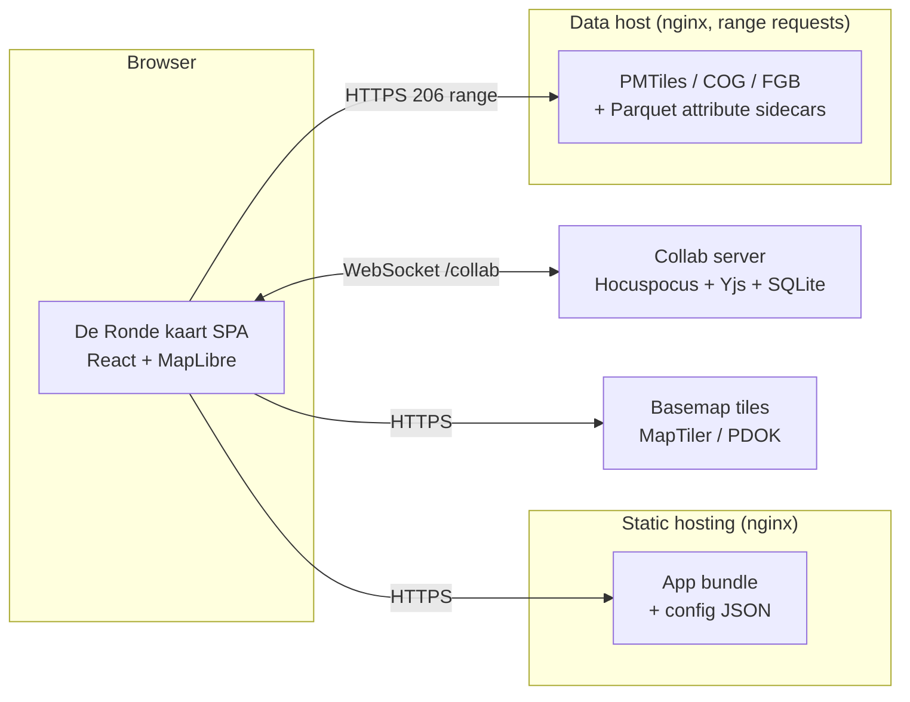
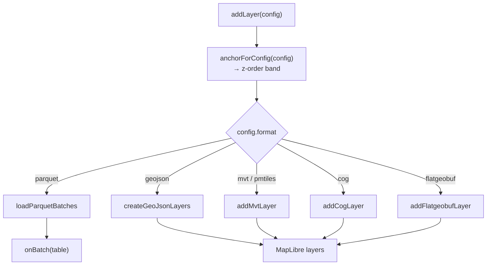
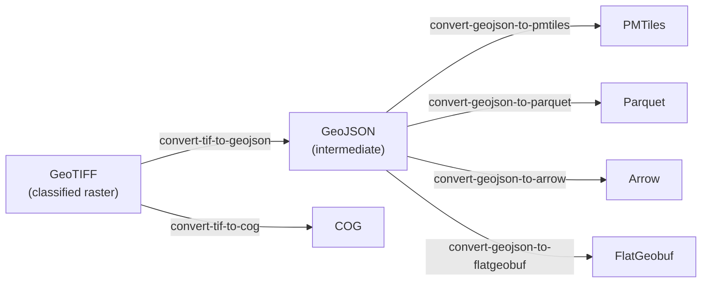

# De Ronde kaart — System Design Document

**Audience:** developers and maintainers. Assumes familiarity with React and
general GIS concepts (tiles, projections, vector vs raster).

**Status:** describes the system as it stands at the time of writing. Figures
(line counts, layer counts) were measured against the working tree, not
estimated.

---

## 1. Purpose, scope, and how to read this

De Ronde kaart is a configuration-driven web map for thematic geospatial data. A
deployment is defined almost entirely by JSON: which layers exist, how they are
styled, how they are grouped in the navigation tree, which charts they support,
and which UI features are switched on. Adding a layer is normally a config edit
and a data upload, not a code change.

This document covers **architecture and rationale** — how the system is divided,
why the divisions are where they are, and which constraints shaped them. It does
not duplicate the task-scoped documentation that already exists:

| For | Read |
|---|---|
| The collaboration subsystem — client, server, guards (§10, **optional feature**) | [system-design-collaboration.md](system-design-collaboration.md) |
| The Power BI integration (§11, **optional**) | [system-design-power-bi.md](system-design-power-bi.md) |
| Running the collaboration server, its guards and operations | [collab-server/README.md](../collab-server/README.md) |
| The Power BI visual — building, publishing, hosting gotchas | [powerbi-visual/README.md](../powerbi-visual/README.md), [known_issues.md](../powerbi-visual/known_issues.md) |
| Per-tenant configuration projects | [configs/README.md](../configs/README.md) |
| Docker/nginx deployment | [deploy/README.md](../deploy/README.md) |
| Server provisioning scripts | [server/README.md](../server/README.md) |
| URL parameters (user-facing reference) | [README.md](../README.md) |

### Start here

| Task | Go to |
|---|---|
| Add a layer to an existing deployment | §12 Configuration, then `configs/<project>/layers.json` |
| Add support for a new data format | §6.1–6.2, then [use-map-layers.ts:112](../src/hooks/use-map-layers.ts#L112) |
| Change how a layer is styled | §6.4, then [geostyler.ts](../src/layers/geostyler.ts) |
| Understand why a filter isn't applying | §7 |
| Work out why charts show no data | §8 (`attributeSource`) |
| Prepare source data for upload | §14 Data pipeline |
| Deploy | §13, then [deploy/README.md](../deploy/README.md) |

---

## 2. System context

De Ronde kaart serves thematic analysis maps (housing, care, demographics,
accessibility, green space) for Dutch regional data. It
runs as a static single-page application, reads its data from a plain HTTPS file host
(over range requests), and optionally connects to a collaboration server for
shared annotations.



The data host is deliberately dumb — no tile server, no database, no API, just a file server. Every format the app reads is a single file addressed by range requests, so the whole data tier is `nginx` serving static files.

---

## 3. Technology stack and major dependencies

#### Rendering

| Package | Why |
|---|---|
| `maplibre-gl` ^6.2 |Drawing geographic data |
| `react-map-gl` ^8.1 |Wrapper between maplibre-gl and react-map-gl |

#### Data formats

One package per format the map can read; the *format* rationale (when to reach
for which) is §6.1, and the loading mechanics are §6.3.

| Package | We use | Why |
|---|---|---|
| `pmtiles` ^4.4 | `Protocol`, registered as `pmtiles://` | Serves a whole vector tileset from one file over range requests — no tile server (§2) |
| `@geomatico/maplibre-cog-protocol` ^0.9 | `cogProtocol` (registered as `cog://`), `setColorFunction` | Cloud-Optimized GeoTIFF as a MapLibre raster source. `setColorFunction` is the hook §6.4 uses to classify raster pixels through the same GeoStyler rules a vector layer uses |
| `flatgeobuf` ^4.4 | `deserialize` from the ESM build (`flatgeobuf/lib/mjs/geojson.js`) | Bbox-filtered streaming reads against the file's packed Hilbert R-tree — large vector data browsed at high zoom without tiling it first (§6.3) |
| `apache-arrow` ^21.1 | `Table`, `tableFromIPC` | The in-memory columnar table every analytics path consumes: chart aggregation, statistics and the filter dropdowns all read Arrow (§8) |
| slim adaptation of `parquet-wasm` | `readParquet`, `readParquetStream`, plus the init promise | Decodes the Parquet attribute sidecars to Arrow IPC.|

#### Collaboration (optional)

Shared annotations on the map. See [system-design-collaboration.md](system-design-collaboration.md).

#### UI

| Package | We use | Why |
|---|---|---|
| `react`·`react-dom` ^19.2 | — | |
| `@base-ui/react` ^1.3 | `Button` and `Dialog` | User interface elements for interaction |
| `material-symbols` ^0.45 | `@import "material-symbols/outlined.css"`, rendered as ligature text by `Icon`/`NavIcon` | Icon's such as the `share` icon |

#### Charts

| Package | We use | Why |
|---|---|---|
| `d3-shape` ^3.2 | `pie` (donut) |  |
| `d3-scale` ^4.0 | `scaleLinear`, `scaleBand` (bar), `scalePoint` (line) | Domain→range mapping including the band/point padding rules |

### Build tooling

`vite` ^8.0 with `@vitejs/plugin-react` and `@tailwindcss/vite`;
`typescript` ~5.9; `eslint` ^10 with `typescript-eslint` ^8,
`eslint-plugin-react-hooks` ^7 and `eslint-plugin-react-refresh`.

### Indirect dependencies

| Capability | Role | Without it |
|---|---|---|
| **WebGL2** | The renderer. MapLibre 6 calls `getContext("webgl2")` and has no WebGL1 path | No map at all |
| **Canvas 2D** | PNG export and the Power BI snapshot ([map-capture.ts](../src/lib/map-capture.ts)), hatch-pattern sprites ([hatch-pattern.ts](../src/layers/hatch-pattern.ts)), icon sprites | Export and hatch fills fail; the map still renders |
| **Module Web Workers** | MapLibre parses tiles off-thread; the worker is a separate ESM file located via `import.meta.url` | No tile is ever parsed — see the `setWorkerUrl` note above |
| **WebAssembly** | Slim adaptation `parquet-wasm` decodes the attribute sidecars | Charts, Kerncijfers and filter dropdowns go empty; map layers are unaffected (§8) |
| **HTTP range requests (206)** | PMTiles, COG and FlatGeobuf read slices of one large file; Parquet streams column chunks | PMTiles/COG/FGB layers fail outright; Parquet falls back to a whole-file read (§6.3) |
| **WebSocket** | Collaborative annotations via Hocuspocus/Yjs (§10) | Annotations become local-only; nothing else degrades |
| **`postMessage` + iframe embedding** | The Power BI visual and the circular embed drive the app through it (§11) | Embedded deployments lose all external control |
| **Secure context (HTTPS)** | `crypto.randomUUID()` mints annotation ids; `navigator.clipboard` backs the share dialog's copy button | Both are `undefined` off HTTPS/localhost — annotation creation throws |
| **`Content-Encoding: br`/`gzip`** | `dist/` ships precompressed; nginx serves the `.br`/`.gz` siblings (§13) | Assets still serve, uncompressed and several times larger |

**WebGPU is *not* a dependency.** MapLibre 6.2's bundle contains zero
references to it. Worth stating because the assumption is easy to make of a
modern GL map, and it would change the browser support floor if it were true.

### External runtime services

| Endpoint | Role |
|---|---|
| `tiles.basemaps.cartocdn.com` | Vector basemap tiles, **glyph PBFs** (all map label text) and the sprite sheet — used by every one of the three basemap styles |
| `service.pdok.nl` | Aerial imagery WMTS behind the "luchtfoto" basemap |
| `maps.googleapis.com` | Street View panel, loaded lazily via the `callback=` readiness signal ([street-view.tsx](../src/components/ui/street-view.tsx)) |
| `fonts.gstatic.com` | Material Symbols SVG for a `map.json` `clickMarker.icon` given by name ([map-config.ts](../src/config/map-config.ts)) |
| The tenant data host | Every layer, sidecar and metadata fragment (`data.woonzorglimburg.nl`, `data.startanalyse2026.nl`) |

Two traps in that table. The basemap style files are named
`maptiler-basic-*.json` but every endpoint inside them is **CARTO** — the names
are historical and misleading. And the glyph URL is a dependency of its own
kind: it is not a fallback for missing fonts, it is where *all* basemap label
text comes from, so losing that host leaves a rendered but unlabelled map.

### Version constraints worth knowing

- **`maplibre-gl` is on v6.**. Two things about it are load-bearing
  and easy to undo by accident:
  - **`setWorkerUrl` + the `?worker&url` import must stay**
    ([MapView.tsx](../src/components/map/MapView.tsx)). v6 splits the worker
    into its own ESM file located relative to the module URL; Vite's
    dependency optimizer rewrites the entry into `.vite/deps/`, where that
    sibling does not exist, so the worker 404s and no tile is ever parsed.
    The import suffix matters as much as the call: the worker itself imports
    `./maplibre-gl-shared.mjs`, so a bare `?url` copies one file and leaves
    that import dangling — which works in dev but ships a **production build
    whose worker boots and dies instantly**. `?worker&url` makes Vite bundle
    the worker with its dependencies. Both failure modes are blank maps with
    **no error in the console**, so test `npm run build` + `vite preview`, not
    just dev.
  - **`zoomLevelsToOverscale={undefined}` must stay** — see §6.3.
- **TypeScript is held at 5.x**, blocked by `typescript-eslint`. The mechanism
  is worth stating precisely, because it is not a conservative version guard
  that could be configured away:
  - TS 7's npm package exports exactly **two** symbols (`version`,
    `versionMajorMinor`). The compiler is a Go binary, and the JS API —
    `createSourceFile`, `SyntaxKind`, `forEachChild`, `createProgram` — is
    simply absent until **TS 7.1**. `@typescript-eslint/parser` calls dozens of
    those, so it throws unconditionally on load
    (`"typescript-eslint does not support TS 7.0"`).
  - The separate TS-*version-range* check (`>=4.8.4 <6.1.0`) defaults to
    `warn`, not `error`, and is overridable via
    `onUnsupportedTypeScriptVersion`. It is **not** what blocks the upgrade.
  - Dropping `typescript-eslint` does **not** trade 20 TS rules for TS 7: it
    removes the only TypeScript **parser**, so ESLint cannot read `.ts`/`.tsx`
    at all and *every* rule stops running — including
    `eslint-plugin-react-hooks`, which has caught real bugs here (the
    "cannot update ref during render" class). Measured: TS 7 cuts `tsc -b`
    from ~3.0s to ~0.2s, which is ~20% of a 14.2s build whose slowest step is
    ~9s of brotli/font work. Not a trade worth making.
  - There is no runtime or bundle-size dimension to this: `tsconfig.app.json`
    sets `noEmit`, esbuild does all transpilation, and `typescript` is a
    devDependency absent from every shipped bundle.

---

## 4. Architecture overview


Four principles organise the system.

### 4.1 Config-driven

Five JSON files define behaviour (§12). The app ships with empty stubs in
`public/`; a tenant configuration in `configs/<project>/` is overlaid at build
or dev time by a Vite plugin keyed on `VITE_CONFIG_PROJECT`. Two projects exist
today: `woonzorglimburg` (79 layers) and `startanalyse2026` (199 layers).

### 4.2 One renderer, one style model

All layers draw through **MapLibre**: tiled vector sources (MVT/PMTiles),
raster (COG), viewport-loaded FlatGeobuf, and GeoJSON sources for host-pushed
data and the on-map overlays (study area, annotations, click marker, selection
box).

Styling is still expressed once and translated per target by
[geostyler.ts](../src/layers/geostyler.ts): MapLibre paint/filter expressions
for vector layers and a per-pixel colour function for COG (§6.4).

#### The MapLibre object model in brief

Enough of `maplibre-gl`'s own model to read §6 and §7. Everything below is what
the app actually drives; MapLibre has more surface than this.

```
Map  ──owns──▶  Style ──▶ sources { id: Source }   data, no appearance
                      ├──▶ layers  [ Layer, … ]    appearance, ordered
                      ├──▶ sprite                  image atlas (icons, hatches)
                      └──▶ glyphs                  font atlas (labels)
```

**Map** — one instance per map view; this app runs two side by side for the
compare mode. It is created declaratively by `react-map-gl`'s `<Map>`
([MapView.tsx](../src/components/map/MapView.tsx)), but every layer operation
afterwards is imperative against the underlying instance
(`mapRef.current.getMap()`).

**Style** — one JSON document the map owns, and the single container for
everything drawable. Consequences worth internalising: a basemap change is
`setStyle()`, which replaces the whole document, so **every source, layer,
sprite image and anchor the app added is destroyed** and has to be re-applied
(§15, GL lifecycle hazards).

**Source** — a named data provider in `style.sources`. Three types are used
here: `vector` (an `{z}/{x}/{y}` template, or a `pmtiles://` URL whose handler
reads the archive header instead), `raster` (`cog://`), and `geojson` (in-memory
— FlatGeobuf results, Power BI pushes, and the overlays). A source carries data
and nothing about appearance, and is shared: `tileSourceId(config)` keys it
`pmtiles-source-<configId>`.

**Layer** — a named draw pass over exactly one source, in `style.layers`. The
types this app emits are `fill`, `line`, `circle`, `symbol`, `fill-extrusion`,
`heatmap` and `raster`. For vector sources, `source-layer` picks one named layer
*inside* the tiles; MapLibre has no setter for it, which is why the timeseries
stepper removes and re-adds layers rather than mutating them.

**One config is not one layer.** `buildNativeLayerDefs`
([mvt-style.ts](../src/layers/mvt-style.ts)) emits one MapLibre layer per
GeoStyler rule, id `<format-prefix>-layer-<configId>-<ruleName>`. A 17-rule
strategy layer is 17 MapLibre layers over one shared source. Add, remove,
visibility, filtering and picking all enumerate that same id list (§4.4).

**Order is the array.** `style.layers` is ordered bottom-to-top and that *is*
the draw order. `addLayer(spec, beforeId)` inserts directly below the named
layer; the app never reshuffles afterwards, because five invisible `background`
anchor layers permanently partition the stack into bands and each config picks
its band (§6.5).

**Three property bags per layer**, each with an in-place setter, so appearance
changes never require re-adding a layer:

| Bag | Holds | Setter |
|---|---|---|
| `paint` | Colour, width, opacity, radius — pure appearance | `setPaintProperty` |
| `layout` | Whether/how geometry becomes drawable: `visibility`, `icon-image`, label placement | `setLayoutProperty` |
| `filter` | Which features enter the layer at all | `setFilter` |

`filter` is the one that matters for §7: a filtered-out feature is not drawn
**and not queryable**, so filtering the map and filtering picking are the same
act, not two.

**Expressions** are the style language — JSON arrays evaluated per feature and
per zoom, e.g. `["==", ["get", "gm_code"], "GM0882"]`. They are what both
translations in this app produce: GeoStyler rules become `paint` and `filter`
expressions, and the area filter compiles its selection into one (§7).

**Sprite and glyphs** are style-owned atlases. Icon symbolizers must
`addImage()` before `addLayer()`, and since `setStyle` wipes the sprite,
`hasImage` is re-checked on every add rather than cached.

**Querying is a render-time operation.** `queryRenderedFeatures(point | box,
{ layers })` reports what is currently drawn — tile-clipped, style-filtered,
viewport-limited. It is not a data API: a feature outside the viewport or above
the source's max zoom simply is not there (§9, feature picking).

**Protocols are global, not per map.** `addProtocol("pmtiles", …)` and
`addProtocol("cog", …)` register at module scope in
[MapView.tsx](../src/components/map/MapView.tsx), so both maps and any later
instance share them; registering per map would double-register.

### 4.3 Module stores for cross-cutting filter state

Filter selections live in **module-level stores**, not React state
([area-filter.ts](../src/layers/area-filter.ts),
[box-filter.ts](../src/layers/box-filter.ts)). MapLibre filter expressions,
feature picking and chart aggregation all read the same store directly. React
mirrors only a `version` counter, used as a memo-cache key.

The reason is that the consumers are not all React components — picking runs
from an event handler, and chart aggregation walks an Arrow table outside the
render path. Prop drilling a filter into each would be both verbose and easy to
desynchronise.

**What a "store" is here.** Not a library and not a subscription mechanism: one
`const store` object at module scope, private to its file, plus the exported
functions that read and replace it. Both are one object per module — the module
is a singleton, so both maps in the compare view and every non-React consumer
see the same selection by construction.

| | Area filter | Box filter |
|---|---|---|
| Shape | `{ version, levels: [{ key, codes: Set<string>, digits: string[] }] }` | `{ version, bbox: [minLng, minLat, maxLng, maxLat] \| null }` |
| Written by | `setAreaFilterSelection(Map<key, Set<code>>)` | `setBoxFilter(bbox \| null)` |
| Owning hook | [use-area-filter.ts](../src/hooks/use-area-filter.ts) | [use-box-select.ts](../src/hooks/use-box-select.ts) |
| Inactive when | `levels` is empty | `bbox` is `null` |

Each store exposes exactly one **writer**, which replaces the state wholesale
rather than mutating part of it, bumps `version`, and returns the new value.
Everything else is a **reader**, and there is one reader per consumer *shape* —
the same predicate expressed against whatever the consumer holds: a MapLibre
expression (`areaFilterExpression`), an Arrow row
(`arrowRowMatchesAreaFilter`, `arrowRowMatchesBoxFilter`), or a plain property
bag (`featureMatchesAreaFilter`). §7 covers the semantics they share.

Some derived state is precomputed into the store rather than recomputed per
row, because the readers run across ~14k rows per redraw: the area filter keeps
each code's digit prefix alongside the raw code, and both modules memoize
column resolution in a `WeakMap` keyed on the Arrow batch or `Table`, keyed
open by `version` so a new selection invalidates it.

**The `version` counter is the whole React bridge.** The writer returns it and
the owning hook parks it in state — `setVersion(setBoxFilter(next))` — so it is
the only piece of store state React holds, and it is a cache key, never data.
Two consumers act on a bump: `useChartData` clears its memo of aggregates, and
[App.tsx](../src/App.tsx) re-runs `setFilter` over the live MapLibre layers.
Charts get `areaFilter.version + boxSelect.version` as a single key; the sum
is sound because both counters only ever increase, so any change to either
changes the sum.

The cost of this design is that a store write is invisible to React on its own.
Nothing re-renders unless the owning hook's `setVersion` runs, so a caller that
reaches past the hook into the store directly would filter the map but leave
the sidebar showing a stale selection.

### 4.4 Single source of truth per concern

- **All layer mutation** funnels through `useMapLayers`
  (`addLayer`/`removeLayer`/`hideLayer`/`toggleLayer`), whether it originates
  from the navigation tree, the legend, a URL command, a Power BI message, or an
  annotation snapshot restore.
- **All camera framing** goes through [fly-to.ts](../src/lib/fly-to.ts)
  (`viewForBbox`, `flyToBbox`, `flyToView`), so bbox→zoom heuristics are never
  duplicated — notably, the Power BI visual sends a raw bbox and lets the app
  resolve it.
- **All native layer identity** comes from `buildNativeLayerDefs`
  ([mvt-style.ts](../src/layers/mvt-style.ts)), used for add, remove, visibility,
  filtering and picking alike.

---

## 5. Module structure

Code is split by responsibility, not by feature: one hook per capability, with
presentation kept out of the data engine.

`src/` holds **17,375 lines across 91 TypeScript files**.

| Directory | Files | Responsibility |
|---|---|---|
| [src/layers/](../src/layers/) | 18 | The data engine: formats, loaders, styling, filtering, aggregation |
| [src/hooks/](../src/hooks/) | 20 | Feature logic — one hook per capability |
| [src/components/](../src/components/) | 36 | Presentation (map, legend, navigation, charts, annotations, share) |
| [src/lib/](../src/lib/) | 10 | Pure utilities: capture, geometry, share URLs, formatting |
| [src/config/](../src/config/) | 1 | `map.json` loading, UI flags, initial view |
| [src/types/](../src/types/) | 2 | Ambient declarations (annotations, Google Streetview) |
| [src/vendor/](../src/vendor/) | 2 | Generated parquet-wasm bindings |

### Largest modules

| Lines | File | Note |
|---|---|---|
| 1721 | [App.tsx](../src/App.tsx) | Composition root — **the main structural weak point** |
| 1014 | [use-map-layers.ts](../src/hooks/use-map-layers.ts) | Layer engine |
| 706 | [map-capture.ts](../src/lib/map-capture.ts) | WebGL capture and PNG compositing |
| 540 | [use-annotation-tool.ts](../src/hooks/use-annotation-tool.ts) | Drawing interaction model |
| 447 | [map-config.ts](../src/config/map-config.ts) | `map.json` validation |

`App.tsx` wires roughly twenty hooks, owns the dual-map composition, and holds
the annotation/box-select/share interaction state. It is the file most in need
of decomposition; nothing about the architecture requires it to be this large.

### The hooks layer

Twenty hooks, each owning one capability: `use-map-layers`, `use-navigation`,
`use-area-filter`, `use-box-select`, `use-chart-data`, `use-feature-pick`,
`use-annotations`, `use-annotation-tool`, `use-annotation-layers`, `use-collab`,
`use-url-commands`, `use-embed-data`, `use-map-snapshot`, `use-study-area-layer`,
`use-filtered-study-area`, `use-click-marker-layer`, `use-selection-box-layer`,
`use-hover-cursor`, `use-auto-collapse`, `use-session-flag`.

---

## 6. Layer subsystem

The deepest part of the system, and where most complexity lives.

### 6.1 Format matrix

`LayerFormat` ([types.ts](../src/layers/types.ts)) admits eight values.
`geojson` is in-memory only and cannot be declared in `layers.json`;
`composite` is a grouping construct, not a data format.

| Format | What it is | Loader | Renderer |
|---|---|---|---|
| `geojson` | In-memory `FeatureCollection` (Power BI push) | none — `config.data` | MapLibre (GeoJSON source) |
| `pmtiles` | Single-file vector tile archive, `pmtiles://` protocol | MapLibre source | MapLibre (vector) |
| `mvt` | Vector tile template `{z}/{x}/{y}.pbf` | MapLibre source | MapLibre (vector) |
| `flatgeobuf` | FGB with packed Hilbert R-tree, bbox-filtered range reads | [flatgeobuf-loader.ts](../src/layers/flatgeobuf-loader.ts) | MapLibre (GeoJSON source) |
| `cog` | Cloud-Optimized GeoTIFF, `cog://` protocol | protocol handler | MapLibre (raster) |
| `composite` | Zoom-banded children under one legend entry | [composite-manager.ts](../src/layers/composite-manager.ts) | delegates per child |

In the `woonzorglimburg` project the mix is 68 pmtiles, 7 cog, 2 composite,
1 mvt, 1 flatgeobuf — tiles dominate because they scale to province-wide
extents. `.parquet` files live on as **attribute sidecars** for the
charts panel and the filter dropdowns (§6.1, `attributeSource`).

### 6.2 Format dispatch

All routing happens in one place: `dispatchFormatLoad`
([use-map-layers.ts:112](../src/hooks/use-map-layers.ts#L112)), shared by
top-level layers and composite children.



The canonical predicate for the native-vector branch is:

```ts
export function isNativeVectorFormat(format: LayerConfig["format"]): boolean {
  return format === "mvt" || format === "pmtiles" || format === "flatgeobuf";
}
```

### 6.3 Loading and caching

**URL-keyed table cache** ([table-cache.ts](../src/layers/table-cache.ts)) —
shared by the Arrow and Parquet loaders. The design point is that it stores the
**in-flight Promise, not the resolved Table**, so concurrent loads of the same
URL dedupe rather than racing two downloads. This matters because one file is
routinely referenced by the left map, the right comparison map, several
`layers.json` ids, the filter dropdowns and the charts panel at once. Rejected
loads are evicted so a retry is possible.

**Parquet streaming** ([parquet-loader.ts](../src/layers/parquet-loader.ts)) —
reads the footer, then fetches column chunks on demand via HTTP 206. Each
`RecordBatch` is emitted as a *cumulative* table, yielding to the event loop
between batches. (This now feeds the charts/statistics panel and the filter
dropdowns; it no longer drives any map rendering.) Falls back to a whole-file read if
streaming throws (e.g. a host without range support). The WASM init is a
memoized promise rather than a boolean flag — wasm-bindgen sets its own guard
only after fetch and compile resolve, so concurrent callers each downloaded the
~1.6 MB module.

**Tile overscaling vs splitting** — MapLibre 6 introduced
`zoomLevelsToOverscale`, defaulting to `4`: past a source's maxzoom, only the
top 4 zoom levels are overscaled and the levels between are *split*. MapLibre's
own documentation notes this "changes the results of query rendered features",
and the app is unusually exposed to that, because **all** picking — feature
info, hover cursor, marker snap, annotation select/drag — runs through
`queryRenderedFeatures`, while the PMTiles archives cap at z12–z14 and users
routinely zoom past z16.

Measured on the v6 default, `line` layers from z12 archives became
**rendered but unpickable** above their cap (`cbsgemeente2026` from z14,
`cbswijk2026` from z17); `fill` and `symbol` layers were unaffected. The map is
therefore constructed with `zoomLevelsToOverscale={undefined}`
([MapView.tsx](../src/components/map/MapView.tsx)), restoring v5 semantics.
This is a **silent, zoom-dependent** failure — nothing throws, and it is
invisible to `tsc` — so verify picking across z11–z18 on a z12-capped *line*
layer before changing it. The proper fix is re-tiling those archives deeper,
which would then allow v6's default and its high-zoom performance benefit.

**FlatGeobuf sessions** ([flatgeobuf-loader.ts](../src/layers/flatgeobuf-loader.ts))
— deliberately *not* URL-cached, because what is loaded depends on the camera.
State lives in per-`(map, config)` sessions in a `WeakMap`, which naturally
handles the two comparison maps and the export preview map. Notable mechanisms:
a minimum zoom below which nothing is fetched (a zoomed-out viewport bbox would
cover the entire dataset), a 25% bbox pad so small pans need no request, and a
**generation counter** used as cancellation — an incremented generation makes
the in-flight async iterator abandon, guaranteeing stale results never reach the
source.

### 6.4 Styling: one model, three translations

[geostyler.ts](../src/layers/geostyler.ts) holds the shared engine —
`evaluateFilter`, `matchRule` (first match wins), and per-symbolizer extractors.
Filter comparison is deliberately loose (`==`), because JSON config values
arrive as strings or numbers interchangeably.

**→ MapLibre** ([mvt-style.ts](../src/layers/mvt-style.ts)): rules become
MapLibre filter expressions (`&&`→`all`, `||`→`any`) and symbolizers map by kind
(`Fill`→`fill`, `Line`→`line`, `Mark`→`circle`, `Icon`→`symbol`). Unsupported
kinds warn loudly rather than drawing an invisible layer.

**→ COG** ([cog-style.ts](../src/layers/cog-style.ts)): a per-pixel colour
function where raster bands are exposed as `band0`, `band1`, … and run through
**the same `evaluateFilter`** — so a raster classifies with identical rule
syntax to a vector layer.

### 6.5 Z-ordering

Maplibre.gl insert against **named invisible anchor layers**
([map-view-config.ts](../src/components/map/map-view-config.ts)):

```ts
export const ANCHORS = {
  background: "background-layers",
  map: "map-layers",        // default
  overlay: "overlay-layers",
  foreground: "foreground-layers",
  studyarea: "studyarea-layers",
} as const;
```

A layer's `beforeid` selects its band. `map.addLayer` honours the anchor, so
ordering is correct without any post-hoc `moveLayer` shuffling and without
depending on load timing. A missing anchor is not fatal — each add falls back
to appending — but the layer then lands in the wrong band, which is why
`ensureAnchors` re-runs on every `styledata`.

### 6.6 Composites

A composite is **one `layers.json` entry** holding inline child configs, each
active over a `[minzoom, maxzoom)` band.
[composite-manager.ts](../src/layers/composite-manager.ts) watches `moveend` and
loads/unloads children as the zoom crosses band edges, delegating the actual
work to a host implemented in `useMapLayers` (children need React state setters
that module scope cannot reach).

The fan-out is one-to-many in exactly one direction: the composite is a single
legend row, a single share id, and a single thing a navigation leaf can point
at, while putting N sets of native MapLibre layers on the map. Children are
never `layerEntries` — they "exist only as native sources on the map"
([use-map-layers.ts](../src/hooks/use-map-layers.ts)). Note that
`navigation.json` knows nothing about any of this: `navigation.ts` contains no
composite handling, and a composite is simply what a leaf's `id` happens to
resolve to.

#### What a child config *is*

`LayerConfig.layers` is typed `LayerConfig[]`, and **that type is looser than
the contract**. `validateChildConfig` ([config.ts](../src/layers/config.ts))
reads a fixed set of keys off the raw JSON and discards everything else, so a
child carrying `charts` or `excludeFromPicking` is accepted by `tsc` and
silently dropped at load.

| | Keys |
|---|---|
| **Read from the child** | `source` (required), `format` (required), `geometryType`, `sourceLayer`, `geostyler`, `style`, `beforeid`, `embeddedColors`, `minzoom`, `maxzoom` |
| **Synthesized from the parent** | `id` = `` `${parent.id}__c${index}` ``, `name` = the parent's `name` |
| **Refused** | `featureinfo` — warns, then ignored; popups use the composite's |
| **Dropped silently** | everything else: `charts`, `statistics`, `attributeSource`, `meta`, `timeseries`, `excludeFrom*`, a nested `layers` |

A child's `format` is checked against `CHILD_FORMATS` — `mvt`, `cog`,
`flatgeobuf`, `pmtiles`. `composite` is deliberately absent, so **composites do
not nest**; `geojson` is absent because it is in-memory only (§6.1).

#### Which property lives where

| Property | Lives on | Note |
|---|---|---|
| `id`, `name` | composite | children derive both |
| `source`, `format`, `sourceLayer`, `embeddedColors` | **child** | a composite has no source of its own; its `source` is forced to `""` |
| `minzoom` / `maxzoom` | **child** | the load band, `minzoom <= zoom < maxzoom`; also stamped on the native layer spec so the cutoff is exact mid-gesture |
| `beforeid` | **child, falling back to the parent's** | the only inherited-with-override property |
| `style`, `geometryType` | child for rendering; parent only as a **fallback legend swatch** | the parent's pair is read solely when neither it nor any child yields legend rows, so on a styled composite it is dead config. Child `style` defaults to `{}` |
| `geostyler` | **either — and which one decides the flavour** | see below |
| `featureinfo` | composite | picks report the parent's id and name and render the parent's template (`expandForMapQueries`) |
| `excludeFromLegend`, `excludeFromPicking`, `excludeFromComparison`, `meta` | composite | |
| `charts`, `statistics`, `attributeSource` | **neither** | forced `undefined` with a warning — composites are not chart-eligible |

`geostyler` is the one property meaningful in both places, and where it sits
selects between the two flavours:

- **Parent has `geostyler`** — children are zoom-banded alternatives sharing one
  rule set. The parent's rules are the legend, and a rule toggle applies to
  *every* child.
- **Parent has none** — children render simultaneously and each contributes its
  own legend rows via `compositeLegendRules`. Those rows are keyed
  `"<childIndex>:<ruleName>"`, because children routinely share rule names —
  every loopafstand COG uses the same six class names, and a bare name would
  toggle all of them at once. COG rows are non-interactive: a per-pixel colour
  function registered per source URL cannot hide one class.

#### Two traps

- **A composite's own `minzoom`/`maxzoom` do nothing.** They are validated and
  stored like any layer's, but the composite branch never reaches
  `buildNativeLayerDefs`, and `childInRange` reads the *child's* bounds. A band
  written on the parent is inert, not inherited.
- **`__c` is reserved in ids.** A top-level id containing it warns, because the
  host recovers the parent id by stripping `/__c\d+$/`, and the child index
  parsed from that same suffix is what routes a hidden-rule key to one child.

---

## 7. Filtering

Two independent systems with different scopes.

| | Area filter | Box filter |
|---|---|---|
| Source | `filter.json` dropdowns (Gemeente/Wijk/Buurt) | User-drawn rectangle |
| MapLibre rendering | ✅ (`setFilter`) | ❌ |
| Feature picking | ✅ | ❌ |
| Charts / statistics | ✅ | ✅ |
| COG (raster) | ❌ | n/a |

**Area filter** ([area-filter.ts](../src/layers/area-filter.ts)) — cascading
administrative selection. Semantics are *AND across levels, OR within a level,
inapplicable levels skipped, empty selection passes everything*. It exists in
three implementations, one per consumer shape: a MapLibre filter expression for
vector layers, an Arrow row predicate for the charts/statistics aggregation
over the sidecar tables, and a plain-props predicate (`featureMatchesAreaFilter`)
for anything holding a picked feature's properties. The last one currently has
no caller — picking gets filtering for free, see below — but it is the reference
statement of the semantics in plain JavaScript.

`setFilter` removes non-matching features from the layer entirely, so they are
neither drawn nor pickable — there is no "rendered but transparent" state to
special-case anywhere.

Because CBS area codes nest (`GM0882` ⊂ `WK088200` ⊂ `BU08820000`), a layer
without the exact key column falls back to digit-prefix matching over
`bu_code`/`wk_code`/`gm_code`.

**Box filter** ([box-filter.ts](../src/layers/box-filter.ts)) — restricts *only*
chart aggregation; map rendering and picking are untouched. A row passes when
its representative point (the point coordinate, or first vertex for
lines/polygons) falls inside the box. It handles both nested GeoArrow encodings
and `geoarrow.wkb`, the latter by walking only the WKB header — a
province-wide polygon can carry thousands of vertices and the test needs exactly
one.

**Composition** happens in exactly one place, chart aggregation:

```ts
function rowPassesFilters(table: Table, index: number): boolean {
  return arrowRowMatchesAreaFilter(rowInfo(table, index))
      && arrowRowMatchesBoxFilter(table, index);
}
```

Their two version counters are summed into a single cache key, so either
changing invalidates memoized aggregates.

---

## 8. Charts and statistics

[charts.json](../configs/woonzorglimburg/charts.json) is a **library** of chart
definitions referenced by id from a layer's `charts` array. Types: donut, bar,
line. Aggregations: sum, mean, count. A layer may also declare `statistics`
(the "Kerncijfers" grid) with `sum`/`count`/`mean`/`variance`.

Aggregation ([chart-data.ts](../src/layers/chart-data.ts)) is a single pass over
the table, skipping rows that fail the combined filters. Variance uses
**Welford's algorithm** for numerical stability. Group-by charts fold everything
beyond the top 8 groups into a single "Overig" datum. Results are memoized on
`(table, spec, filter version)`, with the memo keyed on the **table** rather than
the layer so two layers sharing one sidecar compute once.

### `attributeSource` — why tile layers need a sidecar

Charts aggregate the **entire dataset**. Vector tiles only contain the current
viewport at the current zoom, so aggregating from tiles would produce numbers
that silently change as the user pans.

A pmtiles/mvt/cog layer therefore points `attributeSource` at a `.parquet` or
`.arrow` sidecar carrying the same rows. The map renders from `source`; the
analytics panel reads `attributeSource`. Dispatch is on the **sidecar's own
extension**, not the layer's format — the entire point is that the two differ.

A tile-format layer that declares charts *without* a sidecar renders an empty
panel and warns once. This is not hypothetical: it is exactly what happened when
layers were migrated from Parquet to PMTiles, and the silence is why it went
unnoticed.

---

## 9. Feature catalogue

| Capability | Implemented in | Notes |
|---|---|---|
| **Dual map / comparison** | [App.tsx](../src/App.tsx), [comparison-slider.tsx](../src/components/ui/comparison-slider.tsx) | Two `MapView`s, shared camera, CSS `clipPath` split. Right map mounts only when it holds a comparable layer |
| **Navigation tree** | [use-navigation.ts](../src/hooks/use-navigation.ts), [navigation/](../src/components/ui/navigation/) | `top` or `sidebar` mode, chosen in `map.json` |
| **Legend** | [legend.tsx](../src/components/ui/legend.tsx), [legend-style.ts](../src/lib/legend-style.ts) | Per-layer and per-rule toggles, move between maps, basemap cycling |
| **Feature info** | [use-feature-pick.ts](../src/hooks/use-feature-pick.ts), [feature-info.tsx](../src/components/ui/feature-info.tsx) | `queryRenderedFeatures` over the clickable layers |
| **Street View** | [street-view.tsx](../src/components/ui/street-view.tsx) | Lazy Google Maps load via `callback=` readiness signal |
| **Area filter** | [use-area-filter.ts](../src/hooks/use-area-filter.ts), [FilterSection.tsx](../src/components/ui/sidebar/FilterSection.tsx) | Also replaces the study area and flies to the selection |
| **Box selection** | [use-box-select.ts](../src/hooks/use-box-select.ts) | Scopes statistics only |
| **Charts panel** | [charts/](../src/components/charts/), [use-chart-data.ts](../src/hooks/use-chart-data.ts) | Up to 4 charts + Kerncijfers |
| **Annotations** | [use-annotation-tool.ts](../src/hooks/use-annotation-tool.ts), [use-annotation-source.ts](../src/hooks/use-annotation-source.ts) | Circle / polygon / pin, each carrying a session snapshot |
| **Timeseries** | [use-map-layers.ts](../src/hooks/use-map-layers.ts), `TimeseriesControl` | Play/scrub over a `%YEAR%` placeholder in `sourceLayer` |
| **Sharing** | [share-url.ts](../src/lib/share-url.ts), [ShareDialog.tsx](../src/components/share/ShareDialog.tsx) | Hash-encoded state, share link, social intents |
| **PNG export** | [map-capture.ts](../src/lib/map-capture.ts) | 2048² circular export with legend and callouts |
| **Circular embed** | [CircularExportView.tsx](../src/components/share/CircularExportView.tsx) | `?embed=circular` or `open-circular` message |

### Annotations in brief

Three shape types with a direct-manipulation model: drag a circle's rim to
resize but its body to move; drag out a polygon bbox to create; mousedown on a
polygon edge splits it at that point. Escape unwinds progressively (cancel drag
→ deselect → disarm tool). Hit-testing prioritises vertices, then edges, then
bodies.

Each annotation stores a **session snapshot** — area-filter selections, both
maps' layers and hidden ids, and the camera. Clicking an annotation restores it.
Restore is cancellable, applies hidden state only after layer adds resolve, and
skips layers no longer present in `layers.json`.

---

## 10. Collaboration subsystem

**Moved to [system-design-collaboration.md](system-design-collaboration.md).**

Shared annotations over a Yjs/Hocuspocus WebSocket session: the client lifecycle
and its Awareness handling, the capability-URL security model, and the
server-side guards.

**The subsystem is optional.** It is gated on the `annotations` flag in
`map.json` (default `false`; collaborative *sessions* additionally require
`share`), and the collab server is a separate deployable rather than part of the
static bundle. Switched off — as in the default configuration and in
`startanalyse2026` — annotations stay local to the browser and nothing else in
the app changes.

---

## 11. Power BI integration

**Moved to [system-design-power-bi.md](system-design-power-bi.md).**

A thin custom visual that embeds the hosted app in an iframe and drives it via
`postMessage`.

**The integration is optional and peripheral** — the app neither knows nor cares
whether it is embedded. Nothing in §§4–10 depends on it. Only two things leak
back into the core: the in-memory `geojson` layer format (§6.1) and the snapshot
bridge that keeps Power BI's PDF/PowerPoint export from rendering the map blank.
Both are explained in the companion document.

---

## 12. Configuration system

| File | Loader | Drives |
|---|---|---|
| `layers.json` | [config.ts](../src/layers/config.ts) `loadLayerConfigs` | Every renderable layer |
| `navigation.json` | [navigation.ts](../src/layers/navigation.ts) `loadNavigation` | Category tree |
| `charts.json` | [charts.ts](../src/layers/charts.ts) `loadChartsConfig` | Chart library |
| `filter.json` | [area-filter.ts](../src/layers/area-filter.ts) `loadAreaFilterConfig` | Area filter levels |
| `map.json` | [map-config.ts](../src/config/map-config.ts) `loadMapConfig` | Initial view, study area, ~15 UI flags |

All five are module-level cached after first load.

### Two-tier validation philosophy

Verified against the source: `config.ts` and `navigation.ts` each contain a
`throw` and no `catch`; `charts.ts`, `area-filter.ts` and `map-config.ts` each
contain a `catch` and no `throw`.

- **`layers.json` and `navigation.json` throw** on a missing or failed fetch.
  Without them there is no app, so failing loudly is correct.
- **`map.json`, `charts.json` and `filter.json` never throw.** Each catches,
  warns, and returns defaults — an embedded map must always load, even
  misconfigured.

Within `layers.json`, validation is **per-entry drop-and-warn**, never
all-or-nothing: one malformed layer disappears with a console warning rather
than taking down the other 78.

`validateTimeseries` is deliberately stricter — it drops the whole block unless
`sourceLayer` contains the placeholder, because a timeseries that steps through
years without the rendered layer ever changing is a confusing silent no-op.

### Per-tenant overlay

[vite.config.ts](../vite.config.ts) defines a `configOverlay` plugin: when
`VITE_CONFIG_PROJECT` is set, files from `configs/<project>/` are served in place
of the `public/` defaults (dev) or copied over them (build). Unset, behaviour is
the plain `public/` content. See [configs/README.md](../configs/README.md).

---

## 13. Build and deployment

### Vite pipeline

Four plugins: React, Tailwind, the config overlay (§12), an **icon-font
subsetter** ([subset-icon-font.ts](../scripts/subset-icon-font.ts) — scans
sources for icon names and ships only those glyphs), and **dist precompression**
([precompress-dist.ts](../scripts/precompress-dist.ts) — Brotli q11 + gzip, so
nginx serves precompressed assets).

Manual chunking splits the heavy stacks so they cache independently:
`vendor-parquet`, `vendor-arrow`, `vendor-maplibre`.

`npm run build` is `tsc -b && vite build` — typecheck gates the bundle.

### Deployment

[Dockerfile](../Dockerfile) is a two-stage build (`node:20-alpine` →
`nginx:alpine`, port 80). [docker-compose.yml](../docker-compose.yml) adds the
`collab` service. nginx configs live in [deploy/](../deploy/).

For non-Docker hosts, [server/](../server/) holds provisioning scripts:
`setup_map_application.sh` (app + nginx + `/collab` proxy),
`setup_collab_server.sh` (systemd unit), `setup_fileserver.sh` (the data host),
`setup_landing_page.sh`.

---

## 14. Data pipeline
The initial datapipeline makes use of GeoDMS where sourcedata is translated to intermediate .geojson files, where simplification can be included with preservation of topology to simplify for various zoomlevels of a pmtiles file. Another route for simplification is experimentally tomake use of **mapshaper** using script `convert-tif-to-geojson.py`. These .geojson files then go into external converters. 

[data/](../data/) holds eight Python converters that turn source rasters and
vectors into the formats the app reads. They use PEP 723 inline dependency
metadata, so `uv run <script>` needs no environment setup.



Choosing an output: **COG** for continuous surfaces (elevation, imagery);
**PMTiles** for classified polygons at province scale; **Parquet/Arrow** when
charts need whole-dataset attributes; **FlatGeobuf** for large vector data
browsed at high zoom.

Workflow: convert → upload to the data host → reference the URL from
`layers.json`.

---

## 15. Cross-cutting concerns and known constraints

### GL lifecycle hazards

The most common source of subtle breakage, and heavily commented in the source:

- **Every imperative overlay must be re-added after a basemap swap.**
  `setStyle()` wipes all sources, layers AND sprite images. Each overlay hook
  therefore returns a `resync`, called from `onLabelsReady`.
- **Symbol layers that must stay clickable need `icon-allow-overlap` /
  `text-ignore-placement`.** `queryRenderedFeatures` only returns features that
  actually drew, so a collision-culled symbol is silently unpickable — see the
  annotation layers.
- Sources and layers belong to one map's style, so per-side hooks are called
  once per map. This is bookkeeping, not a GL-resource hazard.
- MapLibre's canvas has no `preserveDrawingBuffer`, so pixels are readable
  **only** synchronously inside a `render` event, never after an `await`. This
  shapes the whole of [map-capture.ts](../src/lib/map-capture.ts).

### Testing

**The app has no automated tests.** The only tests in the repo are
`collab-server`'s 16 (`node:test`, run with `npm test` in that directory).
Verification of app behaviour is currently manual.

### CI

**There is no CI.** No `.github/` workflow exists; nothing enforces typecheck,
lint or build on push. At the time of writing all three gates pass locally
(`tsc -b`, `eslint .` with 0 errors, `npm run build`), but nothing keeps them
that way.

### Other known issues

- **`App.tsx` is 1721 lines** and wires ~20 hooks. Decomposition would be the
  highest-value structural refactor.
- **The Google Maps API key is hardcoded** in
  [street-view.tsx](../src/components/ui/street-view.tsx). This is normal for
  Maps JS (the key is necessarily public) but it should be HTTP-referrer
  restricted in the Google Cloud console.
- **PMTiles archives cap at z12–z14**, which forces
  `zoomLevelsToOverscale={undefined}` on MapLibre 6 to keep `line` layers
  pickable above their cap (§3, §6.3). Re-tiling the z12 archives deeper would
  let the app take v6's default and its high-zoom performance benefit.
- **TypeScript cannot move to v7** until `typescript-eslint` supports it, which
  needs the stable compiler API landing in **TS 7.1** (§3). The tsconfigs are
  otherwise already TS 7-clean — `tsgo` reports 0 type errors.
- **Per-rule visibility is not shareable** — share URLs encode layer and hidden
  state, but there is no rule-level command, so per-rule toggles are dropped.

---

## 16. Appendices

### A. File index

| Concern | Path |
|---|---|
| Layer type model | [src/layers/types.ts](../src/layers/types.ts) |
| `layers.json` validation | [src/layers/config.ts](../src/layers/config.ts) |
| Layer engine / orchestrator | [src/hooks/use-map-layers.ts](../src/hooks/use-map-layers.ts) |
| Format dispatch | [use-map-layers.ts:112](../src/hooks/use-map-layers.ts#L112) |
| GeoStyler → MapLibre | [src/layers/mvt-style.ts](../src/layers/mvt-style.ts) |
| GeoStyler → COG | [src/layers/cog-style.ts](../src/layers/cog-style.ts) |
| Shared style engine | [src/layers/geostyler.ts](../src/layers/geostyler.ts) |
| Table dedup cache | [src/layers/table-cache.ts](../src/layers/table-cache.ts) |
| Area filter | [src/layers/area-filter.ts](../src/layers/area-filter.ts) |
| Box filter | [src/layers/box-filter.ts](../src/layers/box-filter.ts) |
| Chart aggregation | [src/layers/chart-data.ts](../src/layers/chart-data.ts) |
| Composites | [src/layers/composite-manager.ts](../src/layers/composite-manager.ts) |
| Z-order anchors, basemaps | [src/components/map/map-view-config.ts](../src/components/map/map-view-config.ts) |
| Map capture / PNG export | [src/lib/map-capture.ts](../src/lib/map-capture.ts) |
| Share URL encoding | [src/lib/share-url.ts](../src/lib/share-url.ts) |
| Camera framing | [src/lib/fly-to.ts](../src/lib/fly-to.ts) |
| `map.json` flags | [src/config/map-config.ts](../src/config/map-config.ts) |
| Collab server guards | [collab-server/src/guard-extension.ts](../collab-server/src/guard-extension.ts) |
| Power BI visual | [powerbi-visual/src/visual.ts](../powerbi-visual/src/visual.ts) |

### B. Glossary

| Term | Meaning |
|---|---|
| **COG** | Cloud-Optimized GeoTIFF — a raster laid out so range requests fetch just the needed tiles and overviews |
| **PMTiles** | Single-file tile archive read by HTTP range requests; replaces a directory of millions of `.pbf` files |
| **MVT** | Mapbox Vector Tile — the vector tile encoding PMTiles archives contain |
| **FlatGeobuf** | Streamable vector format with a packed Hilbert R-tree, allowing bbox-filtered range reads |
| **GeoArrow** | Convention for encoding geometry in Apache Arrow columnar buffers, readable by the GPU without conversion |
| **GeoStyler** | Renderer-neutral cartographic style model (rules with filters and symbolizers) |
| **CRDT** | Conflict-free Replicated Data Type — the structure (here Yjs) letting peers edit concurrently without a server arbiter |
| **Hocuspocus** | WebSocket server implementation for Yjs documents |
| **Awareness** | Yjs's ephemeral presence channel (cursors, selection) — never persisted to the document |
| **RD New / EPSG:28992** | The Dutch national projected CRS; source data typically arrives in it and is reprojected to WGS84 |
| **Capability URL** | An unguessable URL that *is* the access credential — used here for collaboration rooms |
