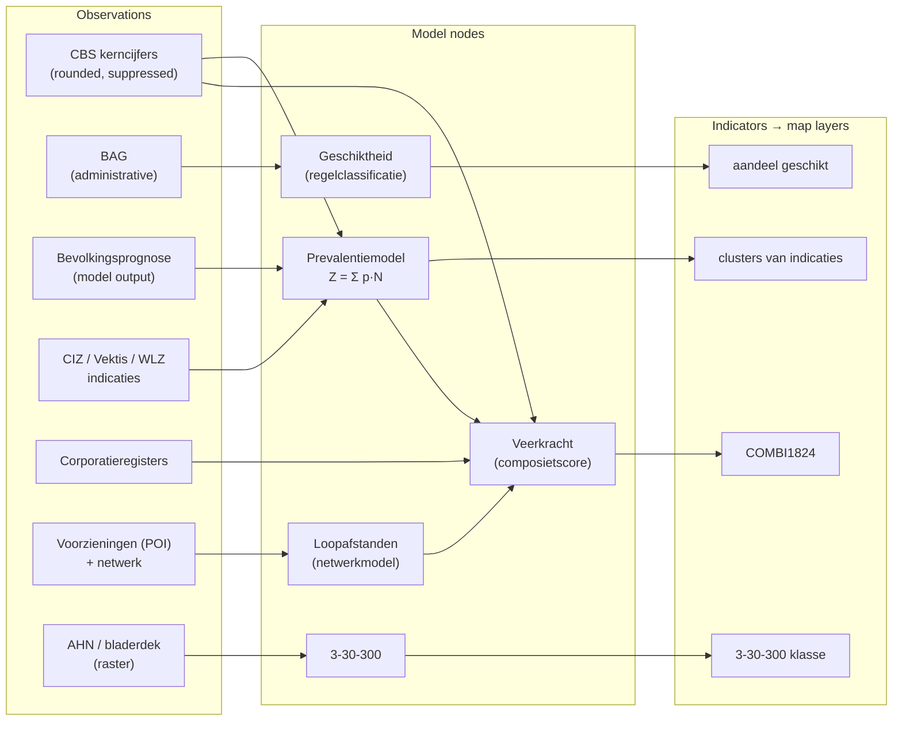

# Uncertainty propagation, observations → indicator

**Audience:** modellers and analysts building the woonzorglimburg indicators.
Assumes linear algebra and basic statistics; no geodesy background required.

**Status:** methodology. It describes how quality *should* be carried through
the model chain and what must be reported when an indicator becomes a map layer.
No part of it is implemented yet.

---

## 1. Purpose and scope

The woonzorglimburg indicators are not measurements. They are the output of a
chain: source registrations and surveys feed models (bevolkingsprognose,
prevalentiemodellen, veerkrachtclassificatie, geschiktheid van de woningvoorraad,
loopafstanden, 3-30-300), whose outputs are combined into a composite score,
which is finally classified into the categories a map legend can draw.

Every link in that chain adds error. At present the chain ends in one number per
area, and the map renders that number as a colour. A buurt whose score sits at
0.51 and one at 0.98 fall in the same class and are drawn identically — the map
asserts the same confidence in both.

This document defines the route from **observation quality** to **indicator
quality**, and states what must accompany an indicator when it is published as a
layer.

**What "quality" means here.** Two things, and the second is the one usually
omitted:

| | Question it answers | Reported as |
|---|---|---|
| **Precision** | how much does the indicator scatter under the noise we believe is present? | σ, confidence interval, class probability |
| **Reliability** | how large an undetected error in an input would it take to change the answer? | MDB, external reliability, "driver" |

An indicator with a small σ resting on a single unverifiable source is not a
good indicator. Precision without reliability is the standard way to be
confidently wrong, and it is precisely what a smoothly coloured choropleth
communicates.

**Scope.** The mathematics and the reporting contract. Where the computation
should live (`data/` Python, alongside the existing converters) is recorded as a
decision, not specified here. Zonation itself is treated as given: the σ derived
below is *conditional on* the buurt/wijk/gemeente partition. Choosing a different
partition changes the indicator (MAUP) — that is a modelling decision, not noise,
and it does not belong in Q.

### Why the Delft framework

The approach is that of the Delft geodetic school (Baarda, Tienstra, Teunissen),
developed for exactly this problem shape: many heterogeneous observations of
differing quality, combined through a known functional relation into a quantity
nobody can observe directly, where being wrong is expensive. Its four
commitments:

1. **Separate the functional model from the stochastic model.** What the world
   is (`E{y} = Ax`) and what we believe about the errors (`D{y} = Q_yy`) are
   distinct statements, written separately, criticized separately.
2. **Propagate covariance, not opinion.** Given the two models, the quality of
   any derived quantity follows by computation, not by judgement.
3. **Use redundancy to test.** Wherever two sources say something about the same
   quantity, that overlap is a testable statement — not an inconvenience to be
   averaged away.
4. **Report precision *and* reliability.**

---

## 2. The chain for woonzorglimburg



Every **edge** in this graph must have three things stated before any σ is
quoted:

1. the functional relation,
2. its Jacobian (analytic, numerical, or "sampled — no Jacobian"),
3. whether the target node has **redundancy**.

Point 3 is the one that gets skipped. A node with no redundancy cannot be
tested; its error is whatever its single source's error is, and no amount of
downstream mathematics discovers otherwise. Knowing this *before* publishing is
the difference between a caveat and an embarrassment.

---

## 3. Notation

| Symbol | Meaning |
|---|---|
| `y` (m×1) | observations |
| `x` (n×1) | unknown parameters |
| `A` (m×n) | design matrix, `E{y} = Ax` |
| `Q_yy` | covariance matrix of the observations, `D{y} = Q_yy` |
| `P = Q_yy⁻¹` | weight matrix |
| `x̂`, `Q_x̂x̂` | estimated parameters and their covariance |
| `ê = y − Ax̂` | least-squares residuals |
| `Q_êê` | covariance of the residuals |
| `r = m − n` | redundancy (degrees of freedom) |
| `z = g(x)` | the indicator; `J = ∂g/∂x` its Jacobian |
| `c` | the class the indicator is drawn as |

Two models, stated separately:

```
functional:   E{y} = A x        "what the world is"
stochastic:   D{y} = Q_yy       "what we believe about the errors"
```

Nearly every failure mode below is one of these two being wrong while the other
is blamed.

---

## 4. Stochastic model of the observations

### 4.1 Name the mechanism before writing a variance

Several inputs in this chain are not noisy measurements. Assigning them a σ
launders a structural problem into a statistical one, and the result *looks*
rigorous.

| Mechanism | Example here | Correct treatment |
|---|---|---|
| Sampling error | WoON, survey-based CBS figures | published SE × design effect. The design effect is not optional — clustered samples are routinely 1.5–3× less precise than the nominal SE implies |
| Rounding / disclosure control | CBS counts rounded to 5 | uniform over the rounding interval: `σ² = h²/12` (h = 5 → σ ≈ 1.44) |
| Suppression | CBS cells < 10 withheld | **interval censoring**, not a variance. The true value lies in [0, 9]. Imputing a midpoint and a σ invents information; carry the interval |
| Administrative, near-exact | BAG, corporatieregisters | error is **bias**, not scatter: definition drift, registration lag, incomplete mutations. Model as a bias interval and handle it in §7, not in `Q_yy` |
| Classification error | sociaal-dominante klasse, nultreden-afleiding uit BAG | a **confusion matrix**, not a σ. The quantity is categorical; "±0.3 classes" is meaningless |
| Model / scenario error | bevolkingsprognose | ensemble or scenario spread, growing with the horizon. Not a measurement error at all — it is a statement about which future |

The last row deserves emphasis. Prognosis error is *not* symmetric noise around
a true value; it is dispersion over scenarios. Treating it as Gaussian is a
working approximation, defensible for short horizons (≤5 years) and increasingly
dishonest beyond. State the horizon at which you stop believing your own σ.

### 4.2 Factor structure, not a dense matrix

Limburg has roughly 1500 buurten. A dense `Q_yy` per source would be
1500×1500 — expensive, and mostly a fiction, since nobody can specify two million
distinct covariances. Use variance components instead:

```
Q_yy = σ²_ind · I  +  σ²_reg · Z_reg Z_regᵀ  +  σ²_prov · 1 1ᵀ
```

- `σ²_ind` — independent local noise (sampling, rounding, local registration).
- `σ²_reg` — a factor shared within a gemeente or regio (`Z_reg` the 0/1
  membership matrix): regional definition differences, a single supplier's
  systematic deviation.
- `σ²_prov` — one province-wide systematic factor: a national prevalence rate, a
  model constant, a common methodological choice.

Three numbers per source instead of a matrix, and — critically — the second and
third terms are the ones that **survive aggregation**. This is developed in §9,
and it is the single most commonly botched step: a provincial total whose error
is computed as if 1500 buurten were independent will be quoted roughly an order
of magnitude too precise.

---

## 5. Functional models and their Jacobians

Each model node must be written explicitly enough to differentiate.

### 5.1 The linear case: prevalence

The prevalence models covering "clusters van indicaties" are bilinear and cover
most of the chain:

```
Z(b) = Σ_a  p_a · N_a(b)
```

with `N_a(b)` the population of age/household class `a` in buurt `b` (from the
prognose) and `p_a` the prevalence of the care cluster in that class.

```
∂Z(b)/∂N_a(b) = p_a          (local input,  small coefficient)
∂Z(b)/∂p_a    = N_a(b)       (shared input, large coefficient)
```

Note the asymmetry, because it drives everything downstream: `p_a` is **one
number shared by every buurt in the province**, while `N_a(b)` is local. Their
errors therefore enter through different factors in §4.2 and aggregate
completely differently. Only the covariance bookkeeping reveals this; a
per-buurt error bar computed in isolation hides it entirely.

**Second-order term.** `Z` is a product of two uncertain quantities, so exactly

```
Var(p·N) = p² σ²_N + N² σ²_p + σ²_N σ²_p
```

Linearization drops the third term. It is negligible when both coefficients of
variation are small, and it is *not* negligible for small buurten where
`σ_N/N` can reach 0.2. Check it rather than assuming it.

### 5.2 The categorical case: geschiktheid, sociaal-dominante klasse

These nodes output a class, derived by rules from BAG attributes or from a
typology. Their error is a confusion matrix `C`, where `C_ij = P(observed class i
| true class j)`. A downstream count of "geschikte woningen" is then

```
E{n̂_i} = Σ_j C_ij n_j          — a linear map, so it composes normally
D{n̂}  = C diag(n) Cᵀ − ... (multinomial covariance)
```

The point is that this composes with the rest of the chain like any other linear
node — as long as `C` is estimated, not assumed diagonal. If no validation
sample exists to estimate `C`, say so: the node is untestable (§7).

### 5.3 The black-box case: prognose, loopafstanden

No closed form. Two options, both legitimate:

- **Numerical Jacobian** — perturb each input by a step of order σ, re-run, take
  the difference quotient. Feasible when the model is cheap and inputs are few.
- **Monte Carlo that node only** — sample its inputs, keep the output ensemble,
  and hand the empirical covariance to the next node.

The DAG makes the hybrid legitimate: analytic where cheap, sampled where
necessary, composed by the chain rule. There is no requirement to pick one
technique for the whole chain, and doing so is usually why people abandon the
exercise as too expensive.

Loopafstanden carry a further, non-stochastic error: network completeness and
the walking-speed assumption. A missing footpath is not noise. Report it as a
scenario (with/without), not as a σ.

---

## 6. Adjustment where redundancy exists

This is the step that distinguishes this route from wrapping the whole chain in
Monte Carlo, and it is where most of the value is.

Wherever two sources describe the same quantity, or a constraint must hold, the
system is **overdetermined** — solve it as such:

- BAG woningvoorraad vs CBS woningvoorraad,
- CIZ-indicaties vs Vektis vs WLZ-realisatie,
- **buurt values must sum to the known gemeente total** — a condition equation,
- prognose age structure vs the observed base year.

Common practice is proportional raking: scale the parts until they match the
known total. Raking always "works", discards the covariance bookkeeping, and
silently decides that the total is perfect and the parts absorb all the
discrepancy. Instead, best linear unbiased estimation:

```
x̂    = (Aᵀ P A)⁻¹ Aᵀ P y
Q_x̂x̂ = (Aᵀ P A)⁻¹                    with P = Q_yy⁻¹
```

Three things follow that raking cannot give:

1. **Weighting is derived, not chosen.** A source with large σ is automatically
   overruled by a precise one, in the exact proportion `Q_yy` implies.
2. **The result arrives with `Q_x̂x̂`**, already reflecting the constraint — the
   adjusted values are *more* precise than the inputs, and by a computable amount.
3. **The misclosures `ê` become available**, which is what makes §7 possible at
   all. Raking sets them to zero by construction and destroys the evidence.

A hard constraint (the gemeente total is exact) enters as a condition equation
rather than a weighted observation; a soft one (the total is itself uncertain)
simply enters `Q_yy` with its own variance. Prefer the soft form — a "known"
total is rarely known.

---

## 7. Testing and reliability

An undetected blunder in one source damages a map more than noise ever will.
Four diagnostics fall out of the same adjustment.

### 7.1 Overall model test

```
T = êᵀ P ê / r     ~ F(r, ∞)   under H₀
```

Rejection means the functional model or the stochastic model is wrong. **Do not
publish a σ from a failed overall test** — it describes a model the data has just
contradicted. Diagnose first: an inflated `T` with residuals spread evenly
suggests `Q_yy` is too optimistic; concentrated in a few observations, a blunder.

### 7.2 w-test (data snooping)

Per observation, with `c_i` the unit vector selecting it:

```
w_i = (c_iᵀ P ê) / √(c_iᵀ P Q_êê P c_i)     ~ N(0,1)   under H₀
```

`|w_i|` above the critical value flags *which* observation, in *which* area,
disagrees with the rest. That is directly mappable as a data-quality layer, and
it is immediately useful to whoever maintains the source registration —
independent of any indicator.

### 7.3 Redundancy numbers

```
r_i = (Q_êê P)_ii ,      Σ r_i = r ,      0 ≤ r_i ≤ 1
```

`r_i` is how much the *i*-th observation is checked by the others. `r_i ≈ 0`
means nothing in the system can contradict it: its error passes into the
indicator unattenuated and undetectably. `r_i ≈ 1` means it is fully verified.

Publishing the distribution of `r_i` per indicator is a cheap, high-value piece
of governance. It converts "we believe this data" into "this input is checked by
nothing else, and here is what depends on it".

### 7.4 Internal and external reliability

**Internal** — the smallest bias in observation `i` that the w-test will detect
with probability γ at significance α:

```
MDB_i = √( λ₀ / (c_iᵀ P Q_êê P c_i) )
```

with `λ₀` the non-centrality parameter for the chosen (α, γ) — conventionally
α = 0.001, γ = 0.80, giving λ₀ ≈ 17.0 for a one-dimensional alternative.

**External** — the effect of that just-undetectable bias on the indicator:

```
∇x̂ = (Aᵀ P A)⁻¹ Aᵀ P c_i · MDB_i          ∇z = J_total · ∇x̂
```

This is the number a policy user actually needs. Not "the standard deviation is
0.4", but: *if the corporation register is systematically wrong by the largest
amount our checks would not catch, this indicator moves by 0.9 — one and a half
class widths.* The bias-to-noise ratio `λ = ∇zᵀ Q_zz⁻¹ ∇z` makes it comparable
across inputs, and the largest-λ input is the indicator's **driver**.

### 7.5 Where bias-dominated sources are handled

The administrative sources of §4.1 (row 4) belong here rather than in `Q_yy`.
Propagate their bias interval deterministically through `J_total` and report the
resulting displacement *alongside* σ, never summed into it. A bias and a
standard deviation are different claims about the world and adding them in
quadrature asserts something neither supports.

---

## 8. Propagation to the indicator

### 8.1 The linear part

```
Q_zz = J_total Q_yy J_totalᵀ ,      J_total = J_n ··· J_2 J_1
```

Chain the Jacobians along the DAG path. With the factor structure of §4.2 this
never forms a dense matrix: each factor propagates separately and the results
add.

### 8.2 Where linearization stops being valid

- `min` / `max` in a composite (kinked, not differentiable),
- ratios with a denominator that can approach zero (small buurten),
- thresholds and the final classification (discontinuous),
- any node whose CV exceeds ~0.2 (the second-order term of §5.1).

Switch to Monte Carlo across those: analytic up to the last continuous score,
sampled across the boundary. **Sample the shared factors jointly across all
buurten** — drawing an independent perturbation per buurt produces a map with
noise it does not have, and systematically understates how many areas move
together. This is the same error as §9, in its sampling form.

### 8.3 What the propagation must produce

Five quantities per area — the interface between the mathematics and the map:

| Quantity | Definition | Why it is the right thing to publish |
|---|---|---|
| `σ_z` | propagated standard deviation of the continuous score | the honest error bar |
| `P(c)` | probability the drawn class is the true class | the map draws a *class*, so this is the decision-relevant number, and it is unit-free |
| stability | `P(c) > 0.9` (threshold by convention) | a boolean a legend can render |
| driver | the input with the largest λ (§7.4) | external reliability, per area |
| `r` | redundancy number of the binding input | whether anything checked this at all |

`P(c)` is computed by integrating the score distribution between the class
boundaries — for a Gaussian score with boundaries `t_lo`, `t_hi`:

```
P(c) = Φ((t_hi − z)/σ_z) − Φ((t_lo − z)/σ_z)
```

An area sitting mid-class with a modest σ scores near 1; one sitting on a
boundary scores near 0.5 regardless of how small its σ is. That is the correct
behaviour, and it is exactly the information a choropleth currently destroys.

### 8.4 Consequences for the map

The propagation ends at these five fields; rendering them needs no new
machinery. A stability flag reads naturally as a hatch over the class colour —
the established idiom for "this is not a value of its own" — and `σ_z`, the
driver and `r` belong in the feature-info popup. The legend gains one entry, not
a second colour ramp: uncertainty shown as a *second* choropleth is unreadable
next to the first.

Resist encoding `σ_z` as transparency or saturation. It reads as "less
important", not "less certain", and it interacts with whatever is underneath.

---

## 9. Aggregation over an area selection

When statistics are computed over a selection (a gemeente, a drawn box, the
whole province), the aggregate's error is **not** `√Σσ_b²`. That formula assumes
independence, and §4.2 exists precisely because the errors are not independent.

For a sum over areas `b ∈ B`, with the factor structure:

```
Var(Σ_b z_b) = Σ_b J_b² σ²_ind  +  σ²_reg (Σ_b J_b)²_per-region  +  σ²_prov (Σ_b J_b)²
                └── shrinks ──┘   └────────── does not shrink ──────────┘
```

The independent term grows as `n`, so its contribution to the *relative* error
falls as `1/√n`. The shared terms grow as `n²`: their relative contribution is
**constant**. Aggregate far enough and the shared factor is the entire error
budget.

**Worked illustration — V&V-indicaties, Limburg.** Take
`Z = p · N₇₅₊`, `N₇₅₊ ≈ 100 000`, `p = 0.08` (σ_p = 0.008, i.e. 10% relative,
province-wide shared), and per-buurt population error of 5%, independent, over
1500 buurten (`N_b ≈ 67`, `σ_{N_b} ≈ 3.3`).

| Level | `Z` | contribution of `σ_N` | contribution of `σ_p` | total σ | relative |
|---|---|---|---|---|---|
| one buurt | 5.3 | `p·σ_N` = 0.27 | `N_b·σ_p` = 0.53 | 0.60 | 11% |
| province | 8 000 | `p·σ_{N,tot}` ≈ 10 | `N_tot·σ_p` = 800 | 800 | 10% |

The population term shrinks from 45% of the buurt-level variance to 0.02% of the
provincial variance. The prevalence term does not shrink at all — the relative
error is essentially unchanged from one buurt to the whole province. Anyone
computing the provincial figure as `√Σσ_b²` gets ≈ 23 instead of 800: a claim
of 0.3% precision on a number that is good to 10%.

This is the whole argument for §4.2 in one table.

---

## 10. Calibration: estimate the stochastic model, don't assert it

Every σ above is a claim, and claims should be checked against outcomes.

**Backtest.** Run the 2020 prognose forward to 2025 and compare with realized
figures. The misclosures give **empirically estimated variance components**
(variance component estimation, Teunissen / Amiri-Simkooei) that replace guessed
values, and the *pattern* of residuals tests the factor structure itself: if
residuals correlate within gemeenten more strongly than `σ²_reg` predicts, the
structure — not just the numbers — is wrong.

**Coverage check.** Over all backtested areas, the realized value should fall
inside the predicted 95% interval about 95% of the time. Systematic
under-coverage means the stochastic model is optimistic, which is the failure
mode to expect: assumed independence and unmodelled bias both push the same way.

This closes the loop. Quality becomes estimated rather than asserted, and the
estimate is refreshed with each data vintage rather than inherited indefinitely
from whoever first wrote the number down.

---

## 11. Worked example: prevalence → clusters van indicaties

The recommended first chain to carry through every step. It is linear and
differentiable throughout, it exhibits **both** factor types, it has a genuine
redundancy partner, and it terminates in a classified layer that already exists
on the map.

| Step | Applied to this chain |
|---|---|
| §2 DAG | `prognose → N_a(b)`; `landelijke prevalentie → p_a`; `Z(b) = Σ p_a N_a(b)`; classify → clusterlaag |
| §4 stochastic | `N`: prognose scenario spread (local + regional factor); `p`: national estimate with a sampling SE — a **pure province-wide factor** |
| §5 functional | bilinear; analytic Jacobians `p_a` and `N_a(b)`; check the second-order term for the smallest buurten |
| §6 adjustment | condition: `Σ_b Z(b) = ` observed CIZ/Vektis total per gemeente. Both sides uncertain → soft constraint, both variances in `Q_yy` |
| §7 testing | overall test on the gemeente misclosures; w-test per gemeente localizes where the model and the registration disagree; `r_i` shows which buurten are effectively unchecked |
| §8 propagation | analytic to `Z(b)`, then boundary integration for `P(c)` |
| §9 aggregation | the table in §9 *is* this chain |
| §10 calibration | 2020→2025 backtest of `N`; realized indicatiecijfers to calibrate `p` |

Expected finding, worth stating in advance so it is not mistaken for a bug: the
per-buurt error will be dominated by the **prevalence rate**, not by the
population forecast, at every level above the individual buurt. The intuition
that "the prognose is the uncertain part" is wrong for aggregates, and the
covariance bookkeeping is what shows it.

One chain carried through all ten steps is worth more than ten chains sketched.

---

## 12. Verification

The method is verified by its worked example being reproducible.

- **Analytic vs Monte Carlo** — `J Q Jᵀ` against 10 000 draws must agree within
  MC error wherever the model is near-linear. Disagreement localizes the node
  where linearization fails; that node's treatment then changes to MC.
- **Constraint** — the buurt→gemeente condition holds on the adjusted values,
  and the overall model test passes on synthetic data generated from the assumed
  `Q_yy`. Failing on *synthetic* data means the implementation is wrong, not the
  data.
- **Blunder detection** — inject a bias of exactly `MDB_i` into one source; the
  w-test must flag it at the design power γ. If it does not, the quoted MDB is
  wrong.
- **Aggregation** — the provincial σ computed with the factor structure must not
  shrink as `√n`; a reviewer should be able to reproduce the §9 table by hand
  from three variance components.
- **Coverage** — backtest residuals inside the 95% interval ≈ 95% of the time.
  Otherwise §10 re-estimates.

---

## Appendix: references

- W. Baarda, *A Testing Procedure for Use in Geodetic Networks*, Netherlands
  Geodetic Commission, 1968 — data snooping, MDB, internal/external reliability.
- P.J.G. Teunissen, *Adjustment Theory* and *Testing Theory*, Delft University
  Press — the modern treatment of both models, propagation, and hypothesis
  testing.
- P.J.G. Teunissen & A.R. Amiri-Simkooei, "Least-squares variance component
  estimation", *Journal of Geodesy* 82 (2008) — estimating `Q_yy` from data
  rather than asserting it (§10).
- J.M. Tienstra, *Theory of the Adjustment of Normally Distributed Observations*
  — the propagation law in its original form.
