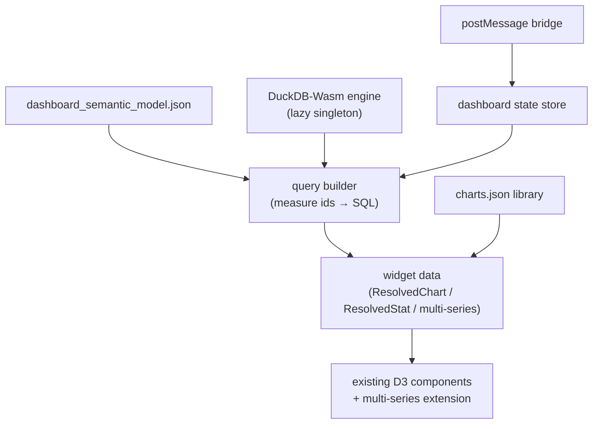

# Dashboard capabilities — implementation plan

**Goal:** add a pure client-side dashboard to northwake, driven by parquet data and a JSON semantic model, in two modes:

- **Standalone** — iframe-embeddable, no map loaded, postMessage-parameterized, PDF-exportable.
- **Complementary** — map stays live; up to 4 areas (gemeente/buurt) are click-selected with colored striped outlines; a bottom panel ("meer informatie") opens a side-by-side statistical comparison.

## 1. Locked decisions

| Decision | Choice | Rationale |
|---|---|---|
| Data engine | **DuckDB-Wasm** (`@duckdb/duckdb-wasm`) | Reads parquet over HTTP range requests; SQL joins are the natural fit for a semantic model with relationships. Perspective's viewer can't host our D3 charts and is single-table; hand-rolled Arrow joins are the most code to maintain. |
| PDF export | **Print stylesheet** | `dashboard_export.json` drives a dedicated print layout (DOM + SVG charts stay vector), exported via `window.print()` with `@page` rules. Zero new deps. |
| Standalone trigger | **Query param** `?mode=dashboard` | `main.tsx` branches at bootstrap, following the existing `?embed=circular` precedent (`src/main.tsx:11`). No router, no second entry point. |

## 2. New config files (4)

All four follow the established pattern (own TS types + `validate*` + `load*` with module-level cache + `fetch("/<name>.json")`, mirroring `src/layers/charts.ts`). Neutral defaults go in `public/`; the Vite overlay plugin (`vite.config.ts:26-87`) copies/serves **any** file from `configs/<slug>/`, so no plugin change is needed. The icon-font subsetter (`scripts/subset-icon-font.ts:74-91`) auto-scans new JSON.

| File | Drives |
|---|---|
| `dashboard_semantic_model.json` | Tables (parquet URLs + key columns), relationships, measures/dimensions |
| `dashboard_standalone.json` | Standalone layout: grid of widgets referencing `charts.json` ids + semantic-model measures |
| `dashboard_complementary.json` | Selection layer (pmtiles source, gemeente/buurt source-layers, zoom switch), comparison widgets |
| `dashboard_export.json` | PDF print layout override: page size/orientation, widget order, headers/titles |

Doc enumerations to update at implementation time: `AGENTS.md` ("Five JSON files"), `configs/README.md`, `docs/system-design.md` §9 table + §3 diagram, `deploy/README.md`, `server/setup_map_application.md`.

## 3. Semantic model (`dashboard_semantic_model.json`)

Sketch:

```json
{
  "tables": [
    { "name": "kerncijfers_buurt", "url": "https://data…/cbsbuurt2026.parquet",
      "key": "bu_code",
      "columns": [{ "name": "aantal_inwoners", "role": "measure", "label": "Inwoners", "format": "number" }] }
  ],
  "relationships": [
    { "from": "kerncijfers_buurt.gm_code", "to": "gemeente.gm_code" }
  ],
  "measures": [
    { "id": "inwoners", "table": "kerncijfers_buurt", "expression": "aantal_inwoners",
      "aggregation": "sum", "label": "Inwoners", "format": "number" }
  ]
}
```

- A widget asks for measures/dimensions by id; a **query builder** resolves which tables are needed and emits SQL with joins along declared relationship paths; ambiguous/missing paths fail validation at load with `console.warn` (house style: warn-and-drop, never throw).
- Level-aware filtering reuses CBS code nesting (`GM0882` ⊂ `WK088200` ⊂ `BU08820000`), the same semantics as `area-filter.ts`.

## 4. Architecture



- **`src/dashboard/`** new module: `semantic-model.ts` (types/loader/validation), `duckdb-engine.ts` (lazy-initialized singleton; parquet registered via httpfs range reads), `query-builder.ts`, `dashboard-state.ts` (module-level Solid store, house pattern §3.3), `postmessage-bridge.ts`.
- **Bundle isolation:** DuckDB-Wasm (wasm + worker) is heavy → dynamic `import()`, loaded only when a dashboard mode is active; own manual chunk like `vendor-parquet` (`vite.config.ts:156`). DuckDB's worker must use the same load-bearing `?worker&url` suffix pattern as MapLibre (`MapView.tsx`) or the production build breaks silently.
- **Chart reuse:** components in `src/components/charts/` take fully-resolved sync props (`ResolvedChart`/`ResolvedStat`); the dashboard supplies data from DuckDB instead of `chart-data.ts`, reusing `ChartConfig` specs from `charts.json` untouched.
- **Standalone bootstrap:** `main.tsx` reads `?mode=dashboard` → renders `<DashboardApp>` (lazy) instead of `<App>`; MapLibre/pmtiles never load.

## 5. Standalone mode

- Layout from `dashboard_standalone.json`: CSS-grid rows/columns of widgets — `chart` (by charts.json id), `statistic` (semantic-model measure), `text` blocks.
- **postMessage protocol** (shape-validated, consistent with the existing `map-command`/`map-data` bridges; `use-embed-data.ts:60-61` documents that stance):
  - Out: `{ type: "dashboard-ready", v: 1 }` handshake on load; `{ type: "dashboard-state", … }` on change.
  - In: `{ type: "dashboard-set", selection?, parameters? }` — updates filter/parameter state and re-queries **without page refresh**; `{ type: "dashboard-reload", tables? }` — re-points a semantic-model table at a new parquet URL when data must actually change.
- **PDF export:** render the export layout from `dashboard_export.json` (or the standalone layout when absent/overruled per-widget) into a print-only DOM tree; `@page` size/orientation + print stylesheet; trigger via `window.print()`. Charts print as vector SVG.

## 6. Complementary mode

- **Selection layer** (`dashboard_complementary.json`): one pmtiles source with gemeente + buurt source-layers and a zoom threshold — below it clicks select gemeente, above it buurt (so selecting a gemeente, then zooming in and adding buurten, works in one selection set). `promoteId`/id resolution reuses `feature-id.ts` (`ID_CANDIDATES` already covers `gm_code`/`bu_code`).
- **Selection store:** new module store, `Selection[]` capped at **N = 4**, each `{ level, code, label, colorSlot }`; colors from the fixed palette `#e41a1c #377eb8 #4daf4a #984ea3 #ff7f00 #ffff33 #a65628`.
- **Outlines:** extend the `buildHighlightLayerDefs` pattern (`mvt-style.ts:194-239`, `buurt_klik`/`highlightcasing`): per source-layer emit two `line` layers — a **white casing** (wider, per `highlightcasing` semantics) and a **striped stroke** on top (constant `line-dasharray`, the documented `RawStyleOverrides` escape hatch), with `line-color` driven per selection slot via a numeric feature-state (data-driven `["case", …]` over the palette). Feature-state writes follow `use-feature-highlight.ts`: write `false` on clear, never `removeFeatureState` (MapLibre 6.3 crash), forget keys on `styledata`.
- **"meer informatie":** when ≥1 selection exists, a bottom-centered button appears (evictionlab-style); it expands a bottom sheet with the side-by-side comparison from `dashboard_complementary.json` — statistic grids per selected area plus charts.
- **Multi-series charts:** extend `ChartDatum` with an optional `series` (selection label + color); BarChart → grouped bars, LineChart → one line per comparee, so comparees share one graph where the type allows; donut falls back to side-by-side small multiples. Aggregation runs per selection via SQL `WHERE code IN (…)` rather than the global filter stores.
- The same postMessage bridge parameterizes this mode (host can set/clear selections).

## 7. Files to create / modify

| Action | Files |
|---|---|
| Create | `src/dashboard/*` (engine, model, query builder, state, bridge), `src/components/dashboard/{DashboardApp,DashboardGrid,ComparePanel,SelectBar,PrintLayout}.tsx`, `src/hooks/use-compare-selection.ts`, `public/dashboard_*.json` (4 neutral defaults) |
| Modify | `src/main.tsx` (mode branch), `src/components/charts/*` (multi-series), `src/layers/mvt-style.ts` (striped/casing selection layers), `vite.config.ts` (duckdb chunk), `package.json` (`@duckdb/duckdb-wasm`) |
| Docs | `AGENTS.md`, `configs/README.md`, `docs/system-design.md` (§9 + new subsystem section) |

## 8. Testing & verification

- Vitest: semantic-model validation, query-builder SQL, selection-store cap/replace, postMessage shape parsing (co-located `*.test.ts`, jsdom — note the load-bearing `resolve.conditions` in `vitest.config.ts`).
- `npm run lint` (watch `solid/reactivity`: no prop destructuring; read reactive inputs before early returns in effects), `npm test`, `npm run build` (typecheck lives in build).
- Verify with `npm run build && npm run preview`, not just dev — both the MapLibre worker and the new DuckDB worker fail silently as blank screen in production-only otherwise.
- `CLAUDE.md` house rules apply throughout: comments/docs in English, UI strings in Dutch ("meer informatie").

## 9. Phasing

1. **Phase 1 — standalone:** semantic model + DuckDB engine + standalone layout + postMessage + PDF export.
2. **Phase 2 — complementary:** selection layer + outlines + "meer informatie" comparison panel + multi-series charts.
