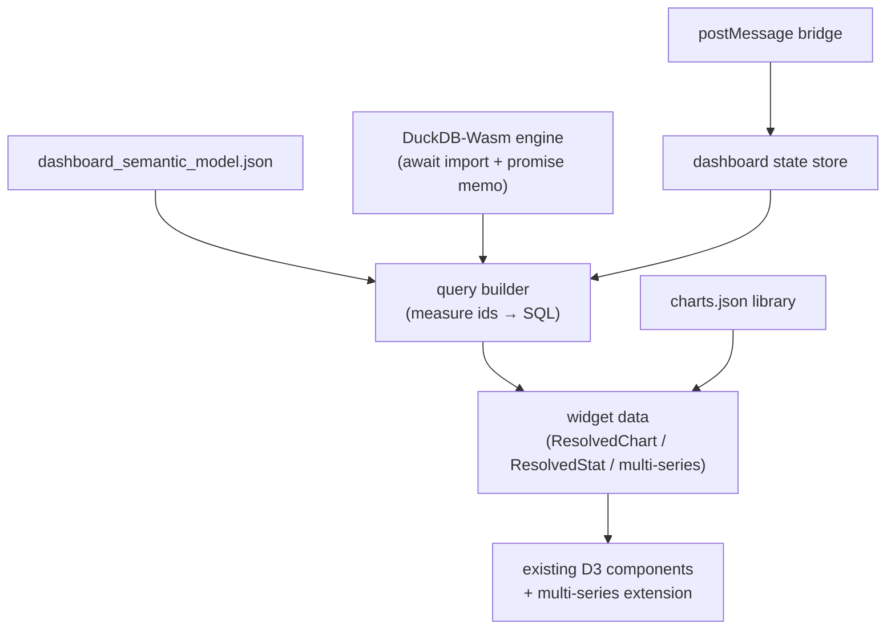

# Dashboard capabilities — implementation plan

**Goal:** add a pure client-side dashboard to northwake, driven by parquet data and a JSON semantic model, in two modes:

- **Standalone** — iframe-embeddable, no map loaded, postMessage-parameterized, PDF-exportable.
- **Complementary** — map stays live; up to 4 areas (gemeente/buurt) are click-selected with colored striped outlines; a bottom panel ("meer informatie") opens a side-by-side statistical comparison.

## 1. Locked decisions

| Decision | Choice | Rationale |
|---|---|---|
| Data engine | **DuckDB-Wasm** (`@duckdb/duckdb-wasm`) | Reads parquet over HTTP range requests; SQL joins are the natural fit for a semantic model with relationships. Perspective's viewer can't host our D3 charts and is single-table; hand-rolled Arrow joins are the most code to maintain. |
| DuckDB delivery | **npm dependency, imported only inside `src/dashboard/duckdb-engine.ts`, reached only through `await import()`** | Map-only users must download none of it. Rules in §4. |
| PDF export | **Print stylesheet** | `dashboard_export.json` drives a dedicated print layout (DOM + SVG charts stay vector), exported via `window.print()` with `@page` rules. Zero new deps. |
| Capability flag | **`map.json` → `"dashboard": "off" \| "standalone" \| "complementary" \| "both"`**, default `"off"` | Follows the `navigationMode` precedent exactly: one key, four literals, warn-and-fallback. |
| Standalone trigger | **Query param** `?mode=dashboard`, gated by the capability | Follows the existing `?embed=circular` precedent (`src/main.tsx:9-15`). No router, no second entry point. |
| Data source | **The semantic model names its own parquet URLs** | Standalone must work in a project with zero map layers configured. |

## 2. The `dashboard` capability in map.json

### 2.1 Config

In [src/config/map-config.ts](src/config/map-config.ts):

```ts
/** map.json `dashboard` — which dashboard modes this project offers. */
export type DashboardMode = "off" | "standalone" | "complementary" | "both";
```

- `MapConfig.dashboard: DashboardMode`; `DEFAULT_MAP_CONFIG.dashboard = "off"` (`map-config.ts:252-270`).
- Validate with the literal-comparison chain used for `navigationMode` (`map-config.ts:452-459`) — **not** `Array.includes`, which does not narrow `unknown`. An unrecognised value gets a `console.warn` and falls back to `"off"`; `loadMapConfig` never throws.
- Export two derived predicates beside the type, so no caller re-implements the union:

```ts
export function standaloneDashboardEnabled(mode: DashboardMode): boolean;
export function complementaryDashboardEnabled(mode: DashboardMode): boolean;
```

No existing `map.json` needs editing: an absent key is already the norm (neither `chartsPanel` nor `filterFlyTo` appears in any config), and the default is off.

### 2.2 Bootstrap

In [src/main.tsx](src/main.tsx):

```
loadMapConfig()
  ├─ ?mode=dashboard && standaloneDashboardEnabled(cfg.dashboard)
  │     → dismissSplash()
  │     → const { DashboardApp } = await import("@/dashboard/standalone")
  │     → render(<DashboardApp … />)          // no MapView, no MapLibre, no pmtiles
  ├─ ?mode=dashboard && !standaloneDashboardEnabled(cfg.dashboard)
  │     → console.warn(`map.json: dashboard "${cfg.dashboard}"; ?mode=dashboard genegeerd`)
  │     → fall through to the map app
  └─ otherwise
        → render(<App … complementaryDashboardEnabled={complementaryDashboardEnabled(cfg.dashboard)} />)
```

`dismissSplash()` on the standalone branch is required for the same reason as `embedCircular` (`main.tsx:12-15`): no MapView mounts, so the map's `onLoad` never fires and the splash would hang over an empty page.

`App` gains one optional boolean prop, defaulted **twice** — in `DEFAULT_MAP_CONFIG` and again in App's `mergeProps` block (`App.tsx:145-166`) — exactly as `combinationsEnabled` is. Gate the complementary UI on it the way `App.tsx:1083` gates the combine dialog.

**Out of scope, deliberately:** `dashboard` is not added to `EmbedConfig` ([use-embed-data.ts:26-32](src/hooks/use-embed-data.ts#L26-L32)), so the Power BI host cannot toggle it at runtime. Only `searchbar`, `navigation`, `streetview`, `share` and `annotations` are host-overridable today.

## 3. New config files (4)

All four follow the established pattern (own TS types + `validate*` + `load*` with module-level cache + `fetch("/<name>.json")`, mirroring `src/layers/charts.ts`). Neutral defaults go in `public/`; the Vite overlay plugin (`vite.config.ts:26-87`) copies/serves **any** file from `configs/<slug>/`, so no plugin change is needed.

| File | Drives |
|---|---|
| `dashboard_semantic_model.json` | Tables (parquet URLs + key columns), relationships, measures/dimensions |
| `dashboard_standalone.json` | Standalone layout: grid of widgets referencing `charts.json` ids + semantic-model measures |
| `dashboard_complementary.json` | Which `layers.json` layer is the selection layer, the gemeente/buurt zoom threshold, comparison widgets |
| `dashboard_export.json` | PDF print layout override: page size/orientation, widget order, headers/titles |

The icon-font subsetter (`scripts/subset-icon-font.ts:74-91`) auto-scans new JSON for `"icon"` values — but any icon the dashboard picks **dynamically** in code must be added to its `RUNTIME_ICON_NAMES` list, or the glyph is subset away in the production build.

Doc enumerations to update at implementation time — "**Five JSON files**" appears in five places and all become wrong: `AGENTS.md:31`, `configs/README.md:3`, `deploy/README.md:35`, `server/setup_map_application.md:110`, `docs/system-design.md:139`. Also add a `map.json`: dashboard section to `configs/README.md` (alongside the `basemap` table at lines 49-82), a Dashboard row to the §8 feature catalogue in `docs/system-design.md`, and correct its "~15 UI flags" count in §9.

## 4. Keeping DuckDB-Wasm lazy

Nothing in the build enforces this, so these are rules, not preferences:

1. `@duckdb/duckdb-wasm` — **including** its `?url` asset and worker imports — is imported only by `src/dashboard/duckdb-engine.ts`. Every other module talks to the engine through its exported functions.
2. Nothing imports `duckdb-engine.ts` statically. It is reached only via `await import("@/dashboard/duckdb-engine")`, from exactly two places: the standalone entry, and the complementary "meer informatie" click handler.
3. Init is a memoized **promise**, nulled on failure so a retry can re-download. Copy the shape of [parquet-loader.ts:16-23](src/layers/parquet-loader.ts#L16-L23):

```ts
let enginePromise: Promise<DuckDbEngine> | null = null;

export function ensureDuckDb(): Promise<DuckDbEngine> {
  return (enginePromise ??= initEngine().catch((err) => {
    enginePromise = null; // reset so a later attempt can retry
    throw err;
  }));
}
```

   A boolean "loaded" flag instead of the promise makes concurrent widgets each start their own download — that is the mistake the parquet loader's comment warns about.
4. **No `lazy()` / `<Suspense>`.** There is none in the codebase and this feature does not need the first one: standalone already boots inside an `async` function, so a plain `await import()` suffices, and complementary mode loads the engine in a click handler and renders a Dutch loading state off a signal. This mirrors the on-demand script load in [street-view.tsx:30-60](src/components/ui/street-view.tsx#L30-L60).
5. `vite.config.ts` `manualChunks` (lines 148-164) gains `if (id.includes("@duckdb/duckdb-wasm")) return "vendor-duckdb"`. Naming a chunk does not pull it into the entry graph — that holds only while rule 2 does.
6. **Worker.** DuckDB selects a bundle and constructs a worker; this is the first explicit `new Worker(...)` in the app. Carry over the lesson from the comment block at [MapView.tsx:6-19](src/components/map/MapView.tsx#L6-L19): the Vite import suffix is load-bearing, `?worker&url` is not `?url`, and getting it wrong fails **silently and only in production builds**. Import the bundle files with `?url` inside `duckdb-engine.ts` and hand them to `duckdb.selectBundle` rather than relying on the package's jsDelivr default, which breaks under CSP and offline deploys.

Laziness is verified as a build assertion, not by inspection — see §10.

## 5. Semantic model (`dashboard_semantic_model.json`)

```json
{
  "tables": [
    { "name": "kerncijfers_buurt", "url": "https://data…/cbsbuurt2026.parquet",
      "key": "bu_code",
      "columns": [{ "name": "aantal_inwoners", "role": "measure", "label": "Inwoners", "format": "number" }] }
  ],
  "relationships": [
    { "from": "kerncijfers_buurt.gm_code", "to": "gemeente.gm_code" }
  ],
  "measures": [
    { "id": "inwoners", "table": "kerncijfers_buurt", "expression": "aantal_inwoners",
      "aggregation": "sum", "label": "Inwoners", "format": "number" }
  ]
}
```

Tables carry their own URLs; the model never reaches into `layers.json`, so standalone mode is independent of the map configuration.

**Query builder contract.** Input `{ measures: string[]; dimensions: string[]; filters: Filter[]; limit?: number }`, ids resolved against the model.

- Join resolution is a BFS over declared `relationships` from the dimension's table to each measure's table. An ambiguous path (two of equal length) or a missing path **drops the widget with a `console.warn` at load time**, matching the warn-and-drop stance of `validateChart` ([charts.ts:78-112](src/layers/charts.ts#L78-L112)). Never throw.
- Every identifier is quoted (`"col"`). `expression` and `aggregation` are inserted as authored — the semantic model ships with the deployment and is trusted input; say so in the module header rather than pretending to sanitize.
- Level-aware filtering reuses the CBS code nesting already implemented in [area-filter.ts:114-126](src/layers/area-filter.ts#L114-L126) (`digitsOf` strips the two-letter prefix; `digitsMatch` is a prefix test in either direction, so `GM0882` ⊃ `BU08820000`). In SQL that is a `LIKE 'BU0882%'`-shaped predicate — not a fourth hand-rolled copy of the rule.
- Results come back as an Arrow `Table`, the same shape `chart-data.ts` already consumes.

## 6. Architecture



- **`src/dashboard/`** new module: `semantic-model.ts` (types/loader/validation), `duckdb-engine.ts` (the only DuckDB importer), `query-builder.ts`, `dashboard-state.ts` (module-level Solid store — follow the signal-based store in `area-filter.ts:89-139`, which replaced the older version-counter idiom), `postmessage-bridge.ts`, `standalone.tsx` (the dynamic-import entry).
- **Chart reuse:** components in `src/components/charts/` are pure and take resolved props ([chart-data.ts:15-31](src/layers/chart-data.ts#L15-L31) defines `ChartDatum` / `ResolvedChart` / `ResolvedStat`); the dashboard supplies data from DuckDB instead of `chart-data.ts`, reusing `ChartConfig` specs from `charts.json` untouched.
- The `.slice(0, 4)` chart cap lives in [use-chart-data.ts](src/hooks/use-chart-data.ts), not in the components — the dashboard has its own data path and is not bound by it.
- **Multi-series:** `ChartDatum` gains an optional `series?: { label: string; color: string }`. `BarChart` → grouped bars; `LineChart` → one path per series, so its hardcoded `LINE_COLOR` (`LineChart.tsx:11`) becomes per-series; `DonutChart` → side-by-side small multiples. Absent `series`, rendering is unchanged.

## 7. Standalone mode

- Layout from `dashboard_standalone.json`: CSS-grid rows/columns of widgets — `chart` (by charts.json id), `statistic` (semantic-model measure), `text` blocks.
- **postMessage protocol** (shape-validated, no origin allow-list — consistent with the two existing bridges; [use-embed-data.ts:43-62](src/hooks/use-embed-data.ts#L43-L62) documents that stance):
  - Out: `{ type: "dashboard-ready", v: 1 }` on load; `{ type: "dashboard-state", … }` on change.
  - In: `{ type: "dashboard-set", selection?, parameters? }` — updates filter/parameter state and re-queries **without page refresh**; `{ type: "dashboard-reload", tables? }` — re-points a semantic-model table at a new parquet URL.
  - Attach in `onMount`, remove in `onCleanup`, as both existing bridges do (`use-embed-data.ts:117-118`).
- **PDF export:** render the export layout from `dashboard_export.json` (or the standalone layout when absent) into a print-only DOM tree; `@page` size/orientation + print stylesheet; trigger with `window.print()`. Charts print as vector SVG.

## 8. Complementary mode

- **Selection layer.** Declared in `layers.json` like `buurt_klik` (`configs/startanalyse2026/layers.json:71921-71944`): invisible polygons (`"style": { "opacity": 0 }`), `highlightable: true`, `excludeFromLegend`, `excludeFromComparison`. This is forced: `promoteId` can only be set at `addSource` time ([use-map-layers.ts:617-645](src/hooks/use-map-layers.ts#L617-L645)), so the layer must exist before the source is created. `dashboard_complementary.json` only *names* that layer id and the zoom threshold that switches gemeente ↔ buurt selection. Id resolution needs no new code — `ID_CANDIDATES` in `feature-id.ts:39-46` already covers `gm_code` / `wk_code` / `bu_code`.
- **Selection store:** module store, `Selection[]` capped at **N = 4**, each `{ level, code, label, slot }`; colours from the fixed palette `#e41a1c #377eb8 #4daf4a #984ea3 #ff7f00 #ffff33 #a65628`. Clicking an already-selected area toggles it off; a fifth selection is refused rather than silently evicting the oldest (state it in the UI copy).
- **Feature state:** today's kinds are `"highlight" | "selected"`, each holding a single key ([use-feature-highlight.ts:15,44-47](src/hooks/use-feature-highlight.ts#L15-L47)). Add a numeric `compareSlot` (0–3) written for up to four features at once. Clearing writes `compareSlot: -1` — **never** `removeFeatureState`, per the MapLibre 6.3.0 crash documented verbatim at `use-feature-highlight.ts:80-98` — and the `styledata` listener (lines 116-137) must forget all four keys, not just one.
- **Outlines:** a new sibling of `buildHighlightLayerDefs` (it does **not** run `applyRawOverrides`, so the `RawStyleOverrides` escape hatch is unavailable there) emitting per selection layer a white casing plus a dashed stroke on top: constant `line-dasharray`, and `line-color` as `["match", ["feature-state", "compareSlot"], 0, c0, 1, c1, 2, c2, 3, c3, "transparent"]`, with `line-width`/`line-opacity` 0 when unselected so `queryRenderedFeatures` never hits them. It must be emitted from `buildNativeLayerDefs` (`mvt-style.ts:168-170`) so pick, hover, filter-refresh and layer removal all see it, and `isHighlightLayerId` (`mvt-style.ts:11-25`) must recognise it or the dim tool will fade the selection.
- **Click path:** branch in `useMapPointer.onClickA` ([use-map-pointer.ts:67-138](src/hooks/use-map-pointer.ts#L67-L138)) when complementary mode is armed — add/toggle a slot instead of driving the info popup.
- **"meer informatie":** with ≥1 selection, a bottom-centered button appears; it expands into the side-by-side comparison from `dashboard_complementary.json`. There is no bottom sheet in `src/components/ui/` — build it on the `ChartsPanel` card idiom ([ChartsPanel.tsx:33-34](src/components/charts/ChartsPanel.tsx#L33-L34)) inside the existing z-30 overlay convention (`App.tsx:1241`), not as a modal `dialog.tsx`. Opening it is what triggers `await import()` of the engine.
- Aggregation runs per selection via SQL `WHERE code IN (…)` rather than through the global filter stores.

## 9. Files to create / modify

| Action | Files |
|---|---|
| Create | `src/dashboard/*` (engine, model, query builder, state, bridge, standalone entry), `src/components/dashboard/{DashboardGrid,ComparePanel,SelectBar,PrintLayout}.tsx`, `src/hooks/use-compare-selection.ts`, `public/dashboard_*.json` (4 neutral defaults) |
| Modify | `src/config/map-config.ts` (`dashboard` enum + predicates), `src/main.tsx` (mode branch), `src/App.tsx` (prop + gating), `src/components/charts/*` (multi-series), `src/layers/mvt-style.ts` (slot outlines + `isHighlightLayerId`), `src/hooks/use-feature-highlight.ts` (`compareSlot`), `src/hooks/use-map-pointer.ts` (multi-select branch), `vite.config.ts` (duckdb chunk), `package.json` (`@duckdb/duckdb-wasm`) |
| Docs | `AGENTS.md`, `configs/README.md`, `deploy/README.md`, `server/setup_map_application.md`, `docs/system-design.md` (§8 catalogue, §9 table, "Five JSON files") |

## 10. Testing & verification

- **`src/config/map-config.test.ts`** — the first test of that module. Needs `fetch` stubbed (`map-config.ts:395`) and must account for the module-level cache written at lines 482/492/505. Cases: each of the four values, an invalid value warning down to `"off"`, an absent key.
- Vitest elsewhere: query-builder SQL (incl. ambiguous join path → drop), selection-store cap/toggle, semantic-model validation, postMessage shape rejection.
- Component tests are viable: [CombineLayersDialog.test.tsx](src/components/ui/CombineLayersDialog.test.tsx) is the working precedent — `solid({ hot: false })` in `vitest.config.ts` (solid-refresh cannot resolve `file:///@solid-refresh` under Vitest) and an explicit `afterEach(cleanup)` because vitest runs without globals.
- `npm run lint` (watch `solid/reactivity`: no prop destructuring; read reactive inputs before early returns in effects), `npm test`, `npm run build` (typecheck lives in the build).
- **Laziness assertions, both required:**
  1. `grep -rn "duckdb" src/ --include=*.ts --include=*.tsx` hits only `src/dashboard/duckdb-engine.ts`.
  2. After `npm run build`, the entry chunk `dist/assets/index-*.js` does not reference `vendor-duckdb`; in the network tab the duckdb chunk and its `.wasm` load only after `?mode=dashboard`.
- Verify with **`npm run build && npm run preview`**, not `npm run dev` — both the MapLibre worker and the new DuckDB worker fail silently as a blank screen in production builds only.
- **Capability matrix by hand:** each of the four `dashboard` values × `{ /, /?mode=dashboard }` — check what boots, and that `"off"` leaves today's app unchanged.
- **Prerequisite before Phase 1:** confirm the parquet host answers HTTP Range requests with CORS for the dashboard's URLs; DuckDB's httpfs reader depends on it.
- `CLAUDE.md` house rules throughout: comments and docs in English, UI strings in Dutch ("meer informatie").

## 11. Phasing

1. **Phase 1 — capability + standalone:** `dashboard` flag in map.json, semantic model, lazily-loaded DuckDB engine, standalone layout, postMessage, PDF export.
2. **Phase 2 — complementary:** selection layer + slot outlines + "meer informatie" comparison panel + multi-series charts.
